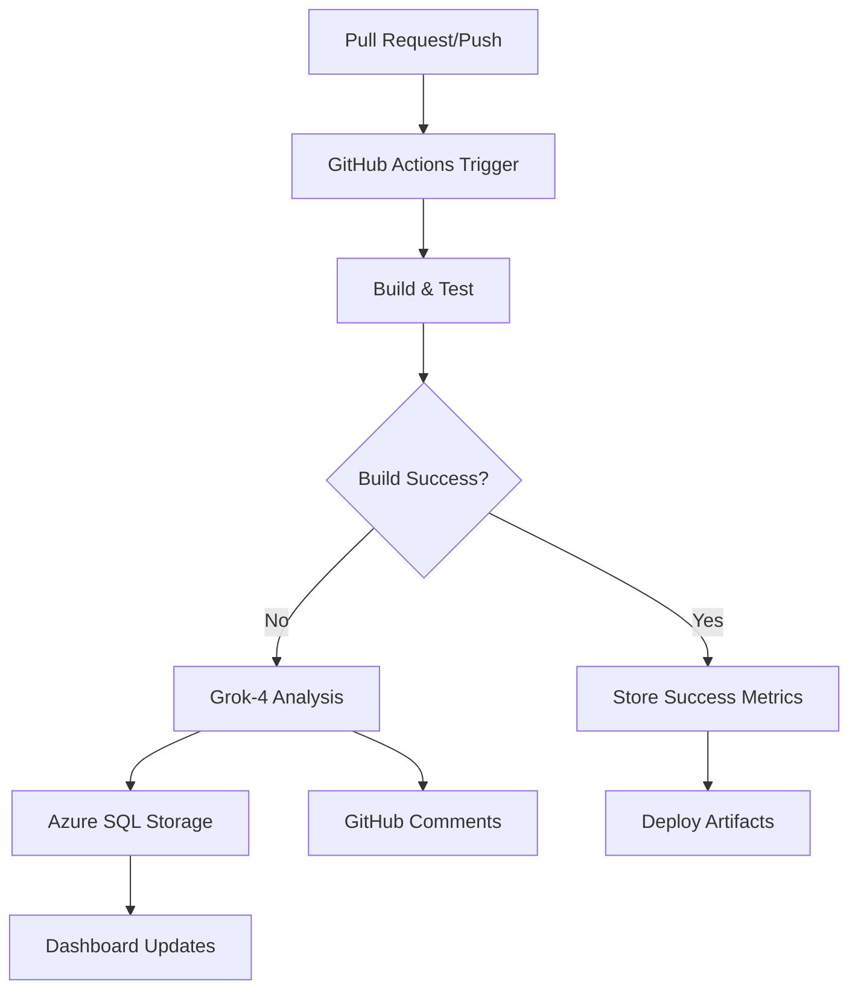

# 🚀 CI/CD with Grok-4 AI Analysis - Complete Guide

**BusBuddy Continuous Integration and Deployment with xAI Grok-4 Intelligent Analysis**

---

## 📖 Overview

BusBuddy's CI/CD pipeline integrates xAI's **Grok-4** model (`grok-4-0709`) to provide intelligent analysis of build failures, test results, and deployment issues. This system combines GitHub Actions automation with AI-powered insights to accelerate debugging and improve code quality.

### 🎯 Key Features

- **Automated Failure Analysis**: Grok-4 analyzes build errors, test failures, and deployment issues
- **Smart Token Management**: Optimized prompts and response handling for Grok-4's 256K context window  
- **Azure SQL Integration**: Persistent storage of AI insights and metrics
- **Pull Request Analysis**: Automated code review and Syncfusion UI optimization suggestions
- **Cost Optimization**: Intelligent batching and caching to minimize API usage

---

## 🏗️ CI/CD Workflow Architecture

### GitHub Actions Integration

The CI/CD system uses two primary workflows:

1. **`ci.yml`** - Standard build/test pipeline
2. **`ci-with-ai.yml`** - Enhanced pipeline with Grok-4 analysis



### 🤖 Grok-4 Integration Points

| **Stage** | **Analysis Type** | **Token Budget** | **Purpose** |
|-----------|------------------|------------------|-------------|
| **Build Failure** | Error diagnosis | 30K tokens | Identify root causes |
| **Test Failure** | Test analysis | 25K tokens | Debug test issues |
| **PR Review** | Code analysis | 40K tokens | Syncfusion optimization |
| **UI Changes** | XAML analysis | 20K tokens | UI/UX improvements |
| **Deployment** | Success metrics | 10K tokens | Performance tracking |

---

## 🔧 Setup and Configuration

### Prerequisites

1. **GitHub Repository Secrets** (Required for CI/CD):
   ```bash
   XAI_API_KEY              # Your xAI API key (84 characters, prefix "xai-")
   AZURE_SQL_SERVER         # Azure SQL server name
   AZURE_CLIENT_ID          # Service principal client ID
   AZURE_CLIENT_SECRET      # Service principal secret
   AZURE_TENANT_ID          # Azure AD tenant ID
   ```

2. **Local Development Environment**:
   ```powershell
   # Machine-level environment variable
   [System.Environment]::SetEnvironmentVariable("XAI_API_KEY", "xai-...", "Machine")
   
   # PowerShell modules
   Import-Module "./PowerShell/Modules/BusBuddy-GrokAssistant.psm1"
   Import-Module "./PowerShell/Modules/BusBuddy-CIAnalysis-Enhanced.psm1"
   Import-Module "./PowerShell/Modules/BusBuddy-GrokAzureSQL.psm1"
   ```

### 🚀 Quick Start

1. **Add GitHub Secrets**:
   ```bash
   # Repository Settings > Secrets and variables > Actions
   # Add all required secrets listed above
   ```

2. **Test Grok Connection**:
   ```powershell
   # Verify API connection
   Test-GrokConnection
   # Expected: "✅ Grok API connection successful"
   ```

3. **Enable AI-Enhanced Workflow**:
   ```yaml
   # Use .github/workflows/ci-with-ai.yml for new PRs
   # Workflow automatically triggers on push/PR events
   ```

---

## 🧠 Grok-4 Token Management & Optimization

### Token Budget Strategy

**Grok-4 Context Window**: 256,000 tokens total

#### 📊 Optimal Token Allocation

```powershell
# Token distribution for comprehensive analysis
$TokenBudget = @{
    SystemPrompt     = 2000   # AI context and instructions
    ProjectContext   = 5000   # BusBuddy architecture info
    ErrorData        = 30000  # Build logs, stack traces
    SourceCode       = 40000  # Relevant code snippets
    Response         = 15000  # AI analysis output
    Safety           = 10000  # Buffer for variations
}
# Total: ~102K tokens (40% of context window)
```

#### 🎯 Prompt Engineering Best Practices

**System Prompt Template**:
```
You are an expert .NET/WPF developer analyzing BusBuddy failures.

CONTEXT:
- Framework: .NET 8.0 WPF with MVVM
- UI: Syncfusion WPF controls (SfDataGrid, SfChart, etc.)
- Database: Azure SQL with Entity Framework Core
- Architecture: Clean Architecture with dependency injection

ANALYSIS REQUIREMENTS:
1. Identify root cause with specific line numbers
2. Provide actionable fix recommendations
3. Include Syncfusion-specific solutions if applicable
4. Estimate fix complexity (Low/Medium/High)
5. Suggest preventive measures

RESPONSE FORMAT:
- Severity: Critical/High/Medium/Low
- Summary: One-line issue description
- Root Cause: Technical explanation
- Fix Steps: Numbered action items
- Code Examples: Relevant snippets
- Prevention: Future avoidance strategies
```

### 🔄 Token Optimization Techniques

#### 1. **Intelligent Log Filtering**

```powershell
function Optimize-LogData {
    param([string]$RawLog)
    
    # Extract only relevant sections
    $relevantPatterns = @(
        'error\s+\w+\d+',        # Compiler errors  
        'failed.*test',          # Test failures
        'exception.*at',         # Stack traces
        'syncfusion.*error'      # Syncfusion issues
    )
    
    $filteredLog = $RawLog -split "`n" | Where-Object {
        $line = $_
        $relevantPatterns | ForEach-Object { $line -match $_ }
    } | Select-Object -First 50
    
    return $filteredLog -join "`n"
}
```

#### 2. **Contextual Code Extraction**

```powershell
function Get-RelevantSourceCode {
    param([string]$ErrorMessage)
    
    # Extract class/method names from error
    $codeReferences = [regex]::Matches($ErrorMessage, '[\w\.]+\.cs\(\d+,\d+\)')
    
    $codeContext = foreach ($ref in $codeReferences[0..2]) {  # Limit to 3 files
        $file = $ref.Value -replace '\(\d+,\d+\)', ''
        if (Test-Path $file) {
            $lines = Get-Content $file
            $errorLine = [int]($ref.Value -replace '.*\((\d+),\d+\)', '$1')
            
            # Get ±10 lines around error
            $start = [Math]::Max(0, $errorLine - 10)
            $end = [Math]::Min($lines.Count - 1, $errorLine + 10)
            
            $lines[$start..$end] -join "`n"
        }
    }
    
    return $codeContext -join "`n---`n"
}
```

#### 3. **Response Size Management**

```powershell
function Invoke-OptimizedGrokAnalysis {
    param(
        [string]$ErrorData,
        [int]$MaxResponseTokens = 15000
    )
    
    $prompt = @"
Analyze this BusBuddy build failure. Provide a focused response within $MaxResponseTokens tokens.

ERROR DATA:
$ErrorData

Required format (be concise):
SEVERITY: [Critical/High/Medium/Low]
SUMMARY: [One sentence]
ROOT_CAUSE: [Technical explanation in 2-3 sentences]
FIX_STEPS: [Max 5 numbered steps]
CODE_EXAMPLE: [Only if essential, <20 lines]
PREVENTION: [One sentence]
"@

    # Add response length instruction
    $prompt += "`n`nKEEP RESPONSE UNDER $MaxResponseTokens TOKENS."
    
    return Invoke-GrokApi -Prompt $prompt -MaxTokens $MaxResponseTokens
}
```

---

## 📈 Workflow Implementation Details

### 🏗️ Build Failure Analysis

When a build fails, the CI system automatically:

1. **Captures Failure Context**:
   ```powershell
   $errorContext = @{
       RestoreFailure = $steps.restore.outcome -eq 'failure'
       BuildFailure = $steps.build.outcome -eq 'failure'  
       TestFailure = $steps.test.outcome -eq 'failure'
       WorkflowName = "ci-with-ai.yml"
       GitCommit = $env:GITHUB_SHA
       PullRequest = $env:GITHUB_PR_NUMBER
   }
   ```

2. **Optimizes Data for Grok**:
   ```powershell
   # Extract relevant build logs (last 1000 lines)
   $buildLog = Get-BuildArtifact | Select-Object -Last 1000
   $filteredLog = Optimize-LogData -RawLog $buildLog
   
   # Add project context
   $projectContext = Get-BusBuddyProjectContext
   ```

3. **Performs AI Analysis**:
   ```powershell
   $analysis = Invoke-EnhancedCIAnalysis -ErrorMessage $filteredLog -WorkflowName $errorContext.WorkflowName
   ```

4. **Stores Results in Azure SQL**:
   ```sql
   INSERT INTO AIInsights (InsightType, Severity, Summary, Recommendations, CreatedDate)
   VALUES ('BuildFailure', @severity, @summary, @recommendations, GETUTCDATE())
   ```

### 🔍 Pull Request Analysis

For pull requests, the system performs:

#### **1. Changed File Analysis**
```powershell
# Get modified XAML files for UI analysis
$changedXaml = git diff --name-only HEAD~1 HEAD | Where-Object { $_ -match '\.xaml$' }

foreach ($xamlFile in $changedXaml) {
    $xamlContent = Get-Content $xamlFile -Raw
    
    # Determine Syncfusion control types
    $controlTypes = @()
    if ($xamlContent -match 'SfDataGrid') { $controlTypes += 'SfDataGrid' }
    if ($xamlContent -match 'SfChart') { $controlTypes += 'SfChart' }
    if ($xamlContent -match 'SfScheduler') { $controlTypes += 'SfScheduler' }
    
    # Analyze each control type
    $uiAnalysis = Invoke-GrokUIOptimization -XamlContent $xamlContent -ControlTypes $controlTypes
}
```

#### **2. Syncfusion-Specific Analysis**
```powershell
function Invoke-GrokUIOptimization {
    param(
        [string]$XamlContent,
        [string[]]$ControlTypes
    )
    
    $prompt = @"
Analyze this BusBuddy XAML for Syncfusion optimization:

XAML CONTENT:
$XamlContent

CONTROL TYPES: $($ControlTypes -join ', ')

Provide optimization suggestions for:
1. Performance improvements
2. MVVM binding best practices  
3. Syncfusion-specific features utilization
4. Accessibility enhancements

Format: JSON with suggestions array
"@

    return Invoke-GrokApi -Prompt $prompt -MaxTokens 20000
}
```

### 🎯 Success Metrics Storage

Even successful builds generate insights:

```powershell
# Store success patterns for learning
$successMetrics = @{
    BuildTime = $buildDuration
    TestCount = $testResults.TotalTests
    CodeCoverage = $coverageResults.Percentage
    SyncfusionControls = $uiMetrics.ControlCount
}

Store-GrokSuccessPattern -Metrics $successMetrics -BuildId $env:GITHUB_RUN_ID
```

---

## 📊 Azure SQL Database Schema

### AI Insights Storage

```sql
-- Main insights table
CREATE TABLE AIInsights (
    InsightId UNIQUEIDENTIFIER PRIMARY KEY DEFAULT NEWID(),
    InsightType NVARCHAR(50) NOT NULL, -- 'BuildFailure', 'UIOptimization', 'TestFailure'
    Severity NVARCHAR(20) NOT NULL,    -- 'Critical', 'High', 'Medium', 'Low'
    Summary NVARCHAR(500) NOT NULL,
    RootCause NVARCHAR(MAX),
    Recommendations NVARCHAR(MAX),
    CodeExample NVARCHAR(MAX),
    PreventionTips NVARCHAR(MAX),
    WorkflowName NVARCHAR(100),
    BuildId NVARCHAR(50),
    CommitSha NVARCHAR(40),
    PullRequestNumber INT,
    TokensUsed INT,
    AnalysisDurationMs INT,
    CreatedDate DATETIME2 DEFAULT GETUTCDATE(),
    
    INDEX IX_AIInsights_Type_Date (InsightType, CreatedDate),
    INDEX IX_AIInsights_Severity (Severity),
    INDEX IX_AIInsights_BuildId (BuildId)
);

-- UI optimization tracking
CREATE TABLE UIOptimizations (
    OptimizationId UNIQUEIDENTIFIER PRIMARY KEY DEFAULT NEWID(),
    ViewName NVARCHAR(100) NOT NULL,
    ControlType NVARCHAR(50) NOT NULL, -- 'SfDataGrid', 'SfChart', etc.
    OptimizationSuggestions NVARCHAR(MAX),
    PerformanceImpact NVARCHAR(20),     -- 'High', 'Medium', 'Low'
    ImplementationComplexity NVARCHAR(20), -- 'Simple', 'Moderate', 'Complex'
    XamlBefore NVARCHAR(MAX),
    XamlAfter NVARCHAR(MAX),
    CreatedDate DATETIME2 DEFAULT GETUTCDATE(),
    
    INDEX IX_UIOptimizations_ControlType (ControlType),
    INDEX IX_UIOptimizations_Date (CreatedDate)
);

-- Build metrics for success patterns
CREATE TABLE BuildMetrics (
    MetricId UNIQUEIDENTIFIER PRIMARY KEY DEFAULT NEWID(),
    BuildId NVARCHAR(50) NOT NULL,
    BuildDurationMs INT,
    TestCount INT,
    CodeCoverage DECIMAL(5,2),
    SyncfusionControlCount INT,
    MemoryUsageMB INT,
    BuildSuccess BIT,
    CreatedDate DATETIME2 DEFAULT GETUTCDATE(),
    
    INDEX IX_BuildMetrics_BuildId (BuildId),
    INDEX IX_BuildMetrics_Success_Date (BuildSuccess, CreatedDate)
);
```

### Query Examples

```sql
-- Get recent critical failures
SELECT TOP 10 
    Summary,
    RootCause,
    Recommendations,
    CreatedDate
FROM AIInsights 
WHERE Severity = 'Critical' 
    AND CreatedDate >= DATEADD(day, -7, GETUTCDATE())
ORDER BY CreatedDate DESC;

-- UI optimization trends
SELECT 
    ControlType,
    COUNT(*) as OptimizationCount,
    AVG(CASE WHEN PerformanceImpact = 'High' THEN 1 ELSE 0 END) as HighImpactRatio
FROM UIOptimizations
WHERE CreatedDate >= DATEADD(month, -1, GETUTCDATE())
GROUP BY ControlType
ORDER BY OptimizationCount DESC;

-- Build success rate by week
SELECT 
    DATEPART(week, CreatedDate) as WeekNumber,
    COUNT(*) as TotalBuilds,
    SUM(CASE WHEN BuildSuccess = 1 THEN 1 ELSE 0 END) as SuccessfulBuilds,
    CAST(SUM(CASE WHEN BuildSuccess = 1 THEN 1 ELSE 0 END) * 100.0 / COUNT(*) AS DECIMAL(5,2)) as SuccessRate
FROM BuildMetrics
WHERE CreatedDate >= DATEADD(month, -2, GETUTCDATE())
GROUP BY DATEPART(week, CreatedDate)
ORDER BY WeekNumber;
```

---

## 🚨 Error Handling & Resilience

### API Failure Handling

```powershell
function Invoke-ResilientGrokAnalysis {
    param([string]$ErrorData)
    
    $maxRetries = 3
    $retryDelay = 2
    
    for ($attempt = 1; $attempt -le $maxRetries; $attempt++) {
        try {
            $result = Invoke-GrokApi -Prompt $ErrorData
            if ($result) {
                Write-Information "✅ Grok analysis successful on attempt $attempt" -InformationAction Continue
                return $result
            }
        }
        catch {
            Write-Warning "❌ Grok analysis attempt $attempt failed: $($_.Exception.Message)"
            
            if ($attempt -lt $maxRetries) {
                Start-Sleep -Seconds ($retryDelay * $attempt)
            } else {
                # Fallback to pattern-based analysis
                Write-Information "🔄 Falling back to pattern-based analysis" -InformationAction Continue
                return Get-PatternBasedAnalysis -ErrorData $ErrorData
            }
        }
    }
}

function Get-PatternBasedAnalysis {
    param([string]$ErrorData)
    
    # Pattern-based fallback for common issues
    $patterns = @{
        'CS1061' = 'Member not found - check spelling and using statements'
        'CS0246' = 'Type not found - verify namespace and assembly references'
        'Syncfusion.*license' = 'Syncfusion license issue - verify key registration'
        'Azure.*connection' = 'Database connection problem - check connection string'
    }
    
    foreach ($pattern in $patterns.Keys) {
        if ($ErrorData -match $pattern) {
            return [PSCustomObject]@{
                Severity = 'Medium'
                Summary = $patterns[$pattern]
                Source = 'Pattern-based analysis'
                Recommendations = @("Check the specific error pattern: $pattern")
            }
        }
    }
    
    return [PSCustomObject]@{
        Severity = 'Unknown'
        Summary = 'Unable to analyze - requires manual investigation'
        Source = 'Fallback'
        Recommendations = @('Review build logs manually', 'Check recent code changes')
    }
}
```

### Rate Limiting Management

```powershell
# Token usage tracking
$Script:TokenUsageToday = 0
$Script:LastTokenReset = Get-Date

function Test-TokenBudget {
    param([int]$RequiredTokens)
    
    # Reset daily counter
    if ((Get-Date).Date -gt $Script:LastTokenReset.Date) {
        $Script:TokenUsageToday = 0
        $Script:LastTokenReset = Get-Date
    }
    
    $dailyLimit = 100000  # Conservative daily limit
    
    if (($Script:TokenUsageToday + $RequiredTokens) -gt $dailyLimit) {
        Write-Warning "🚨 Daily token budget exceeded. Switching to lightweight analysis."
        return $false
    }
    
    return $true
}

function Update-TokenUsage {
    param([int]$TokensUsed)
    $Script:TokenUsageToday += $TokensUsed
    Write-Verbose "Token usage today: $Script:TokenUsageToday"
}
```

---

## 📋 Usage Examples

### Basic CI Failure Analysis

```powershell
# Analyze build failure from GitHub Actions
Invoke-EnhancedCIAnalysis -FetchGitHubLogs -WorkflowName "ci.yml"

# Analyze specific error message
Invoke-EnhancedCIAnalysis -ErrorMessage "CS1061: 'VehicleService' does not contain a definition for 'GetVehicleByIdAsync'"

# Analyze from log file
Invoke-EnhancedCIAnalysis -LogFile ".\build-error.log"
```

### Batch Analysis

```powershell
# Analyze multiple recent failures
Start-BatchCIAnalysis -DaysBack 7 -Async

# Analyze all failed workflows
$failedWorkflows = Get-GitHubFailedWorkflows -Repository "BusBuddy-3" -Status "failure"
$failedWorkflows | ForEach-Object -Parallel {
    Invoke-EnhancedCIAnalysis -WorkflowName $_.name -Async
} -ThrottleLimit 3
```

### UI Optimization Analysis

```powershell
# Analyze changed XAML files in current PR
$changedXaml = git diff --name-only HEAD~1 HEAD | Where-Object { $_ -match '\.xaml$' }
foreach ($file in $changedXaml) {
    $content = Get-Content $file -Raw
    $optimization = Invoke-GrokUIOptimization -XamlContent $content -ViewName (Split-Path $file -LeafBase)
}

# Store optimization in database
Store-GrokUIOptimization -UIContext $content -ViewName "VehicleManagementView" -ControlType "SfDataGrid"
```

### Success Pattern Learning

```powershell
# Store successful build metrics
$metrics = @{
    BuildDuration = 180  # seconds
    TestCount = 45
    CodeCoverage = 85.5
    SyncfusionControls = 12
}

Store-GrokSuccessPattern -Metrics $metrics -BuildId "run-123456"
```

---

## 🔧 Local Development Commands

### PowerShell Profile Integration

```powershell
# Quick commands available after importing BusBuddy profile

# Test Grok connection
Test-GrokConnection

# Analyze recent build failure
grok-ci

# Analyze specific error
grok-ci -ErrorMessage "Build failed with CS1061"

# Get optimization suggestions for current XAML
grok-ui -File "VehicleManagementView.xaml"

# Check Azure SQL connection
grok-sql-test

# View recent AI insights
grok-insights -Days 7

# Export insights to JSON
grok-export -OutputPath "insights.json"
```

### Manual Testing

```powershell
# Test complete workflow locally
Import-Module "./PowerShell/Modules/BusBuddy-CIAnalysis-Enhanced.psm1" -Force

# Simulate GitHub Actions environment
$env:GITHUB_RUN_ID = "test-123"
$env:GITHUB_SHA = "abc123"

# Run analysis
$result = Invoke-EnhancedCIAnalysis -ErrorMessage "Test error message"

# Verify result structure
$result | ConvertTo-Json -Depth 3
```

---

## 📊 Monitoring and Metrics

### Key Performance Indicators

| **Metric** | **Target** | **Current** | **Tracking** |
|------------|------------|-------------|--------------|
| **Analysis Accuracy** | >90% | TBD | Manual validation |
| **Response Time** | <30s | TBD | Automated timing |
| **Token Efficiency** | <50K/analysis | TBD | Usage tracking |
| **Daily Token Budget** | <100K total | TBD | Daily counters |
| **API Success Rate** | >95% | TBD | Error tracking |

### Dashboard Queries

```sql
-- Weekly analysis summary
SELECT 
    DATEPART(week, CreatedDate) as Week,
    InsightType,
    COUNT(*) as AnalysisCount,
    AVG(TokensUsed) as AvgTokens,
    AVG(AnalysisDurationMs) as AvgDurationMs
FROM AIInsights
WHERE CreatedDate >= DATEADD(week, -4, GETUTCDATE())
GROUP BY DATEPART(week, CreatedDate), InsightType
ORDER BY Week DESC, InsightType;

-- Most common failure patterns
SELECT 
    LEFT(Summary, 100) as FailurePattern,
    COUNT(*) as Occurrences,
    AVG(CASE WHEN Severity = 'Critical' THEN 1 ELSE 0 END) as CriticalRatio
FROM AIInsights
WHERE InsightType = 'BuildFailure'
    AND CreatedDate >= DATEADD(month, -1, GETUTCDATE())
GROUP BY LEFT(Summary, 100)
HAVING COUNT(*) >= 2
ORDER BY Occurrences DESC;
```

---

## 🔐 Security Best Practices

### API Key Management

1. **GitHub Secrets**: Store XAI_API_KEY as repository secret
2. **Local Development**: Use machine-level environment variables
3. **PowerShell SecretManagement**: Store in encrypted vault
4. **Rotation**: Rotate API keys monthly

### Data Privacy

```powershell
# Anonymize sensitive data before AI analysis
function Sanitize-LogData {
    param([string]$LogData)
    
    $sanitized = $LogData
    
    # Remove connection strings
    $sanitized = $sanitized -replace 'Password=[^;]+', 'Password=***'
    $sanitized = $sanitized -replace 'User ID=[^;]+', 'User ID=***'
    
    # Remove API keys
    $sanitized = $sanitized -replace 'xai-[a-zA-Z0-9]+', 'xai-***'
    
    # Remove personal paths
    $sanitized = $sanitized -replace 'C:\\Users\\[^\\]+', 'C:\Users\***'
    
    return $sanitized
}
```

### Audit Trail

```sql
-- Track all AI API calls
CREATE TABLE GrokAPIAudit (
    AuditId UNIQUEIDENTIFIER PRIMARY KEY DEFAULT NEWID(),
    UserId NVARCHAR(100),
    PromptHash NVARCHAR(64), -- SHA256 of prompt
    TokensUsed INT,
    ResponseTime INT,
    Success BIT,
    ErrorMessage NVARCHAR(500),
    CreatedDate DATETIME2 DEFAULT GETUTCDATE()
);
```

---

## 🎯 Optimization Strategies

### Prompt Optimization

1. **Structured Templates**: Use consistent prompt formats
2. **Context Minimization**: Include only relevant information
3. **Response Formatting**: Request structured JSON responses
4. **Token Estimation**: Calculate token usage before API calls

### Caching Strategy

```powershell
# Cache analysis results for similar errors
$Script:AnalysisCache = @{}

function Get-CachedAnalysis {
    param([string]$ErrorHash)
    
    if ($Script:AnalysisCache.ContainsKey($ErrorHash)) {
        $cached = $Script:AnalysisCache[$ErrorHash]
        if ((Get-Date) - $cached.Timestamp -lt [TimeSpan]::FromHours(24)) {
            Write-Information "Using cached analysis for error hash: $ErrorHash" -InformationAction Continue
            return $cached.Analysis
        }
    }
    
    return $null
}

function Set-CachedAnalysis {
    param(
        [string]$ErrorHash,
        [object]$Analysis
    )
    
    $Script:AnalysisCache[$ErrorHash] = @{
        Analysis = $Analysis
        Timestamp = Get-Date
    }
}
```

### Batch Processing

```powershell
# Process multiple failures efficiently
function Start-BatchCIAnalysis {
    param(
        [int]$DaysBack = 7,
        [switch]$Async
    )
    
    $failures = Get-GitHubFailures -DaysBack $DaysBack
    $batches = $failures | Group-Object { [Math]::Floor($_.Index / 5) }  # Groups of 5
    
    foreach ($batch in $batches) {
        $combinedPrompt = Build-BatchPrompt -Failures $batch.Group
        
        if ($Async) {
            Start-ThreadJob -ScriptBlock {
                param($Prompt)
                Invoke-GrokApi -Prompt $Prompt
            } -ArgumentList $combinedPrompt
        } else {
            $result = Invoke-GrokApi -Prompt $combinedPrompt
            Process-BatchResult -Result $result -Failures $batch.Group
        }
    }
}
```

---

## 🚀 Advanced Features

### Auto-Fix Suggestions

```powershell
# Generate code fix suggestions
function Get-AutoFixSuggestions {
    param([string]$ErrorMessage, [string]$FilePath)
    
    $sourceCode = Get-Content $FilePath -Raw
    $context = Get-RelevantSourceCode -ErrorMessage $ErrorMessage
    
    $prompt = @"
Generate specific code fix for this BusBuddy error:

ERROR: $ErrorMessage

CURRENT CODE:
$context

Provide:
1. Exact line numbers to change
2. Before/after code snippets
3. Additional files to modify
4. Using statements to add

Format as JSON with specific instructions.
"@

    $fixSuggestions = Invoke-GrokApi -Prompt $prompt -MaxTokens 10000
    return $fixSuggestions | ConvertFrom-Json
}
```

### Predictive Analysis

```powershell
# Predict potential issues from code changes
function Get-PredictiveAnalysis {
    param([string[]]$ChangedFiles)
    
    $codeChanges = foreach ($file in $ChangedFiles) {
        $diff = git diff HEAD~1 HEAD $file
        [PSCustomObject]@{
            File = $file
            Changes = $diff
        }
    }
    
    $prompt = @"
Analyze these BusBuddy code changes for potential issues:

$($codeChanges | ConvertTo-Json -Depth 2)

Predict:
1. Compilation risks
2. Runtime exceptions
3. Performance impacts
4. Syncfusion integration issues
5. Database migration needs

Provide risk assessment (Low/Medium/High) and prevention steps.
"@

    return Invoke-GrokApi -Prompt $prompt -MaxTokens 20000
}
```

### Integration Testing

```powershell
# Test AI integration end-to-end
function Test-GrokCIIntegration {
    Write-Information "🧪 Testing Grok CI/CD integration..." -InformationAction Continue
    
    # 1. Test API connection
    $connection = Test-GrokConnection
    if (-not $connection.Success) {
        throw "API connection failed: $($connection.Message)"
    }
    
    # 2. Test analysis function
    $testError = "CS1061: 'VehicleService' does not contain a definition for 'TestMethod'"
    $analysis = Invoke-EnhancedCIAnalysis -ErrorMessage $testError
    
    if (-not $analysis) {
        throw "Analysis function failed"
    }
    
    # 3. Test Azure SQL integration
    $sqlTest = Test-AzureSQLConnection
    if (-not $sqlTest.Success) {
        Write-Warning "Azure SQL connection failed: $($sqlTest.Message)"
    }
    
    # 4. Test token management
    $tokenTest = Test-TokenBudget -RequiredTokens 1000
    if (-not $tokenTest) {
        Write-Warning "Token budget check failed"
    }
    
    Write-Information "✅ Integration test completed successfully" -InformationAction Continue
    
    return [PSCustomObject]@{
        ApiConnection = $connection.Success
        AnalysisFunction = $analysis -ne $null
        SqlConnection = $sqlTest.Success
        TokenManagement = $tokenTest
        OverallStatus = 'Healthy'
    }
}
```

---

## 📞 Support and Troubleshooting

### Common Issues

| **Issue** | **Symptoms** | **Solution** |
|-----------|-------------|-------------|
| **API Key Invalid** | 401 Unauthorized | Verify XAI_API_KEY format and expiration |
| **Token Limit** | 400 Bad Request | Reduce prompt size or use batching |
| **SQL Connection** | Database timeout | Check Azure SQL firewall and credentials |
| **Module Loading** | Command not found | Import required PowerShell modules |
| **GitHub Secrets** | Workflow failure | Verify all repository secrets are set |

### Debug Commands

```powershell
# Comprehensive system check
bb-health

# Detailed Grok configuration
Get-GrokConfiguration -Detailed

# Test all components
Test-GrokCIIntegration

# View recent API calls
Get-GrokAPIHistory -Hours 24

# Check token usage
Get-TokenUsageReport -Days 7
```

### Contact Information

- **Technical Issues**: Submit GitHub issue with logs
- **API Problems**: Check xAI status page
- **Azure SQL Issues**: Verify connection in Azure portal
- **PowerShell Modules**: Run module validation script

---

## 📚 Additional Resources

### Documentation Links

- [xAI Grok-4 API Documentation](https://docs.x.ai/grok-4)
- [GitHub Actions Documentation](https://docs.github.com/en/actions)
- [Azure SQL Database Documentation](https://docs.microsoft.com/en-us/azure/azure-sql/)
- [PowerShell 7.5.2 Documentation](https://docs.microsoft.com/en-us/powershell/)

### BusBuddy-Specific Guides

- `GROK-INTEGRATION-COMPLETE.md` - Setup and configuration
- `GROK-ASSISTANT-CONFIG.md` - PowerShell module reference
- `DEVELOPMENT-GUIDE.md` - Development practices
- `SETUP-GUIDE.md` - Initial environment setup

### Example Projects

- View GitHub Actions logs in repository
- Check Azure SQL insights table for analysis examples
- Review PowerShell module tests for usage patterns

---

*This document is part of the BusBuddy project documentation. Last updated: December 2024*

**Version**: 1.0.0  
**Author**: BusBuddy Development Team  
**License**: See LICENSE.md

---
