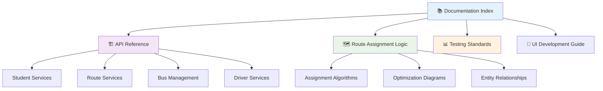
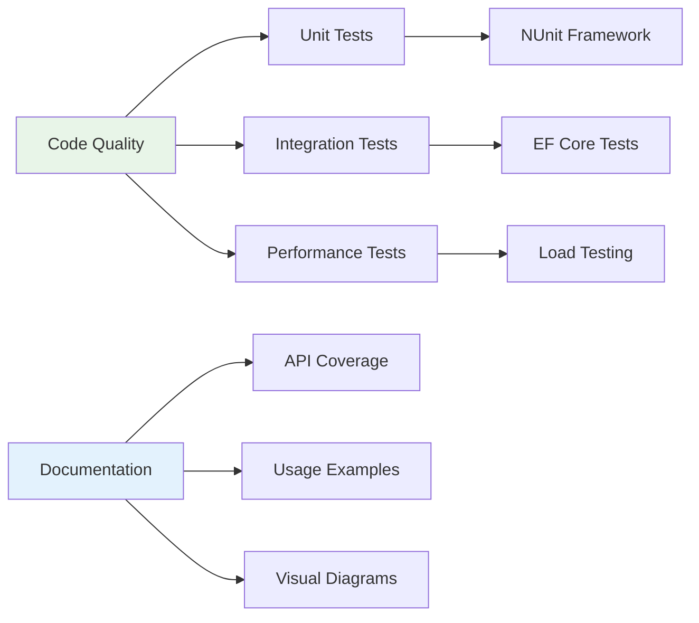
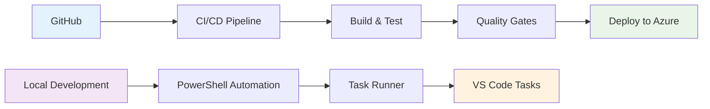

# � BusBuddy Documentation Index & Quick Reference

**Last Updated**: August 21, 2025  
**Purpose**: Central navigation hub for all BusBuddy documentation  
**Quick Access**: Essential links for developers and AI assistants

---

## 🚀 **Quick Start Guides**

| Guide                                           | Purpose                                | Audience       |
| ----------------------------------------------- | -------------------------------------- | -------------- |
| [SETUP-GUIDE.md](../SETUP-GUIDE.md)             | Initial project setup and installation | New Developers |
| [DEVELOPMENT-GUIDE.md](../DEVELOPMENT-GUIDE.md) | Development environment and workflows  | All Developers |
| [CONTRIBUTING.md](../CONTRIBUTING.md)           | Contribution guidelines and standards  | Contributors   |

---

## 🏗️ **Architecture & API Documentation**

### **Core Services & API Reference**

| Document                                                                      | Coverage                                         | Use Case                                               |
| ----------------------------------------------------------------------------- | ------------------------------------------------ | ------------------------------------------------------ |
| [**Core Services API Reference**](./Reference/CORE-SERVICES-API-REFERENCE.md) | Complete API documentation for all Core services | Service integration, method signatures, usage examples |
| [Route Assignment Logic](./Reference/Route-Assignment-Logic.md)               | Route assignment algorithms with visual diagrams | Route optimization, student assignment logic           |
| [Database Configuration](./DATABASE-CONFIGURATION.md)                         | Database setup, migrations, and configuration    | Database operations, EF Core setup                     |

### **Visual Architecture Guides**



---

## 🎯 **Entity-Specific Guides**

### **Student Management**

- **[Student Entry & Route Design](./Student-Entry-Route-Design-Guide-Complete.md)** - Complete student registration and route assignment workflow
- **[Student Services API](./Reference/CORE-SERVICES-API-REFERENCE.md#student-management-services)** - IStudentService interface and implementation details
- **[Student Validation](./VALIDATION-COMPLETE-Student-Entry-Route-Design.md)** - Data validation rules and business logic

### **Route & Transportation**

- **[Route Assignment Logic](./Reference/Route-Assignment-Logic.md)** - Advanced routing algorithms with visual flowcharts
- **[Route Foundation Assessment](./Route-Foundation-Assessment.md)** - Current state analysis and improvements
- **[Transportation Services API](./Reference/CORE-SERVICES-API-REFERENCE.md#transportation-management-services)** - Route, Bus, and Driver service interfaces

### **Scheduling & Activities**

- **[Sports Scheduling](./Reference/CORE-SERVICES-API-REFERENCE.md#scheduling--activity-services)** - Sports event transportation management
- **[Activity Management](./Reference/CORE-SERVICES-API-REFERENCE.md#scheduling--activity-services)** - Extracurricular activity scheduling

### **Maintenance & Fleet**

- **[Fleet Services API](./Reference/CORE-SERVICES-API-REFERENCE.md#maintenance--fleet-services)** - Maintenance and fuel management interfaces
- **[Vehicle Management](./Reference/CORE-SERVICES-API-REFERENCE.md#maintenance--fleet-services)** - Fleet tracking and optimization

---

## 🧪 **Testing & Quality Assurance**

### **Testing Documentation**

| Document                                                      | Focus                                    | Location        |
| ------------------------------------------------------------- | ---------------------------------------- | --------------- |
| [Testing Standards](../BusBuddy.Tests/TESTING-STANDARDS.md)   | Unit testing patterns and best practices | BusBuddy.Tests/ |
| [TDD Copilot Best Practices](./TDD-COPILOT-BEST-PRACTICES.md) | AI-assisted test development             | Documentation/  |
| [UAT Plan Excellence](./UAT-Plan-Excellence.md)               | User acceptance testing procedures       | Documentation/  |

### **Quality Assurance Tools**



---

## 🔧 **Configuration & Setup**

### **Infrastructure Configuration**

| Document                                              | Purpose                                     | Critical For          |
| ----------------------------------------------------- | ------------------------------------------- | --------------------- |
| [Database Configuration](./DATABASE-CONFIGURATION.md) | EF Core, migrations, connection strings     | Data layer setup      |
| [NuGet Config Reference](./NUGET-CONFIG-REFERENCE.md) | Package management and Syncfusion licensing | Build configuration   |
| [Package Management](./PACKAGE-MANAGEMENT.md)         | Dependency management best practices        | Project maintenance   |
| [Azure Setup Guide](./AzureSetupGuide.md)             | Cloud deployment configuration              | Production deployment |

---

## 🎨 **UI & Frontend Development**

### **Syncfusion WPF Integration**

| Topic       | Documentation                                                                               | Implementation Guide            |
| ----------- | ------------------------------------------------------------------------------------------- | ------------------------------- |
| UI Controls | [Syncfusion Standards](../.github/copilot-instructions.md#syncfusion-integration-standards) | Component usage patterns        |
| Theming     | [Theming Audit Checklist](./Theming/Theming-Audit-Checklist.md)                             | FluentDark theme implementation |
| Data Grids  | [SfDataGrid Examples](./Reference/CORE-SERVICES-API-REFERENCE.md#usage-examples)            | Advanced grid functionality     |

### **MVVM Architecture**

```mermaid
graph TB
    A[View (XAML)] --> B[ViewModel]
    B --> C[Model/Service]
    C --> D[Database/API]

    B --> E[Commands]
    B --> F[Properties]
    B --> G[Validation]

    style A fill:#e3f2fd
    style B fill:#f3e5f5
    style C fill:#e8f5e8
    style D fill:#fff3e0
```

---

## 📊 **Reports & Analytics**

### **Generated Reports**

| Report                                                        | Purpose                           | Frequency |
| ------------------------------------------------------------- | --------------------------------- | --------- |
| [Documentation Audit Report](./Documentation-Audit-Report.md) | Documentation coverage analysis   | Weekly    |
| [Organization Summary](./ORGANIZATION-SUMMARY.md)             | Project structure overview        | As needed |
| [Consolidation Plan](./CONSOLIDATION-PLAN.md)                 | Cleanup and organization strategy | Ongoing   |

---

## 🔐 **Security & Compliance**

### **Security Documentation**

| Document                                                | Coverage                         | Compliance         |
| ------------------------------------------------------- | -------------------------------- | ------------------ |
| [SECURITY.md](./SECURITY.md)                            | Security policies and procedures | Industry standards |
| [Accessibility Standards](./ACCESSIBILITY-STANDARDS.md) | WCAG compliance guidelines       | ADA requirements   |
| [License Information](../LICENSE)                       | Open source licensing            | Legal compliance   |

---

## 🚀 **Deployment & DevOps**

### **Deployment Guides**

- **[Azure Deployment](./Deployment/)** - Cloud deployment procedures
- **[CI/CD Pipeline](../.github/workflows/)** - Automated build and deployment
- **[Environment Configuration](./Development/)** - Multi-environment setup

### **DevOps Tools Integration**



---

## 🎓 **Learning & Reference**

### **Educational Resources**

| Resource                            | Focus                   | Skill Level          |
| ----------------------------------- | ----------------------- | -------------------- |
| [Learning Materials](./Learning/)   | Tutorials and examples  | Beginner to Advanced |
| [Sample Code](./Samples/)           | Implementation examples | All levels           |
| [Language References](./Languages/) | Multi-language support  | Intermediate         |

---

## 🔄 **Maintenance & Updates**

### **Documentation Maintenance**

| Task                   | Responsibility     | Frequency                |
| ---------------------- | ------------------ | ------------------------ |
| API Reference Updates  | Core developers    | With each service change |
| Visual Diagram Updates | Technical writers  | Monthly                  |
| Link Validation        | Documentation team | Weekly                   |
| Content Audit          | Project leads      | Quarterly                |

---

## 📱 **Quick Access Shortcuts**

### **Developer Essentials**

```bash
# Quick development commands
bb-build          # Build solution
bb-test           # Run tests
bb-docs-serve     # Serve documentation locally
bb-health         # System health check
```

### **Documentation Shortcuts**

- **🔍 Search**: Use VS Code global search across all documentation
- **📋 Quick Reference**: Bookmark this index for fast navigation
- **🔗 Link Validation**: Run `check-docs-health` PowerShell command
- **📊 Coverage Report**: Execute `generate-docs-coverage` for missing documentation analysis

---

## 🏆 **Best Practices Summary**

### **Documentation Standards**

1. ✅ **Always include visual diagrams** for complex processes
2. ✅ **Provide working code examples** for all API methods
3. ✅ **Link related documentation** using relative paths
4. ✅ **Update version history** when making significant changes
5. ✅ **Include performance considerations** for service methods

### **Development Workflow**

1. 📖 **Read relevant documentation** before implementing
2. 🧪 **Write tests** based on documented behavior
3. 📝 **Update documentation** when adding features
4. 🔄 **Validate links and examples** before committing
5. 📊 **Generate coverage reports** to identify gaps

---

**📧 Contact**: See [CONTRIBUTING.md](../CONTRIBUTING.md) for team contact information  
**🔄 Last Updated**: August 21, 2025  
**📝 Version**: 1.0.0

---

## 🚀 **August 2025 Refactor Summary**

**Recent Accomplishments:**

- ✅ **Canonicalized DbContext**: Single source of truth for database operations
- ✅ **Enhanced Documentation**: Added visual diagrams and comprehensive API reference
- ✅ **Restored SportsEvents**: Full sports scheduling functionality
- ✅ **Improved Data Seeding**: OCR-based student/family import capabilities
- ✅ **Project Hygiene**: Clean codebase with intentional `.disabled` files for MVP control

**Documentation Enhancements:**

- 🗺️ **Route Assignment Logic**: Added flowcharts and decision matrices
- 🏗️ **Core Services API**: Comprehensive interface documentation with examples
- 📊 **Entity Relationship Diagrams**: Visual database schema representation
- 🎯 **Entity-Specific Guides**: Focused documentation for each business domain

### 🏗️ **Architecture** (`/Architecture/`)

Deep technical documentation:

- **[System Architecture](Architecture/System-Architecture.md)** — Overall system design
- **[MVVM Implementation](Architecture/MVVM-Implementation.md)** — Our MVVM patterns
- **[Database Design](Architecture/Database-Design.md)** — Entity relationships and design

### 📡 **API Documentation** (`/API/`)

Technical references:

- **[Service Layer API](API/Service-Layer-API.md)** — Business logic interfaces
- **[External API Integration](API/External-API-Integration.md)** — Third-party integrations

## 📚 **Quick Reference Links**

### Official Microsoft Documentation

- **[.NET Documentation](https://learn.microsoft.com/en-us/dotnet/)** — Complete .NET framework reference
- **[WPF Documentation](https://learn.microsoft.com/en-us/dotnet/desktop/wpf/)** — Windows Presentation Foundation guide
- **[Entity Framework Documentation](https://learn.microsoft.com/en-us/ef/)** — Database ORM documentation
- **[Azure Documentation](https://learn.microsoft.com/en-us/azure/)** — Cloud services reference

### Third-Party Documentation

- **[Syncfusion WPF Controls](https://help.syncfusion.com/wpf/welcome-to-syncfusion-essential-wpf)** — UI component library
- **[Serilog Documentation](https://serilog.net/)** — Structured logging framework

## 🚀 **Getting Started Quickly**

### For Newcomers

1. Start with **[Getting Started Guide](Learning/Getting-Started.md)**
2. Set up your environment using **[PowerShell Learning Path](Learning/PowerShell-Learning-Path.md)**
3. Explore **[WPF Development Guide](Learning/WPF-Development-Guide.md)** for UI development
4. Check out **[Bug Hall of Fame](Humor/Bug-Hall-of-Fame.md)** for a laugh!

### For Experienced Developers

1. Review **[System Architecture](Architecture/System-Architecture.md)** for the big picture
2. Check **[Service Layer API](API/Service-Layer-API.md)** for quick reference
3. Review **[TDD Best Practices](TDD-COPILOT-BEST-PRACTICES.md)** for development workflow

### For Contributors

1. Read **[CONTRIBUTING.md](../CONTRIBUTING.md)** in the root directory
2. Review **[MVVM Implementation](Architecture/MVVM-Implementation.md)** for coding patterns
3. Check **[Testing Standards](../BusBuddy.Tests/TESTING-STANDARDS.md)** for testing guidelines

## 🎯 **Documentation Goals**

- **📖 Accessible Learning**: Step-by-step guides with real examples
- **🔍 Quick Reference**: Fast lookup for experienced developers
- **🎭 Enjoyable Experience**: Humor and personality in technical docs
- **🌐 External Links**: Direct connections to official documentation
- **🛠️ Development-Focused**: Practical guides for active development

## 🔄 **Migration from Old README**

This Docs structure replaces sections that were previously in the main README:

- ✅ **Setup Instructions** → `Learning/Getting-Started.md`
- ✅ **Architecture Overview** → `Architecture/System-Architecture.md`
- ✅ **API References** → `API/Service-Layer-API.md`
- ✅ **Technical Details** → Appropriate specialized documents
- ✅ **Funny Stories** → `Humor/Bug-Hall-of-Fame.md`

The main README now focuses on project overview and quick navigation to this Docs hub.

---

**💡 Tip**: Use standard .NET CLI commands for building and testing, and refer to our comprehensive documentation for specific workflows!

**🎉 Remember**: Great documentation makes great developers. Happy coding! 🚌✨
