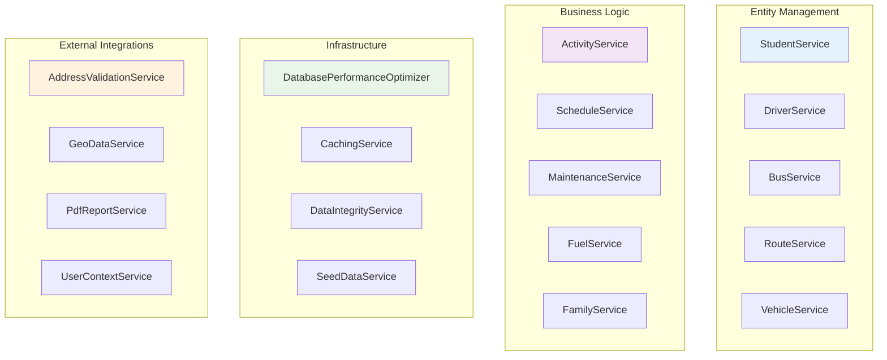

# 🏗️ BusBuddy Core Services API Reference

**Last Updated**: August 21, 2025  
**Purpose**: Centralized API documentation for all BusBuddy.Core services and interfaces  
**Target Audience**: Developers, GitHub Copilot, Technical Documentation

---

## 📋 **Service Categories Overview**



---

## 🎓 **Student Management Services**

### **IStudentService Interface**

```csharp
/// <summary>
/// Core service for student entity management and operations
/// </summary>
public interface IStudentService
{
    Task<Result<List<Student>>> GetAllStudentsAsync();
    Task<Result<Student>> GetStudentByIdAsync(int studentId);
    Task<Result<Student>> CreateStudentAsync(CreateStudentRequest request);
    Task<Result<Student>> UpdateStudentAsync(int studentId, UpdateStudentRequest request);
    Task<Result<bool>> DeleteStudentAsync(int studentId);
    Task<Result<List<Student>>> GetStudentsByRouteIdAsync(int routeId);
    Task<Result<List<Student>>> GetUnassignedStudentsAsync();
    Task<Result<bool>> AssignStudentToRouteAsync(int studentId, int routeId);
    Task<Result<bool>> ValidateStudentDataAsync(Student student);
}
```

**Key Features:**

- ✅ **CRUD Operations**: Complete Create, Read, Update, Delete functionality
- ✅ **Route Integration**: Student-to-route assignment capabilities
- ✅ **Data Validation**: Built-in validation for student data integrity
- ✅ **Result Pattern**: All methods return `Result<T>` for error handling
- ✅ **Async/Await**: Full asynchronous operation support

**Usage Examples:**

```csharp
// Get all students
var studentsResult = await _studentService.GetAllStudentsAsync();
if (studentsResult.IsSuccess)
{
    var students = studentsResult.Value;
    // Process students...
}

// Create new student
var createRequest = new CreateStudentRequest
{
    StudentNumber = "STU001",
    FirstName = "John",
    LastName = "Doe",
    // ... other properties
};
var newStudentResult = await _studentService.CreateStudentAsync(createRequest);
```

### **StudentService Implementation**

**Location**: `BusBuddy.Core/Services/StudentService.cs`  
**Dependencies**:

- `IDbContextFactory<AppDbContext>`
- `ILogger<StudentService>`
- `IValidator<Student>` (optional)

**Key Methods:**

- `GetAllStudentsAsync()` - Retrieves all active students
- `GetStudentsByRouteIdAsync(int routeId)` - Students on specific route
- `GetUnassignedStudentsAsync()` - Students without route assignment
- `ValidateStudentDataAsync(Student student)` - Data integrity validation

---

## 🚌 **Transportation Management Services**

### **IRouteService Interface**

```csharp
/// <summary>
/// Advanced route management with assignment and optimization capabilities
/// </summary>
public interface IRouteService
{
    // Basic CRUD Operations
    Task<Result<List<Route>>> GetAllRoutesAsync();
    Task<Result<Route>> GetRouteByIdAsync(int routeId);
    Task<Result<Route>> CreateRouteAsync(CreateRouteRequest request);
    Task<Result<Route>> UpdateRouteAsync(int routeId, UpdateRouteRequest request);
    Task<Result<bool>> DeleteRouteAsync(int routeId);

    // Advanced Route Assignment
    Task<Result<bool>> AssignStudentToRouteAsync(int studentId, int routeId);
    Task<Result<bool>> RemoveStudentFromRouteAsync(int studentId, int routeId);
    Task<Result<List<Student>>> GetUnassignedStudentsAsync();
    Task<Result<List<Route>>> GetRoutesWithCapacityAsync();

    // Route Analysis & Optimization
    Task<Result<bool>> ValidateRouteCapacityAsync(int routeId);
    Task<Result<bool>> CanAssignStudentToRouteAsync(int studentId, int routeId);
    Task<Result<RouteUtilizationStats>> GetRouteUtilizationStatsAsync();
    Task<Result<List<RouteOptimizationSuggestion>>> GetOptimizationSuggestionsAsync();
}
```

**Advanced Features:**

- 🎯 **Smart Assignment**: Intelligent student-to-route assignment with capacity validation
- 📊 **Analytics**: Route utilization statistics and optimization suggestions
- 🔍 **Validation**: Pre-assignment validation to prevent capacity overruns
- ⚡ **Performance**: Optimized queries with proper EF Core patterns

### **IBusService Interface**

```csharp
/// <summary>
/// Fleet management service for bus operations and maintenance
/// </summary>
public interface IBusService
{
    Task<Result<List<Bus>>> GetAllBusesAsync();
    Task<Result<Bus>> GetBusByIdAsync(int busId);
    Task<Result<List<Bus>>> GetAvailableBusesAsync();
    Task<Result<List<Bus>>> GetBusesByStatusAsync(BusStatus status);
    Task<Result<Bus>> CreateBusAsync(CreateBusRequest request);
    Task<Result<Bus>> UpdateBusAsync(int busId, UpdateBusRequest request);
    Task<Result<bool>> UpdateBusStatusAsync(int busId, BusStatus status);
    Task<Result<BusUtilizationReport>> GetBusUtilizationReportAsync();
}
```

### **IDriverService Interface**

```csharp
/// <summary>
/// Driver management with scheduling and availability tracking
/// </summary>
public interface IDriverService
{
    Task<Result<List<Driver>>> GetAllDriversAsync();
    Task<Result<Driver>> GetDriverByIdAsync(int driverId);
    Task<Result<List<Driver>>> GetAvailableDriversAsync();
    Task<Result<List<Driver>>> GetDriversByStatusAsync(DriverStatus status);
    Task<Result<Driver>> CreateDriverAsync(CreateDriverRequest request);
    Task<Result<Driver>> UpdateDriverAsync(int driverId, UpdateDriverRequest request);
    Task<Result<bool>> ValidateDriverLicenseAsync(int driverId);
    Task<Result<List<Driver>>> GetDriversWithExpiringLicensesAsync(int daysAhead = 30);
}
```

---

## 📅 **Scheduling & Activity Services**

### **IActivityService Interface**

```csharp
/// <summary>
/// Comprehensive activity management for extracurricular transportation
/// </summary>
public interface IActivityService
{
    Task<Result<List<Activity>>> GetAllActivitiesAsync();
    Task<Result<Activity>> GetActivityByIdAsync(int activityId);
    Task<Result<List<Activity>>> GetActivitiesByDateAsync(DateTime date);
    Task<Result<Activity>> CreateActivityAsync(CreateActivityRequest request);
    Task<Result<Activity>> UpdateActivityAsync(int activityId, UpdateActivityRequest request);
    Task<Result<bool>> DeleteActivityAsync(int activityId);
    Task<Result<List<ActivitySchedule>>> GetActivityScheduleAsync(int activityId);
}
```

### **IScheduleService Interface**

```csharp
/// <summary>
/// Route scheduling and timing optimization
/// </summary>
public interface IScheduleService
{
    Task<Result<List<RouteSchedule>>> GetRouteSchedulesAsync();
    Task<Result<RouteSchedule>> GetScheduleByRouteIdAsync(int routeId);
    Task<Result<RouteSchedule>> CreateScheduleAsync(CreateScheduleRequest request);
    Task<Result<RouteSchedule>> UpdateScheduleAsync(int scheduleId, UpdateScheduleRequest request);
    Task<Result<List<ScheduleConflict>>> ValidateScheduleConflictsAsync();
    Task<Result<ScheduleOptimizationResult>> OptimizeSchedulesAsync();
}
```

### **ISportsSchedulingService Interface**

```csharp
/// <summary>
/// Specialized sports event transportation scheduling
/// </summary>
public interface ISportsSchedulingService
{
    Task<Result<List<SportsEvent>>> GetUpcomingSportsEventsAsync();
    Task<Result<SportsTransportPlan>> CreateTransportPlanAsync(int eventId);
    Task<Result<bool>> AssignBusToSportsEventAsync(int eventId, int busId);
    Task<Result<List<SportsScheduleConflict>>> CheckScheduleConflictsAsync();
}
```

---

## 🛠️ **Maintenance & Fleet Services**

### **IMaintenanceService Interface**

```csharp
/// <summary>
/// Vehicle maintenance tracking and scheduling
/// </summary>
public interface IMaintenanceService
{
    Task<Result<List<MaintenanceRecord>>> GetMaintenanceHistoryAsync(int vehicleId);
    Task<Result<MaintenanceRecord>> CreateMaintenanceRecordAsync(CreateMaintenanceRequest request);
    Task<Result<List<MaintenanceReminder>>> GetUpcomingMaintenanceAsync();
    Task<Result<List<Vehicle>>> GetVehiclesDueForMaintenanceAsync();
    Task<Result<MaintenanceSchedule>> ScheduleMaintenanceAsync(ScheduleMaintenanceRequest request);
    Task<Result<bool>> CompleteMaintenanceAsync(int recordId, CompleteMaintenanceRequest request);
}
```

### **IFuelService Interface**

```csharp
/// <summary>
/// Fuel consumption tracking and cost analysis
/// </summary>
public interface IFuelService
{
    Task<Result<List<FuelRecord>>> GetFuelRecordsAsync(int vehicleId);
    Task<Result<FuelRecord>> AddFuelRecordAsync(CreateFuelRecordRequest request);
    Task<Result<FuelEfficiencyReport>> GetFuelEfficiencyReportAsync(DateTime startDate, DateTime endDate);
    Task<Result<List<FuelAlert>>> GetFuelAlertsAsync();
    Task<Result<FuelCostAnalysis>> AnalyzeFuelCostsAsync(int vehicleId, int months = 12);
}
```

---

## 👨‍👩‍👧‍👦 **Family & Guardian Services**

### **IFamilyService Interface**

```csharp
/// <summary>
/// Family and guardian relationship management
/// </summary>
public interface IFamilyService
{
    Task<Result<List<Family>>> GetAllFamiliesAsync();
    Task<Result<Family>> GetFamilyByIdAsync(int familyId);
    Task<Result<Family>> CreateFamilyAsync(CreateFamilyRequest request);
    Task<Result<Family>> UpdateFamilyAsync(int familyId, UpdateFamilyRequest request);
    Task<Result<List<Student>>> GetStudentsInFamilyAsync(int familyId);
    Task<Result<bool>> AddStudentToFamilyAsync(int studentId, int familyId);
    Task<Result<bool>> RemoveStudentFromFamilyAsync(int studentId, int familyId);
}
```

### **IGuardianService Interface**

```csharp
/// <summary>
/// Guardian contact management and communication
/// </summary>
public interface IGuardianService
{
    Task<Result<List<Guardian>>> GetAllGuardiansAsync();
    Task<Result<Guardian>> GetGuardianByIdAsync(int guardianId);
    Task<Result<List<Guardian>>> GetGuardiansByStudentIdAsync(int studentId);
    Task<Result<Guardian>> CreateGuardianAsync(CreateGuardianRequest request);
    Task<Result<Guardian>> UpdateGuardianAsync(int guardianId, UpdateGuardianRequest request);
    Task<Result<bool>> AssignGuardianToStudentAsync(int guardianId, int studentId);
    Task<Result<List<EmergencyContact>>> GetEmergencyContactsAsync(int studentId);
}
```

---

## 🗺️ **Geographic & Address Services**

### **IGeoDataService Interface**

```csharp
/// <summary>
/// Geographic data processing and spatial analysis
/// </summary>
public interface IGeoDataService
{
    Task<Result<GeoLocation>> GeocodeAddressAsync(string address);
    Task<Result<string>> ReverseGeocodeAsync(double latitude, double longitude);
    Task<Result<double>> CalculateDistanceAsync(GeoLocation point1, GeoLocation point2);
    Task<Result<RouteGeometry>> GetRouteGeometryAsync(List<GeoLocation> waypoints);
    Task<Result<List<GeoLocation>>> GetOptimalRouteSequenceAsync(List<GeoLocation> stops);
}
```

### **IAddressValidationService Interface**

```csharp
/// <summary>
/// Address validation and standardization
/// </summary>
public interface IAddressValidationService
{
    Task<Result<AddressValidationResult>> ValidateAddressAsync(string address);
    Task<Result<StandardizedAddress>> StandardizeAddressAsync(string address);
    Task<Result<List<AddressSuggestion>>> GetAddressSuggestionsAsync(string partialAddress);
    Task<Result<bool>> IsAddressServableAsync(string address, int maxDistanceFromSchool = 25);
}
```

---

## 💾 **Data & Infrastructure Services**

### **ISeedDataService Interface**

```csharp
/// <summary>
/// Development and testing data seeding
/// </summary>
public interface ISeedDataService
{
    Task<Result<bool>> SeedAllDataAsync();
    Task<Result<bool>> SeedStudentsAsync(int count = 100);
    Task<Result<bool>> SeedRoutesAsync(int count = 10);
    Task<Result<bool>> SeedVehiclesAsync(int count = 15);
    Task<Result<bool>> SeedDriversAsync(int count = 20);
    Task<Result<bool>> ClearAllDataAsync();
    Task<Result<SeedDataReport>> GenerateSeedDataReportAsync();
}
```

### **DatabasePerformanceOptimizer**

```csharp
/// <summary>
/// Database performance monitoring and optimization
/// </summary>
public class DatabasePerformanceOptimizer
{
    public async Task<PerformanceMetrics> AnalyzeQueryPerformanceAsync();
    public async Task<List<OptimizationSuggestion>> GetOptimizationSuggestionsAsync();
    public async Task<bool> OptimizeIndexesAsync();
    public async Task<DatabaseHealthReport> GenerateHealthReportAsync();
}
```

### **DataIntegrityService**

```csharp
/// <summary>
/// Data validation and integrity checking
/// </summary>
public class DataIntegrityService
{
    public async Task<IntegrityReport> ValidateDataIntegrityAsync();
    public async Task<List<OrphanedRecord>> FindOrphanedRecordsAsync();
    public async Task<bool> FixDataInconsistenciesAsync();
    public async Task<ValidationResult> ValidateBusinessRulesAsync();
}
```

---

## 🔧 **Utility & Helper Services**

### **UserContextService**

```csharp
/// <summary>
/// User session and context management
/// </summary>
public class UserContextService : IUserContextService
{
    public Task<UserContext> GetCurrentUserContextAsync();
    public Task<bool> SetUserPreferencesAsync(UserPreferences preferences);
    public Task<List<UserRole>> GetUserRolesAsync(string userId);
    public Task<bool> HasPermissionAsync(string userId, string permission);
}
```

### **PdfReportService**

```csharp
/// <summary>
/// PDF report generation for various entities
/// </summary>
public class PdfReportService
{
    public async Task<byte[]> GenerateStudentRosterAsync(int routeId);
    public async Task<byte[]> GenerateMaintenanceReportAsync(int vehicleId);
    public async Task<byte[]> GenerateFuelEfficiencyReportAsync(DateTime startDate, DateTime endDate);
    public async Task<byte[]> GenerateActivityScheduleAsync(int activityId);
}
```

---

## 🏗️ **Service Registration & Dependency Injection**

### **Service Container Configuration**

```csharp
// Located in: BusBuddy.Core/Services/ServiceContainer.cs
public static class ServiceContainer
{
    public static IServiceCollection RegisterCoreServices(this IServiceCollection services)
    {
        // Entity Services
        services.AddScoped<IStudentService, StudentService>();
        services.AddScoped<IDriverService, DriverService>();
        services.AddScoped<IBusService, BusService>();
        services.AddScoped<IRouteService, RouteService>();

        // Business Logic Services
        services.AddScoped<IActivityService, ActivityService>();
        services.AddScoped<IScheduleService, ScheduleService>();
        services.AddScoped<IMaintenanceService, MaintenanceService>();
        services.AddScoped<IFuelService, FuelService>();

        // Infrastructure Services
        services.AddScoped<DatabasePerformanceOptimizer>();
        services.AddScoped<DataIntegrityService>();
        services.AddScoped<ISeedDataService, SeedDataService>();

        // External Integration Services
        services.AddScoped<IAddressValidationService, AddressValidationService>();
        services.AddScoped<IGeoDataService, GeoDataService>();
        services.AddScoped<PdfReportService>();

        return services;
    }
}
```

### **Usage in Startup Configuration**

```csharp
// In Program.cs or Startup.cs
services.RegisterCoreServices();

// Additional configuration
services.AddDbContextFactory<AppDbContext>(options =>
    options.UseSqlServer(connectionString));

services.AddLogging(builder =>
    builder.AddSerilog());
```

---

## 📊 **Performance Guidelines**

### **Service Performance Best Practices**

1. **Async/Await Patterns**

    ```csharp
    // ✅ Correct async implementation
    public async Task<Result<List<Student>>> GetStudentsAsync()
    {
        var students = await _context.Students
            .AsNoTracking()
            .ToListAsync();
        return Result<List<Student>>.Success(students);
    }
    ```

2. **Efficient EF Core Queries**

    ```csharp
    // ✅ Optimized query with includes
    var routes = await _context.Routes
        .Include(r => r.Students)
        .Include(r => r.Bus)
        .Include(r => r.Driver)
        .AsNoTracking()
        .ToListAsync();
    ```

3. **Result Pattern Usage**
    ```csharp
    // ✅ Proper error handling with Result<T>
    try
    {
        var entity = await _repository.GetAsync(id);
        return entity != null
            ? Result<Entity>.Success(entity)
            : Result<Entity>.Failure("Entity not found");
    }
    catch (Exception ex)
    {
        _logger.LogError(ex, "Error retrieving entity {Id}", id);
        return Result<Entity>.Failure($"Database error: {ex.Message}");
    }
    ```

### **Memory & Performance Considerations**

- 🔄 **Use `AsNoTracking()`** for read-only operations
- 📊 **Implement pagination** for large data sets
- 🗃️ **Use `Include()`** strategically to avoid N+1 queries
- ⚡ **Cache frequently accessed data** with `EnhancedCachingService`
- 📝 **Log performance metrics** for optimization analysis

---

## 🧪 **Testing Guidelines**

### **Service Testing Patterns**

```csharp
[Test]
public async Task GetStudentByIdAsync_ValidId_ReturnsStudent()
{
    // Arrange
    var studentId = 1;
    var expectedStudent = new Student { Id = studentId, Name = "Test Student" };
    _mockRepository.Setup(r => r.GetByIdAsync(studentId))
               .ReturnsAsync(expectedStudent);

    // Act
    var result = await _studentService.GetStudentByIdAsync(studentId);

    // Assert
    Assert.IsTrue(result.IsSuccess);
    Assert.AreEqual(expectedStudent.Name, result.Value.Name);
}
```

### **Integration Testing Setup**

```csharp
[TestFixture]
public class StudentServiceIntegrationTests
{
    private IServiceProvider _serviceProvider;
    private IStudentService _studentService;

    [SetUp]
    public void Setup()
    {
        var services = new ServiceCollection();
        services.RegisterCoreServices();
        services.AddDbContext<AppDbContext>(options =>
            options.UseInMemoryDatabase("TestDb"));

        _serviceProvider = services.BuildServiceProvider();
        _studentService = _serviceProvider.GetRequiredService<IStudentService>();
    }
}
```

---

## 📚 **Related Documentation**

- 📖 [Route Assignment Logic with Diagrams](./Route-Assignment-Logic.md)
- 🎨 [UI Service Integration Guide](../Development/UI-Service-Integration.md)
- 🔧 [Database Configuration Reference](../DATABASE-CONFIGURATION.md)
- 🧪 [Testing Standards](../../BusBuddy.Tests/TESTING-STANDARDS.md)
- 🏗️ [Architecture Overview](../ORGANIZATION-SUMMARY.md)

---

## 🔄 **Version History**

| Version | Date         | Changes                                          |
| ------- | ------------ | ------------------------------------------------ |
| 1.0     | Aug 21, 2025 | Initial comprehensive API reference              |
| 1.1     | Aug 21, 2025 | Added visual diagrams and performance guidelines |

**Maintained by**: BusBuddy Development Team  
**Contact**: See CONTRIBUTING.md for contribution guidelines
