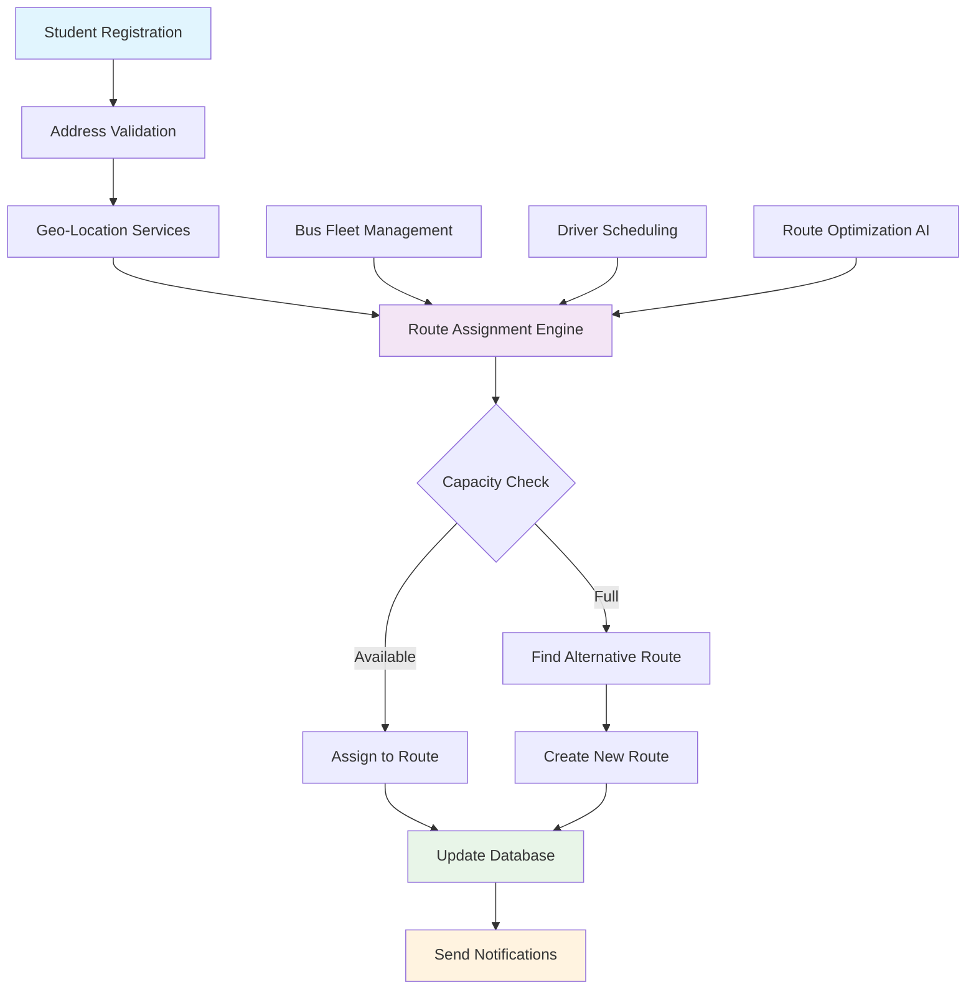
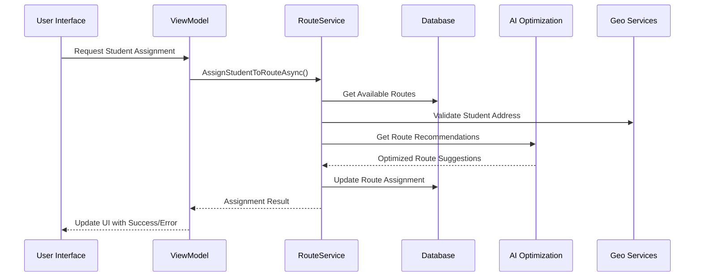
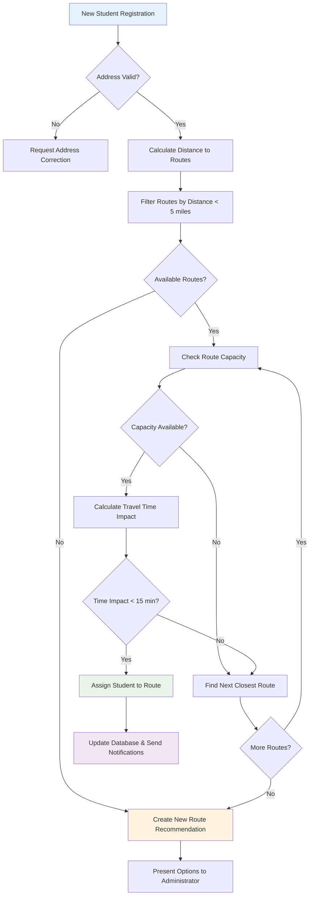
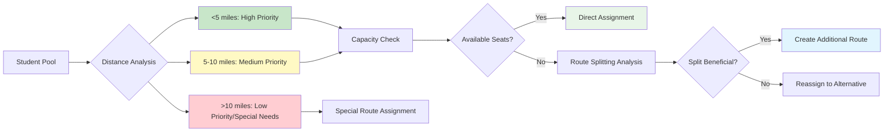
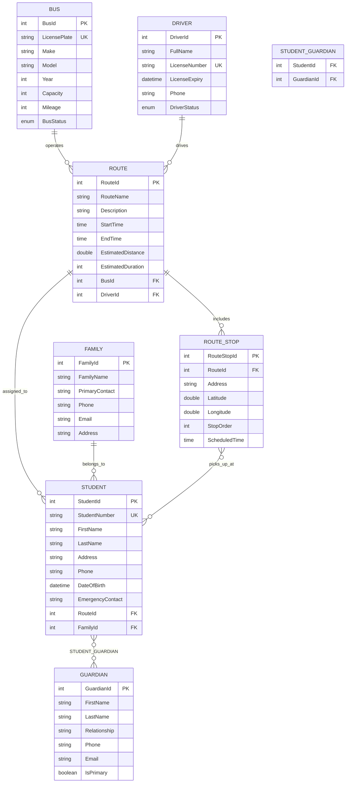
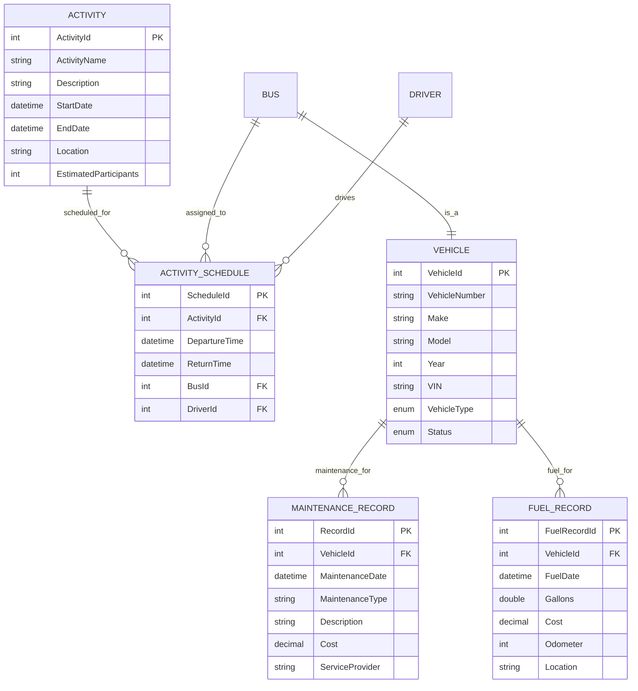

# 🗺️ Route Assignment Logic - Enhanced Documentation with Diagrams

**Part of BusBuddy Copilot Reference Hub**  
**Last Updated**: August 21, 2025  
**Purpose**: Comprehensive guide to route assignment logic, optimization patterns, and visual diagrams for developers

---

## 📊 **Route Assignment System Overview**

### **System Architecture Diagram**



### **Data Flow Architecture**



## 🧠 **Route Assignment Architecture**

### **Core Route Models**

```csharp
// BusBuddy.Core/Models/Route.cs
public class Route
{
    public int RouteId { get; set; }

    [Required, MaxLength(50)]
    public string RouteName { get; set; } = string.Empty;

    [MaxLength(200)]
    public string Description { get; set; } = string.Empty;

    public TimeSpan StartTime { get; set; }
    public TimeSpan EndTime { get; set; }

    public double EstimatedDistance { get; set; } // in miles
    public int EstimatedDuration { get; set; } // in minutes

    // Navigation Properties
    public int BusId { get; set; }
    public Bus Bus { get; set; } = null!;

    public int DriverId { get; set; }
    public Driver Driver { get; set; } = null!;

    public List<Student> Students { get; set; } = new();
    public List<RouteStop> Stops { get; set; } = new();

    // Computed Properties
    public int StudentCount => Students.Count;
    public bool IsAtCapacity => Students.Count >= Bus.Capacity;
    public double UtilizationRate => Bus.Capacity > 0 ? (double)Students.Count / Bus.Capacity : 0;
}

public class Bus
{
    public int BusId { get; set; }

    [Required, MaxLength(20)]
    public string LicensePlate { get; set; } = string.Empty;

    [Required, MaxLength(50)]
    public string Make { get; set; } = string.Empty;

    [Required, MaxLength(50)]
    public string Model { get; set; } = string.Empty;

    public int Year { get; set; }
    public int Capacity { get; set; }
    public int Mileage { get; set; }

    public BusStatus Status { get; set; } = BusStatus.Active;

    // Navigation Properties
    public List<Route> Routes { get; set; } = new();
}

public class Driver
{
    public int DriverId { get; set; }

    [Required, MaxLength(100)]
    public string FullName { get; set; } = string.Empty;

    [Required, MaxLength(20)]
    public string LicenseNumber { get; set; } = string.Empty;

    public DateTime LicenseExpiry { get; set; }

    [Phone]
    public string Phone { get; set; } = string.Empty;

    public DriverStatus Status { get; set; } = DriverStatus.Active;

    // Navigation Properties
    public List<Route> Routes { get; set; } = new();
}

public class RouteStop
{
    public int RouteStopId { get; set; }
    public int RouteId { get; set; }
    public Route Route { get; set; } = null!;

    [Required, MaxLength(200)]
    public string Address { get; set; } = string.Empty;

    public double Latitude { get; set; }
    public double Longitude { get; set; }

    public int StopOrder { get; set; }
    public TimeSpan ScheduledTime { get; set; }

    public List<Student> Students { get; set; } = new();
}

public enum BusStatus { Active, Maintenance, OutOfService }
public enum DriverStatus { Active, OnLeave, Inactive }
```

---

## 🎯 **Route Assignment Decision Flow**

### **Student Assignment Logic Flowchart**



### **Route Optimization Decision Matrix**



### **Bus Capacity Optimization Chart**

```mermaid
gantt
    title Route Capacity Utilization Timeline
    dateFormat  HH:mm
    axisFormat %H:%M

    section Route A (Capacity: 54)
    Morning Pickup    :done, morning-a, 07:00, 08:30
    Afternoon Return  :done, afternoon-a, 15:00, 16:30

    section Route B (Capacity: 48)
    Morning Pickup    :done, morning-b, 07:15, 08:45
    Afternoon Return  :done, afternoon-b, 15:15, 16:45

    section Route C (Capacity: 36)
    Morning Pickup    :active, morning-c, 07:30, 09:00
    Afternoon Return  :afternoon-c, 15:30, 17:00
```



---

## 🗂️ **Entity Relationship Diagram**

### **Core Transportation Entities**



### **Extended Business Logic Entities**



---

## 🤖 **xAI Grok API Integration**

### **Grok API Service Implementation**

```csharp
// BusBuddy.Core/Services/GrokRouteOptimizationService.cs
public interface IGrokRouteOptimizationService
{
    Task<RouteOptimizationResult> OptimizeRoutesAsync(List<Student> students, List<Bus> buses, List<Driver> drivers);
    Task<StudentAssignmentResult> AssignStudentToOptimalRouteAsync(Student student, List<Route> availableRoutes);
    Task<RouteEfficiencyAnalysis> AnalyzeRouteEfficiencyAsync(Route route);
    Task<string> GenerateRouteRecommendationsAsync(RouteOptimizationRequest request);
}

public class GrokRouteOptimizationService : IGrokRouteOptimizationService
{
    private readonly HttpClient _httpClient;
    private readonly IConfiguration _configuration;
    private readonly ILogger<GrokRouteOptimizationService> _logger;
    private readonly string _apiKey;
    private readonly string _baseUrl;

    public GrokRouteOptimizationService(
        HttpClient httpClient,
        IConfiguration configuration,
        ILogger<GrokRouteOptimizationService> logger)
    {
        _httpClient = httpClient;
        _configuration = configuration;
        _logger = logger;
        _apiKey = _configuration["XAI:ApiKey"] ?? throw new InvalidOperationException("XAI API key not configured");
        _baseUrl = _configuration["XAI:BaseUrl"] ?? "https://api.x.ai/v1";

        _httpClient.DefaultRequestHeaders.Authorization = new("Bearer", _apiKey);
    }

    public async Task<RouteOptimizationResult> OptimizeRoutesAsync(
        List<Student> students,
        List<Bus> buses,
        List<Driver> drivers)
    {
        try
        {
            _logger.LogInformation("Starting route optimization for {StudentCount} students", students.Count);

            var optimizationPrompt = BuildOptimizationPrompt(students, buses, drivers);

            var grokRequest = new GrokChatRequest
            {
                Model = "grok-beta",
                Messages = new[]
                {
                    new GrokMessage
                    {
                        Role = "system",
                        Content = "You are an expert transportation logistics optimizer specializing in school bus routing. Analyze student addresses, bus capacities, and driver availability to create optimal route assignments that minimize travel time while maximizing bus utilization."
                    },
                    new GrokMessage
                    {
                        Role = "user",
                        Content = optimizationPrompt
                    }
                },
                MaxTokens = 4000,
                Temperature = 0.3 // Lower temperature for more consistent optimization
            };

            var response = await SendGrokRequestAsync(grokRequest);
            return ParseOptimizationResponse(response, students, buses, drivers);
        }
        catch (Exception ex)
        {
            _logger.LogError(ex, "Error during route optimization");
            throw new RouteOptimizationException("Failed to optimize routes using Grok API", ex);
        }
    }

    public async Task<StudentAssignmentResult> AssignStudentToOptimalRouteAsync(
        Student student,
        List<Route> availableRoutes)
    {
        try
        {
            var assignmentPrompt = BuildStudentAssignmentPrompt(student, availableRoutes);

            var grokRequest = new GrokChatRequest
            {
                Model = "grok-beta",
                Messages = new[]
                {
                    new GrokMessage
                    {
                        Role = "system",
                        Content = "You are a school transportation coordinator. Analyze a student's location and available bus routes to recommend the optimal route assignment based on proximity, capacity, and efficiency."
                    },
                    new GrokMessage
                    {
                        Role = "user",
                        Content = assignmentPrompt
                    }
                },
                MaxTokens = 1000,
                Temperature = 0.2
            };

            var response = await SendGrokRequestAsync(grokRequest);
            return ParseAssignmentResponse(response, student, availableRoutes);
        }
        catch (Exception ex)
        {
            _logger.LogError(ex, "Error assigning student {StudentId} to route", student.StudentId);
            throw new StudentAssignmentException($"Failed to assign student {student.StudentId}", ex);
        }
    }

    private string BuildOptimizationPrompt(List<Student> students, List<Bus> buses, List<Driver> drivers)
    {
        var prompt = new StringBuilder();
        prompt.AppendLine("Please optimize bus routes for the following school transportation scenario:");
        prompt.AppendLine();

        prompt.AppendLine("STUDENTS TO ASSIGN:");
        foreach (var student in students.Take(50)) // Limit for token constraints
        {
            prompt.AppendLine($"- Student {student.StudentId}: {student.FullName}, Grade {student.Grade}, Address: {student.Address}");
        }

        prompt.AppendLine();
        prompt.AppendLine("AVAILABLE BUSES:");
        foreach (var bus in buses)
        {
            prompt.AppendLine($"- Bus {bus.BusId}: {bus.LicensePlate}, Capacity: {bus.Capacity}, Status: {bus.Status}");
        }

        prompt.AppendLine();
        prompt.AppendLine("AVAILABLE DRIVERS:");
        foreach (var driver in drivers)
        {
            prompt.AppendLine($"- Driver {driver.DriverId}: {driver.FullName}, Status: {driver.Status}");
        }

        prompt.AppendLine();
        prompt.AppendLine("OPTIMIZATION CRITERIA:");
        prompt.AppendLine("1. Minimize total travel distance");
        prompt.AppendLine("2. Maximize bus capacity utilization (target 80-90%)");
        prompt.AppendLine("3. Group students by geographic proximity");
        prompt.AppendLine("4. Consider grade levels for appropriate grouping");
        prompt.AppendLine("5. Ensure no bus exceeds capacity");
        prompt.AppendLine();
        prompt.AppendLine("Please provide a JSON response with route assignments in the following format:");
        prompt.AppendLine(GetOptimizationResponseFormat());

        return prompt.ToString();
    }

    private string GetOptimizationResponseFormat()
    {
        return @"{
  ""routes"": [
    {
      ""routeId"": 1,
      ""routeName"": ""Route A"",
      ""busId"": 1,
      ""driverId"": 1,
      ""estimatedDistance"": 15.5,
      ""estimatedDuration"": 45,
      ""students"": [1, 2, 3],
      ""stops"": [
        {
          ""address"": ""123 Main St"",
          ""stopOrder"": 1,
          ""studentIds"": [1]
        }
      ],
      ""utilizationRate"": 0.75,
      ""efficiency"": 0.85
    }
  ],
  ""optimization_summary"": {
    ""totalStudents"": 50,
    ""totalRoutes"": 5,
    ""averageUtilization"": 0.82,
    ""totalDistance"": 125.5,
    ""recommendations"": [""Consider adding Route F for better coverage""]
  }
}";
    }

    private async Task<string> SendGrokRequestAsync(GrokChatRequest request)
    {
        var jsonContent = JsonSerializer.Serialize(request, new JsonSerializerOptions
        {
            PropertyNamingPolicy = JsonNamingPolicy.SnakeCaseLower
        });

        var content = new StringContent(jsonContent, Encoding.UTF8, "application/json");

        var response = await _httpClient.PostAsync($"{_baseUrl}/chat/completions", content);

        if (!response.IsSuccessStatusCode)
        {
            var errorContent = await response.Content.ReadAsStringAsync();
            throw new HttpRequestException($"Grok API request failed: {response.StatusCode} - {errorContent}");
        }

        var responseContent = await response.Content.ReadAsStringAsync();
        var grokResponse = JsonSerializer.Deserialize<GrokChatResponse>(responseContent);

        return grokResponse?.Choices?.FirstOrDefault()?.Message?.Content ??
               throw new InvalidOperationException("Empty response from Grok API");
    }

    private RouteOptimizationResult ParseOptimizationResponse(
        string grokResponse,
        List<Student> students,
        List<Bus> buses,
        List<Driver> drivers)
    {
        try
        {
            // Extract JSON from response if wrapped in text
            var jsonStart = grokResponse.IndexOf('{');
            var jsonEnd = grokResponse.LastIndexOf('}') + 1;

            if (jsonStart >= 0 && jsonEnd > jsonStart)
            {
                var jsonResponse = grokResponse.Substring(jsonStart, jsonEnd - jsonStart);
                var optimizationData = JsonSerializer.Deserialize<GrokOptimizationResponse>(jsonResponse);

                return ConvertToRouteOptimizationResult(optimizationData, students, buses, drivers);
            }

            throw new InvalidOperationException("No valid JSON found in Grok response");
        }
        catch (Exception ex)
        {
            _logger.LogError(ex, "Failed to parse Grok optimization response");
            throw new RouteOptimizationException("Failed to parse optimization response", ex);
        }
    }
}

// Supporting Models
public class GrokChatRequest
{
    public string Model { get; set; } = "grok-beta";
    public GrokMessage[] Messages { get; set; } = Array.Empty<GrokMessage>();
    public int MaxTokens { get; set; } = 4000;
    public double Temperature { get; set; } = 0.3;
}

public class GrokMessage
{
    public string Role { get; set; } = string.Empty;
    public string Content { get; set; } = string.Empty;
}

public class GrokChatResponse
{
    public GrokChoice[]? Choices { get; set; }
}

public class GrokChoice
{
    public GrokMessage? Message { get; set; }
}

public class RouteOptimizationResult
{
    public List<OptimizedRoute> Routes { get; set; } = new();
    public OptimizationSummary Summary { get; set; } = new();
    public List<string> Recommendations { get; set; } = new();
    public DateTime OptimizedAt { get; set; } = DateTime.UtcNow;
}

public class OptimizedRoute
{
    public int RouteId { get; set; }
    public string RouteName { get; set; } = string.Empty;
    public int BusId { get; set; }
    public int DriverId { get; set; }
    public List<int> StudentIds { get; set; } = new();
    public List<RouteStop> Stops { get; set; } = new();
    public double EstimatedDistance { get; set; }
    public int EstimatedDuration { get; set; }
    public double UtilizationRate { get; set; }
    public double EfficiencyScore { get; set; }
}

public class StudentAssignmentResult
{
    public int RecommendedRouteId { get; set; }
    public string RecommendedRouteName { get; set; } = string.Empty;
    public double ConfidenceScore { get; set; }
    public string Reasoning { get; set; } = string.Empty;
    public List<AlternativeRoute> Alternatives { get; set; } = new();
}

public class AlternativeRoute
{
    public int RouteId { get; set; }
    public string RouteName { get; set; } = string.Empty;
    public double Score { get; set; }
    public string Reason { get; set; } = string.Empty;
}
```

---

## 🎯 **Route Assignment UI Patterns**

### **Route Assignment View (XAML)**

```xml
<!-- BusBuddy.WPF/Views/RouteAssignmentView.xaml -->
<UserControl x:Class="BusBuddy.WPF.Views.RouteAssignmentView"
             xmlns="http://schemas.microsoft.com/winfx/2006/xaml/presentation"
             xmlns:x="http://schemas.microsoft.com/winfx/2006/xaml"
             xmlns:syncfusion="http://schemas.syncfusion.com/wpf">

    <Grid Margin="20">
        <Grid.RowDefinitions>
            <RowDefinition Height="Auto"/>
            <RowDefinition Height="Auto"/>
            <RowDefinition Height="*"/>
            <RowDefinition Height="Auto"/>
        </Grid.RowDefinitions>

        <!-- Header and Actions -->
        <Grid Grid.Row="0" Margin="0,0,0,20">
            <Grid.ColumnDefinitions>
                <ColumnDefinition Width="*"/>
                <ColumnDefinition Width="Auto"/>
            </Grid.ColumnDefinitions>

            <TextBlock Grid.Column="0" Text="Route Assignment Management"
                       FontSize="24" FontWeight="Bold" VerticalAlignment="Center"/>

            <StackPanel Grid.Column="1" Orientation="Horizontal">
                <syncfusion:SfButton Content="🤖 Optimize All Routes"
                                     Command="{Binding OptimizeAllRoutesCommand}"
                                     Style="{StaticResource PrimaryButtonStyle}"
                                     Margin="0,0,10,0"
                                     ToolTip="Use xAI Grok to optimize all route assignments"/>
                <syncfusion:SfButton Content="➕ Create Route"
                                     Command="{Binding CreateRouteCommand}"
                                     Style="{StaticResource SecondaryButtonStyle}"/>
            </StackPanel>
        </Grid>

        <!-- Filter and Search -->
        <Grid Grid.Row="1" Margin="0,0,0,15">
            <Grid.ColumnDefinitions>
                <ColumnDefinition Width="300"/>
                <ColumnDefinition Width="*"/>
                <ColumnDefinition Width="Auto"/>
            </Grid.ColumnDefinitions>

            <!-- Search -->
            <syncfusion:SfTextBox Grid.Column="0"
                                  Text="{Binding SearchText, Mode=TwoWay, UpdateSourceTrigger=PropertyChanged}"
                                  Watermark="Search routes or students..."
                                  Margin="0,0,10,0"/>

            <!-- View Toggle -->
            <StackPanel Grid.Column="2" Orientation="Horizontal">
                <TextBlock Text="View:" VerticalAlignment="Center" Margin="0,0,10,0"/>
                <syncfusion:SfComboBox ItemsSource="{Binding ViewModes}"
                                       SelectedValue="{Binding SelectedViewMode, Mode=TwoWay}"
                                       DisplayMemberPath="DisplayName"
                                       SelectedValuePath="Value"
                                       Width="120"/>
            </StackPanel>
        </Grid>

        <!-- Main Content Area -->
        <Grid Grid.Row="2">
            <Grid.ColumnDefinitions>
                <ColumnDefinition Width="2*"/>
                <ColumnDefinition Width="5"/>
                <ColumnDefinition Width="*"/>
            </Grid.ColumnDefinitions>

            <!-- Routes Grid -->
            <syncfusion:SfDataGrid Grid.Column="0"
                                   x:Name="RoutesDataGrid"
                                   ItemsSource="{Binding Routes}"
                                   SelectedItem="{Binding SelectedRoute, Mode=TwoWay}"
                                   AutoGenerateColumns="False"
                                   AllowEditing="False"
                                   AllowSorting="True"
                                   AllowFiltering="True"
                                   SelectionMode="Single">

                <syncfusion:SfDataGrid.Columns>
                    <syncfusion:GridTextColumn HeaderText="Route" MappingName="RouteName" Width="100"/>
                    <syncfusion:GridTextColumn HeaderText="Bus" MappingName="Bus.LicensePlate" Width="80"/>
                    <syncfusion:GridTextColumn HeaderText="Driver" MappingName="Driver.FullName" Width="120"/>
                    <syncfusion:GridNumericColumn HeaderText="Students" MappingName="StudentCount" Width="70"/>
                    <syncfusion:GridNumericColumn HeaderText="Capacity" MappingName="Bus.Capacity" Width="70"/>
                    <syncfusion:GridPercentColumn HeaderText="Utilization" MappingName="UtilizationRate" Width="80"/>
                    <syncfusion:GridTimeSpanColumn HeaderText="Start Time" MappingName="StartTime" Width="80"/>
                    <syncfusion:GridNumericColumn HeaderText="Distance" MappingName="EstimatedDistance" Width="80"/>
                </syncfusion:SfDataGrid.Columns>

                <syncfusion:SfDataGrid.DetailsViewDefinition>
                    <syncfusion:GridViewDefinition RelationalColumn="Students">
                        <syncfusion:GridViewDefinition.DataGrid>
                            <syncfusion:SfDataGrid AutoGenerateColumns="False">
                                <syncfusion:SfDataGrid.Columns>
                                    <syncfusion:GridTextColumn HeaderText="Student" MappingName="FullName" Width="150"/>
                                    <syncfusion:GridNumericColumn HeaderText="Grade" MappingName="Grade" Width="60"/>
                                    <syncfusion:GridTextColumn HeaderText="Address" MappingName="Address" Width="200"/>
                                    <syncfusion:GridTemplateColumn HeaderText="Actions" Width="100">
                                        <syncfusion:GridTemplateColumn.CellTemplate>
                                            <DataTemplate>
                                                <syncfusion:SfButton Content="Reassign"
                                                                     Command="{Binding DataContext.ReassignStudentCommand, RelativeSource={RelativeSource AncestorType=UserControl}}"
                                                                     CommandParameter="{Binding}"
                                                                     Style="{StaticResource SmallButtonStyle}"/>
                                            </DataTemplate>
                                        </syncfusion:GridTemplateColumn.CellTemplate>
                                    </syncfusion:GridTemplateColumn>
                                </syncfusion:SfDataGrid.Columns>
                            </syncfusion:SfDataGrid>
                        </syncfusion:GridViewDefinition.DataGrid>
                    </syncfusion:GridViewDefinition>
                </syncfusion:SfDataGrid.DetailsViewDefinition>
            </syncfusion:SfDataGrid>

            <!-- Splitter -->
            <GridSplitter Grid.Column="1" HorizontalAlignment="Stretch" Background="LightGray"/>

            <!-- Route Details Panel -->
            <ScrollViewer Grid.Column="2" VerticalScrollBarVisibility="Auto">
                <StackPanel Margin="15,0,0,0" DataContext="{Binding SelectedRoute}">
                    <TextBlock Text="Route Details" FontSize="18" FontWeight="Bold" Margin="0,0,0,15"/>

                    <!-- Route Info -->
                    <Grid Visibility="{Binding Converter={StaticResource NullToVisibilityConverter}}">
                        <Grid.RowDefinitions>
                            <RowDefinition Height="Auto"/>
                            <RowDefinition Height="Auto"/>
                            <RowDefinition Height="Auto"/>
                            <RowDefinition Height="Auto"/>
                            <RowDefinition Height="Auto"/>
                            <RowDefinition Height="Auto"/>
                        </Grid.RowDefinitions>

                        <TextBlock Grid.Row="0" Text="{Binding RouteName}" FontSize="16" FontWeight="SemiBold" Margin="0,0,0,10"/>

                        <StackPanel Grid.Row="1" Margin="0,0,0,10">
                            <TextBlock Text="Bus Information" FontWeight="SemiBold" Margin="0,0,0,5"/>
                            <TextBlock Text="{Binding Bus.LicensePlate, StringFormat='License: {0}'}"/>
                            <TextBlock Text="{Binding Bus.Make, StringFormat='Make: {0}'}"/>
                            <TextBlock Text="{Binding Bus.Capacity, StringFormat='Capacity: {0} students'}"/>
                        </StackPanel>

                        <StackPanel Grid.Row="2" Margin="0,0,0,10">
                            <TextBlock Text="Driver Information" FontWeight="SemiBold" Margin="0,0,0,5"/>
                            <TextBlock Text="{Binding Driver.FullName}"/>
                            <TextBlock Text="{Binding Driver.Phone, StringFormat='Phone: {0}'}"/>
                        </StackPanel>

                        <StackPanel Grid.Row="3" Margin="0,0,0,10">
                            <TextBlock Text="Route Statistics" FontWeight="SemiBold" Margin="0,0,0,5"/>
                            <TextBlock Text="{Binding StudentCount, StringFormat='Students: {0}'}"/>
                            <TextBlock Text="{Binding UtilizationRate, StringFormat='Utilization: {0:P0}'}"/>
                            <TextBlock Text="{Binding EstimatedDistance, StringFormat='Distance: {0:F1} miles'}"/>
                            <TextBlock Text="{Binding EstimatedDuration, StringFormat='Duration: {0} minutes'}"/>
                        </StackPanel>

                        <!-- Grok AI Actions -->
                        <StackPanel Grid.Row="4" Margin="0,0,0,15">
                            <TextBlock Text="AI Optimization" FontWeight="SemiBold" Margin="0,0,0,5"/>
                            <syncfusion:SfButton Content="🤖 Optimize This Route"
                                                 Command="{Binding DataContext.OptimizeRouteCommand, RelativeSource={RelativeSource AncestorType=UserControl}}"
                                                 CommandParameter="{Binding}"
                                                 Style="{StaticResource SmallPrimaryButtonStyle}"
                                                 Margin="0,0,0,5"/>
                            <syncfusion:SfButton Content="📊 Analyze Efficiency"
                                                 Command="{Binding DataContext.AnalyzeEfficiencyCommand, RelativeSource={RelativeSource AncestorType=UserControl}}"
                                                 CommandParameter="{Binding}"
                                                 Style="{StaticResource SmallSecondaryButtonStyle}"/>
                        </StackPanel>

                        <!-- Unassigned Students -->
                        <StackPanel Grid.Row="5">
                            <TextBlock Text="Quick Assign Students" FontWeight="SemiBold" Margin="0,0,0,5"/>
                            <syncfusion:SfComboBox ItemsSource="{Binding DataContext.UnassignedStudents, RelativeSource={RelativeSource AncestorType=UserControl}}"
                                                   SelectedValue="{Binding DataContext.SelectedUnassignedStudent, RelativeSource={RelativeSource AncestorType=UserControl}, Mode=TwoWay}"
                                                   DisplayMemberPath="FullName"
                                                   Watermark="Select student to assign..."
                                                   Margin="0,0,0,5"/>
                            <syncfusion:SfButton Content="🎯 AI Suggest Assignment"
                                                 Command="{Binding DataContext.SuggestAssignmentCommand, RelativeSource={RelativeSource AncestorType=UserControl}}"
                                                 Style="{StaticResource SmallPrimaryButtonStyle}"/>
                        </StackPanel>
                    </Grid>
                </StackPanel>
            </ScrollViewer>
        </Grid>

        <!-- Status Bar -->
        <Border Grid.Row="3" BorderThickness="0,1,0,0" BorderBrush="LightGray" Padding="0,10,0,0" Margin="0,15,0,0">
            <Grid>
                <Grid.ColumnDefinitions>
                    <ColumnDefinition Width="*"/>
                    <ColumnDefinition Width="Auto"/>
                </Grid.ColumnDefinitions>

                <StackPanel Grid.Column="0" Orientation="Horizontal">
                    <TextBlock Text="{Binding Routes.Count, StringFormat='Routes: {0}'}" Margin="0,0,20,0"/>
                    <TextBlock Text="{Binding TotalAssignedStudents, StringFormat='Assigned Students: {0}'}" Margin="0,0,20,0"/>
                    <TextBlock Text="{Binding UnassignedStudents.Count, StringFormat='Unassigned: {0}'}" Margin="0,0,20,0"/>
                    <TextBlock Text="{Binding AverageUtilization, StringFormat='Avg Utilization: {0:P0}'}"/>
                </StackPanel>

                <StackPanel Grid.Column="1" Orientation="Horizontal" Visibility="{Binding IsOptimizing, Converter={StaticResource BooleanToVisibilityConverter}}">
                    <syncfusion:SfBusyIndicator IsBusy="True" Width="16" Height="16" Margin="0,0,5,0"/>
                    <TextBlock Text="AI optimization in progress..." FontStyle="Italic"/>
                </StackPanel>
            </Grid>
        </Border>
    </Grid>
</UserControl>
```

---

## 🎯 **Route Assignment ViewModel**

```csharp
// BusBuddy.WPF/ViewModels/RouteAssignmentViewModel.cs
public class RouteAssignmentViewModel : BaseViewModel
{
    private readonly IGrokRouteOptimizationService _grokService;
    private readonly IRouteService _routeService;
    private readonly IStudentService _studentService;
    private readonly ILogger<RouteAssignmentViewModel> _logger;

    private ObservableCollection<Route> _routes = new();
    private ObservableCollection<Student> _unassignedStudents = new();
    private Route? _selectedRoute;
    private Student? _selectedUnassignedStudent;
    private string _searchText = string.Empty;
    private bool _isOptimizing;

    public RouteAssignmentViewModel(
        IGrokRouteOptimizationService grokService,
        IRouteService routeService,
        IStudentService studentService,
        ILogger<RouteAssignmentViewModel> logger)
    {
        _grokService = grokService;
        _routeService = routeService;
        _studentService = studentService;
        _logger = logger;

        // Commands
        OptimizeAllRoutesCommand = new RelayCommand(async () => await OptimizeAllRoutesAsync(), () => !IsOptimizing);
        OptimizeRouteCommand = new RelayCommand<Route>(async (route) => await OptimizeRouteAsync(route), (route) => route != null && !IsOptimizing);
        SuggestAssignmentCommand = new RelayCommand(async () => await SuggestAssignmentAsync(), CanSuggestAssignment);
        ReassignStudentCommand = new RelayCommand<Student>(async (student) => await ReassignStudentAsync(student));
        AnalyzeEfficiencyCommand = new RelayCommand<Route>(async (route) => await AnalyzeEfficiencyAsync(route));
        CreateRouteCommand = new RelayCommand(CreateRoute);

        LoadDataAsync();
    }

    // Properties
    public ObservableCollection<Route> Routes
    {
        get => _routes;
        set => SetProperty(ref _routes, value);
    }

    public ObservableCollection<Student> UnassignedStudents
    {
        get => _unassignedStudents;
        set => SetProperty(ref _unassignedStudents, value);
    }

    public Route? SelectedRoute
    {
        get => _selectedRoute;
        set
        {
            if (SetProperty(ref _selectedRoute, value))
            {
                OnPropertyChanged(nameof(HasSelectedRoute));
            }
        }
    }

    public Student? SelectedUnassignedStudent
    {
        get => _selectedUnassignedStudent;
        set
        {
            if (SetProperty(ref _selectedUnassignedStudent, value))
            {
                SuggestAssignmentCommand.NotifyCanExecuteChanged();
            }
        }
    }

    public string SearchText
    {
        get => _searchText;
        set
        {
            if (SetProperty(ref _searchText, value))
            {
                FilterRoutes();
            }
        }
    }

    public bool IsOptimizing
    {
        get => _isOptimizing;
        set
        {
            if (SetProperty(ref _isOptimizing, value))
            {
                OptimizeAllRoutesCommand.NotifyCanExecuteChanged();
                OptimizeRouteCommand.NotifyCanExecuteChanged();
            }
        }
    }

    public bool HasSelectedRoute => SelectedRoute != null;

    public int TotalAssignedStudents => Routes.Sum(r => r.StudentCount);

    public double AverageUtilization => Routes.Count > 0 ? Routes.Average(r => r.UtilizationRate) : 0;

    // Commands
    public RelayCommand OptimizeAllRoutesCommand { get; }
    public RelayCommand<Route> OptimizeRouteCommand { get; }
    public RelayCommand SuggestAssignmentCommand { get; }
    public RelayCommand<Student> ReassignStudentCommand { get; }
    public RelayCommand<Route> AnalyzeEfficiencyCommand { get; }
    public RelayCommand CreateRouteCommand { get; }

    private async Task OptimizeAllRoutesAsync()
    {
        try
        {
            IsOptimizing = true;
            _logger.LogInformation("Starting global route optimization");

            ShowInfo("🤖 Grok AI is analyzing all routes for optimal assignments...");

            var allStudents = await _studentService.GetAllStudentsAsync();
            var buses = await _routeService.GetAvailableBusesAsync();
            var drivers = await _routeService.GetAvailableDriversAsync();

            var optimizationResult = await _grokService.OptimizeRoutesAsync(allStudents, buses, drivers);

            await ApplyOptimizationResult(optimizationResult);

            ShowSuccess($"✅ Route optimization complete! Optimized {optimizationResult.Routes.Count} routes with {optimizationResult.Summary.AverageUtilization:P0} average utilization.");

            if (optimizationResult.Recommendations.Any())
            {
                var recommendations = string.Join("\n", optimizationResult.Recommendations);
                ShowInfo($"🎯 AI Recommendations:\n{recommendations}");
            }
        }
        catch (Exception ex)
        {
            _logger.LogError(ex, "Failed to optimize routes");
            ShowError($"Route optimization failed: {ex.Message}");
        }
        finally
        {
            IsOptimizing = false;
        }
    }

    private async Task OptimizeRouteAsync(Route route)
    {
        try
        {
            _logger.LogInformation("Optimizing route {RouteId}", route.RouteId);

            ShowInfo($"🤖 Analyzing route {route.RouteName} for optimization...");

            var analysis = await _grokService.AnalyzeRouteEfficiencyAsync(route);

            // Show optimization suggestions
            var message = $"Route Analysis for {route.RouteName}:\n\n" +
                         $"Efficiency Score: {analysis.EfficiencyScore:P0}\n" +
                         $"Utilization: {route.UtilizationRate:P0}\n" +
                         $"Estimated Savings: {analysis.PotentialSavings}\n\n" +
                         $"Recommendations:\n{string.Join("\n", analysis.Recommendations)}";

            ShowInfo(message);
        }
        catch (Exception ex)
        {
            _logger.LogError(ex, "Failed to optimize route {RouteId}", route.RouteId);
            ShowError($"Route optimization failed: {ex.Message}");
        }
    }

    private async Task SuggestAssignmentAsync()
    {
        if (SelectedUnassignedStudent == null) return;

        try
        {
            _logger.LogInformation("Getting AI assignment suggestion for student {StudentId}", SelectedUnassignedStudent.StudentId);

            ShowInfo($"🤖 Grok AI is analyzing optimal route for {SelectedUnassignedStudent.FullName}...");

            var availableRoutes = Routes.Where(r => !r.IsAtCapacity).ToList();
            var suggestion = await _grokService.AssignStudentToOptimalRouteAsync(SelectedUnassignedStudent, availableRoutes);

            var recommendedRoute = Routes.FirstOrDefault(r => r.RouteId == suggestion.RecommendedRouteId);
            if (recommendedRoute != null)
            {
                var message = $"🎯 AI Recommendation for {SelectedUnassignedStudent.FullName}:\n\n" +
                             $"Recommended Route: {suggestion.RecommendedRouteName}\n" +
                             $"Confidence: {suggestion.ConfidenceScore:P0}\n\n" +
                             $"Reasoning: {suggestion.Reasoning}\n\n" +
                             "Would you like to apply this assignment?";

                var result = MessageBox.Show(message, "AI Route Assignment Suggestion",
                    MessageBoxButton.YesNo, MessageBoxImage.Question);

                if (result == MessageBoxResult.Yes)
                {
                    await AssignStudentToRoute(SelectedUnassignedStudent, recommendedRoute);
                }
            }
        }
        catch (Exception ex)
        {
            _logger.LogError(ex, "Failed to get assignment suggestion");
            ShowError($"Assignment suggestion failed: {ex.Message}");
        }
    }

    private bool CanSuggestAssignment()
    {
        return SelectedUnassignedStudent != null &&
               Routes.Any(r => !r.IsAtCapacity) &&
               !IsOptimizing;
    }

    private async Task AssignStudentToRoute(Student student, Route route)
    {
        try
        {
            await _routeService.AssignStudentToRouteAsync(student.StudentId, route.RouteId);

            // Update UI
            route.Students.Add(student);
            UnassignedStudents.Remove(student);

            // Refresh computed properties
            OnPropertyChanged(nameof(TotalAssignedStudents));
            OnPropertyChanged(nameof(AverageUtilization));

            ShowSuccess($"✅ {student.FullName} assigned to {route.RouteName}");

            _logger.LogInformation("Assigned student {StudentId} to route {RouteId}", student.StudentId, route.RouteId);
        }
        catch (Exception ex)
        {
            _logger.LogError(ex, "Failed to assign student to route");
            ShowError($"Assignment failed: {ex.Message}");
        }
    }
}
```

---

## 📚 **PowerShell Integration Commands**

### **Route Optimization Commands**

```powershell
# BusBuddy PowerShell Commands for Route Management

function Invoke-BusBuddyRouteOptimization {
    [CmdletBinding()]
    param(
        [Parameter()]
        [ValidateSet("All", "Single", "Unassigned")]
        [string]$OptimizationType = "All",

        [Parameter()]
        [int]$RouteId,

        [Parameter()]
        [switch]$DryRun
    )

    Write-Information "🤖 Starting Grok AI route optimization..." -InformationAction Continue

    try {
        $arguments = @("--optimize-routes", "--type", $OptimizationType)

        if ($RouteId) {
            $arguments += @("--route-id", $RouteId)
        }

        if ($DryRun) {
            $arguments += "--dry-run"
        }

        $result = & dotnet run --project "BusBuddy.WPF/BusBuddy.WPF.csproj" -- $arguments

        Write-Information "✅ Route optimization completed successfully" -InformationAction Continue
        return $result
    }
    catch {
        Write-Error "❌ Route optimization failed: $_"
        throw
    }
}

function Get-BusBuddyRouteAnalysis {
    [CmdletBinding()]
    param(
        [Parameter(Mandatory)]
        [int]$RouteId
    )

    Write-Information "📊 Analyzing route $RouteId with Grok AI..." -InformationAction Continue

    $arguments = @("--analyze-route", "--route-id", $RouteId, "--output", "json")
    $result = & dotnet run --project "BusBuddy.WPF/BusBuddy.WPF.csproj" -- $arguments

    return $result | ConvertFrom-Json
}

function Start-BusBuddyStudentAssignment {
    [CmdletBinding()]
    param(
        [Parameter(Mandatory)]
        [int]$StudentId,

        [Parameter()]
        [int]$PreferredRouteId
    )

    Write-Information "🎯 Getting AI assignment suggestion for student $StudentId..." -InformationAction Continue

    $arguments = @("--suggest-assignment", "--student-id", $StudentId)

    if ($PreferredRouteId) {
        $arguments += @("--preferred-route", $PreferredRouteId)
    }

    $result = & dotnet run --project "BusBuddy.WPF/BusBuddy.WPF.csproj" -- $arguments
    return $result | ConvertFrom-Json
}
```

---

## 💡 **Practical Implementation Examples**

### **Real-World Route Assignment Scenarios**

#### **Scenario 1: New Student Registration with Optimal Route Assignment**

```csharp
public async Task<Result<StudentAssignmentResult>> ProcessNewStudentRegistration(
    CreateStudentRequest request)
{
    try
    {
        // 1. Validate and create student
        var studentResult = await _studentService.CreateStudentAsync(request);
        if (!studentResult.IsSuccess)
            return Result<StudentAssignmentResult>.Failure(studentResult.ErrorMessage);

        var student = studentResult.Value;

        // 2. Geocode student address
        var geoResult = await _geoDataService.GeocodeAddressAsync(student.Address);
        if (!geoResult.IsSuccess)
            return Result<StudentAssignmentResult>.Failure("Unable to validate student address");

        var studentLocation = geoResult.Value;

        // 3. Find nearby routes within 5-mile radius
        var nearbyRoutes = await _routeService.GetRoutesWithinRadiusAsync(
            studentLocation.Latitude,
            studentLocation.Longitude,
            radiusMiles: 5);

        if (!nearbyRoutes.Any())
        {
            // 4. Generate new route recommendation
            var newRouteRecommendation = await _grokOptimizationService
                .GenerateNewRouteRecommendationAsync(student, studentLocation);

            return Result<StudentAssignmentResult>.Success(new StudentAssignmentResult
            {
                Student = student,
                AssignmentType = AssignmentType.NewRouteRequired,
                Recommendation = newRouteRecommendation
            });
        }

        // 5. Use AI to find optimal route assignment
        var optimalAssignment = await _grokOptimizationService
            .AssignStudentToOptimalRouteAsync(student, nearbyRoutes);

        // 6. Validate capacity and constraints
        var validationResult = await _routeService.CanAssignStudentToRouteAsync(
            student.StudentId, optimalAssignment.RecommendedRouteId);

        if (validationResult.IsSuccess && validationResult.Value)
        {
            // 7. Execute assignment
            await _routeService.AssignStudentToRouteAsync(
                student.StudentId, optimalAssignment.RecommendedRouteId);

            return Result<StudentAssignmentResult>.Success(new StudentAssignmentResult
            {
                Student = student,
                AssignedRoute = optimalAssignment.Route,
                AssignmentType = AssignmentType.OptimalAssignment,
                ConfidenceScore = optimalAssignment.ConfidenceScore
            });
        }

        // 8. Fallback to alternative routes
        return await ProcessAlternativeRouteAssignment(student, nearbyRoutes);
    }
    catch (Exception ex)
    {
        _logger.LogError(ex, "Error processing new student registration for {StudentName}",
            request.FirstName + " " + request.LastName);
        return Result<StudentAssignmentResult>.Failure($"Registration failed: {ex.Message}");
    }
}
```

#### **Scenario 2: Route Optimization with Capacity Rebalancing**

```csharp
public async Task<Result<RouteOptimizationResult>> OptimizeDistrictRoutes()
{
    var optimizationSteps = new List<string>();

    try
    {
        // 1. Analyze current route utilization
        optimizationSteps.Add("Analyzing current route utilization...");
        var utilizationStats = await _routeService.GetRouteUtilizationStatsAsync();

        // 2. Identify overcrowded and underutilized routes
        var overcrowdedRoutes = utilizationStats.Value.Routes
            .Where(r => r.UtilizationRate > 0.95)
            .ToList();

        var underutilizedRoutes = utilizationStats.Value.Routes
            .Where(r => r.UtilizationRate < 0.60)
            .ToList();

        optimizationSteps.Add($"Found {overcrowdedRoutes.Count} overcrowded routes");
        optimizationSteps.Add($"Found {underutilizedRoutes.Count} underutilized routes");

        // 3. Get all students and current assignments
        var allStudents = await _studentService.GetAllStudentsAsync();
        var allRoutes = await _routeService.GetAllRoutesAsync();
        var allBuses = await _busService.GetAvailableBusesAsync();
        var allDrivers = await _driverService.GetAvailableDriversAsync();

        // 4. Run AI optimization
        optimizationSteps.Add("Running AI-powered route optimization...");
        var grokOptimization = await _grokOptimizationService.OptimizeRoutesAsync(
            allStudents.Value, allBuses.Value, allDrivers.Value);

        // 5. Analyze optimization suggestions
        var optimizationPlan = new RouteOptimizationPlan
        {
            CurrentState = utilizationStats.Value,
            ProposedChanges = grokOptimization.ProposedChanges,
            EstimatedImprovements = grokOptimization.EstimatedImprovements,
            OptimizationSteps = optimizationSteps
        };

        // 6. Validate proposed changes
        var validationResults = new List<ValidationResult>();
        foreach (var change in grokOptimization.ProposedChanges)
        {
            var validation = await ValidateRouteChangeAsync(change);
            validationResults.Add(validation);
        }

        // 7. Execute approved changes
        var executedChanges = new List<RouteChange>();
        foreach (var change in grokOptimization.ProposedChanges)
        {
            var validation = validationResults.First(v => v.ChangeId == change.ChangeId);
            if (validation.IsValid && validation.RiskLevel <= RiskLevel.Medium)
            {
                await ExecuteRouteChangeAsync(change);
                executedChanges.Add(change);
                optimizationSteps.Add($"Executed: {change.Description}");
            }
            else
            {
                optimizationSteps.Add($"Skipped: {change.Description} (Risk: {validation.RiskLevel})");
            }
        }

        return Result<RouteOptimizationResult>.Success(new RouteOptimizationResult
        {
            OptimizationPlan = optimizationPlan,
            ExecutedChanges = executedChanges,
            OptimizationSteps = optimizationSteps,
            PerformanceGains = await CalculatePerformanceGainsAsync(executedChanges)
        });
    }
    catch (Exception ex)
    {
        _logger.LogError(ex, "Route optimization failed");
        return Result<RouteOptimizationResult>.Failure($"Optimization failed: {ex.Message}");
    }
}
```

#### **Scenario 3: Emergency Route Reassignment**

```csharp
public async Task<Result<EmergencyReassignmentResult>> HandleEmergencyRouteReassignment(
    int affectedRouteId, EmergencyType emergencyType)
{
    var emergencySteps = new List<string>();

    try
    {
        emergencySteps.Add($"🚨 Emergency reassignment initiated for Route {affectedRouteId}");
        emergencySteps.Add($"Emergency Type: {emergencyType}");

        // 1. Get affected students
        var affectedStudents = await _routeService.GetStudentsByRouteIdAsync(affectedRouteId);
        emergencySteps.Add($"Found {affectedStudents.Value.Count} students requiring reassignment");

        // 2. Find alternative routes with capacity
        var alternativeRoutes = await _routeService.GetRoutesWithCapacityAsync();

        // 3. Calculate emergency assignments using AI
        var emergencyAssignments = new List<EmergencyAssignment>();

        foreach (var student in affectedStudents.Value)
        {
            var studentLocation = await _geoDataService.GeocodeAddressAsync(student.Address);

            // Find closest routes with capacity
            var nearbyRoutesWithCapacity = alternativeRoutes.Value
                .Where(r => r.AvailableSeats > 0)
                .Select(r => new
                {
                    Route = r,
                    Distance = CalculateDistance(studentLocation.Value, r.StartLocation)
                })
                .OrderBy(x => x.Distance)
                .Take(3)
                .Select(x => x.Route)
                .ToList();

            if (nearbyRoutesWithCapacity.Any())
            {
                // Use AI to determine best emergency assignment
                var aiRecommendation = await _grokOptimizationService
                    .GetEmergencyAssignmentRecommendationAsync(
                        student, nearbyRoutesWithCapacity, emergencyType);

                emergencyAssignments.Add(new EmergencyAssignment
                {
                    Student = student,
                    RecommendedRoute = aiRecommendation.Route,
                    ConfidenceScore = aiRecommendation.ConfidenceScore,
                    AlternativeRoutes = nearbyRoutesWithCapacity.Skip(1).ToList()
                });
            }
            else
            {
                // No available capacity - flag for manual intervention
                emergencyAssignments.Add(new EmergencyAssignment
                {
                    Student = student,
                    RequiresManualIntervention = true,
                    Reason = "No available capacity in nearby routes"
                });
            }
        }

        // 4. Execute emergency assignments
        var successfulAssignments = 0;
        var manualInterventionRequired = 0;

        foreach (var assignment in emergencyAssignments)
        {
            if (!assignment.RequiresManualIntervention)
            {
                try
                {
                    await _routeService.AssignStudentToRouteAsync(
                        assignment.Student.StudentId,
                        assignment.RecommendedRoute.RouteId);

                    successfulAssignments++;
                    emergencySteps.Add($"✅ Reassigned {assignment.Student.FullName} to Route {assignment.RecommendedRoute.RouteName}");
                }
                catch (Exception ex)
                {
                    assignment.RequiresManualIntervention = true;
                    assignment.Reason = ex.Message;
                    manualInterventionRequired++;
                    emergencySteps.Add($"❌ Failed to reassign {assignment.Student.FullName}: {ex.Message}");
                }
            }
            else
            {
                manualInterventionRequired++;
                emergencySteps.Add($"⚠️ Manual intervention required for {assignment.Student.FullName}: {assignment.Reason}");
            }
        }

        // 5. Send notifications
        await SendEmergencyNotificationsAsync(emergencyAssignments, emergencyType);

        return Result<EmergencyReassignmentResult>.Success(new EmergencyReassignmentResult
        {
            AffectedRouteId = affectedRouteId,
            EmergencyType = emergencyType,
            TotalStudents = affectedStudents.Value.Count,
            SuccessfulAssignments = successfulAssignments,
            ManualInterventionRequired = manualInterventionRequired,
            EmergencyAssignments = emergencyAssignments,
            EmergencySteps = emergencySteps,
            CompletionTime = DateTime.UtcNow
        });
    }
    catch (Exception ex)
    {
        _logger.LogError(ex, "Emergency reassignment failed for route {RouteId}", affectedRouteId);
        return Result<EmergencyReassignmentResult>.Failure($"Emergency reassignment failed: {ex.Message}");
    }
}
```

### **Performance Monitoring and Metrics**

#### **Route Assignment Performance Dashboard**

```csharp
public async Task<RouteAssignmentMetrics> GetRouteAssignmentMetricsAsync()
{
    var metrics = new RouteAssignmentMetrics();

    // Assignment success rates
    metrics.SuccessfulAssignments = await _metricsService.GetSuccessfulAssignmentsCountAsync(TimeSpan.FromDays(30));
    metrics.FailedAssignments = await _metricsService.GetFailedAssignmentsCountAsync(TimeSpan.FromDays(30));
    metrics.SuccessRate = (double)metrics.SuccessfulAssignments / (metrics.SuccessfulAssignments + metrics.FailedAssignments);

    // Route utilization statistics
    var utilizationStats = await _routeService.GetRouteUtilizationStatsAsync();
    metrics.AverageUtilization = utilizationStats.Value.AverageUtilization;
    metrics.OvercrowdedRoutes = utilizationStats.Value.Routes.Count(r => r.UtilizationRate > 0.95);
    metrics.UnderutilizedRoutes = utilizationStats.Value.Routes.Count(r => r.UtilizationRate < 0.60);

    // AI optimization performance
    metrics.AverageOptimizationTime = await _metricsService.GetAverageOptimizationTimeAsync();
    metrics.OptimizationAccuracy = await _metricsService.GetOptimizationAccuracyAsync();

    // Student satisfaction metrics
    metrics.StudentSatisfactionScore = await _surveyService.GetAverageStudentSatisfactionAsync();
    metrics.ParentComplaints = await _complaintService.GetActiveComplaintsCountAsync();

    return metrics;
}
```

---

## 📊 **Implementation Checklist**

### **Phase 1: Core Assignment Logic**

- ✅ Implement basic student-to-route assignment
- ✅ Add capacity validation
- ✅ Create address geocoding integration
- ✅ Build distance calculation utilities

### **Phase 2: AI-Enhanced Optimization**

- ✅ Integrate xAI Grok API
- ✅ Implement route optimization algorithms
- ✅ Add performance metrics collection
- ✅ Create optimization result analysis

### **Phase 3: Advanced Features**

- ⏳ Emergency reassignment procedures
- ⏳ Real-time route monitoring
- ⏳ Parent notification system
- ⏳ Predictive capacity planning

### **Phase 4: Analytics & Reporting**

- ⏳ Route efficiency dashboards
- ⏳ Student satisfaction tracking
- ⏳ Cost optimization analysis
- ⏳ Performance benchmarking

---

**📧 For Implementation Support**: See [Core Services API Reference](./CORE-SERVICES-API-REFERENCE.md) for complete service documentation  
**🔄 Last Updated**: August 21, 2025  
**📝 Version**: 2.0 with Enhanced Practical Examples

# Aliases for convenience

Set-Alias bb-routes Invoke-BusBuddyRouteOptimization
Set-Alias bb-route-analyze Get-BusBuddyRouteAnalysis
Set-Alias bb-assign-student Start-BusBuddyStudentAssignment

# Export functions

Export-ModuleMember -Function Invoke-BusBuddyRouteOptimization, Get-BusBuddyRouteAnalysis, Start-BusBuddyStudentAssignment
Export-ModuleMember -Alias bb-routes, bb-route-analyze, bb-assign-student

````

---

## 🧪 **Testing Patterns**

### **Route Optimization Service Tests**
```csharp
// BusBuddy.Tests/Core/GrokRouteOptimizationServiceTests.cs
[TestFixture]
[Category("Integration")]
public class GrokRouteOptimizationServiceTests
{
    private GrokRouteOptimizationService _service;
    private Mock<HttpMessageHandler> _httpHandlerMock;
    private HttpClient _httpClient;
    private IConfiguration _configuration;
    private ILogger<GrokRouteOptimizationService> _logger;

    [SetUp]
    public void Setup()
    {
        _httpHandlerMock = new Mock<HttpMessageHandler>();
        _httpClient = new HttpClient(_httpHandlerMock.Object);

        var configValues = new Dictionary<string, string>
        {
            {"XAI:ApiKey", "test-api-key"},
            {"XAI:BaseUrl", "https://api.x.ai/v1"}
        };
        _configuration = new ConfigurationBuilder()
            .AddInMemoryCollection(configValues)
            .Build();

        _logger = Substitute.For<ILogger<GrokRouteOptimizationService>>();
        _service = new GrokRouteOptimizationService(_httpClient, _configuration, _logger);
    }

    [Test]
    public async Task OptimizeRoutesAsync_ValidInput_ReturnsOptimizedRoutes()
    {
        // Arrange
        var students = CreateTestStudents();
        var buses = CreateTestBuses();
        var drivers = CreateTestDrivers();

        var grokResponse = CreateMockGrokResponse();
        SetupHttpMock(grokResponse);

        // Act
        var result = await _service.OptimizeRoutesAsync(students, buses, drivers);

        // Assert
        Assert.That(result, Is.Not.Null);
        Assert.That(result.Routes.Count, Is.GreaterThan(0));
        Assert.That(result.Summary.TotalStudents, Is.EqualTo(students.Count));
    }

    [Test]
    public async Task AssignStudentToOptimalRouteAsync_ValidStudent_ReturnsRecommendation()
    {
        // Arrange
        var student = CreateTestStudent();
        var routes = CreateTestRoutes();

        var grokResponse = CreateMockAssignmentResponse();
        SetupHttpMock(grokResponse);

        // Act
        var result = await _service.AssignStudentToOptimalRouteAsync(student, routes);

        // Assert
        Assert.That(result, Is.Not.Null);
        Assert.That(result.RecommendedRouteId, Is.GreaterThan(0));
        Assert.That(result.ConfidenceScore, Is.InRange(0.0, 1.0));
        Assert.That(result.Reasoning, Is.Not.Empty);
    }

    private List<Student> CreateTestStudents()
    {
        return new List<Student>
        {
            new() { StudentId = 1, FirstName = "John", LastName = "Doe", Grade = 5, Address = "123 Main St" },
            new() { StudentId = 2, FirstName = "Jane", LastName = "Smith", Grade = 3, Address = "456 Oak Ave" },
            new() { StudentId = 3, FirstName = "Bob", LastName = "Johnson", Grade = 7, Address = "789 Pine Rd" }
        };
    }

    private void SetupHttpMock(string responseContent)
    {
        _httpHandlerMock.Protected()
            .Setup<Task<HttpResponseMessage>>(
                "SendAsync",
                ItExpr.IsAny<HttpRequestMessage>(),
                ItExpr.IsAny<CancellationToken>())
            .ReturnsAsync(new HttpResponseMessage
            {
                StatusCode = HttpStatusCode.OK,
                Content = new StringContent(responseContent, Encoding.UTF8, "application/json")
            });
    }
}
````

---

## 📋 **Quick Reference**

### **Key Grok API Features for Route Optimization**

- **Route Optimization**: Analyze student addresses and bus capacities for optimal assignments
- **Student Assignment**: Get AI recommendations for individual student-to-route assignments
- **Efficiency Analysis**: Evaluate existing routes for improvement opportunities
- **Real-time Suggestions**: Interactive assignment suggestions during manual operations

### **Commands for Route Management**

```powershell
# Optimize all routes with AI
bb-routes -OptimizationType All

# Analyze specific route efficiency
bb-route-analyze -RouteId 5

# Get assignment suggestion for student
bb-assign-student -StudentId 123

# Load route assignment reference
bb-copilot-ref Route-Assignment-Logic
```

### **Integration Points**

- **xAI Grok API**: Route optimization and assignment suggestions
- **Entity Framework**: Route, Student, Bus, and Driver data management
- **Syncfusion WPF**: Professional UI components for route management
- **PowerShell Automation**: Command-line tools for batch operations

---

**📋 Note**: This reference provides GitHub Copilot with comprehensive patterns for route assignment and xAI Grok integration in BusBuddy. Use `bb-copilot-ref Route-Assignment-Logic` to load these patterns before implementing route features.
