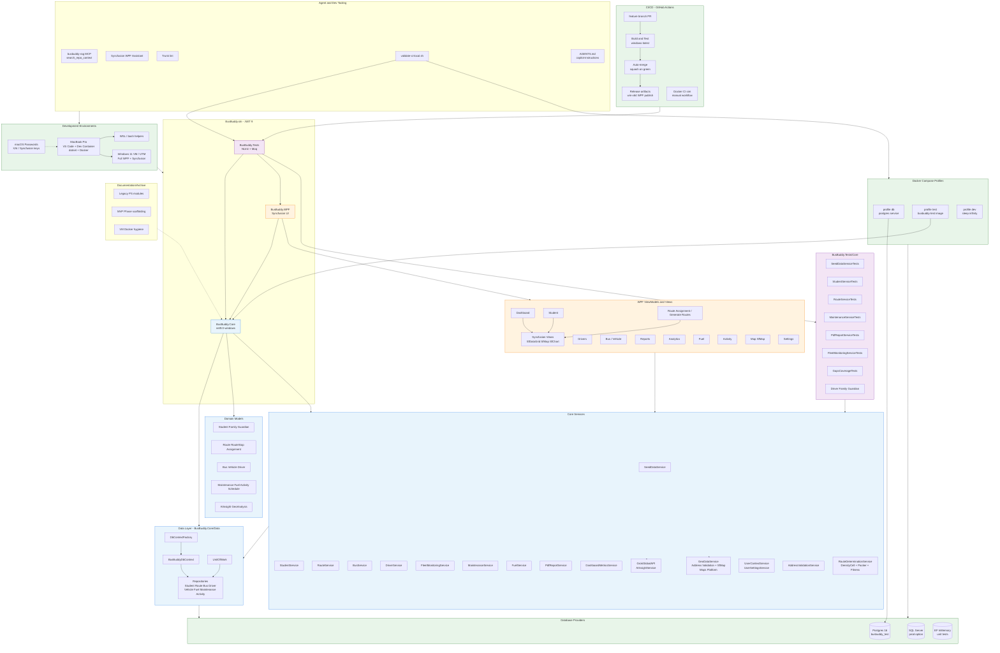
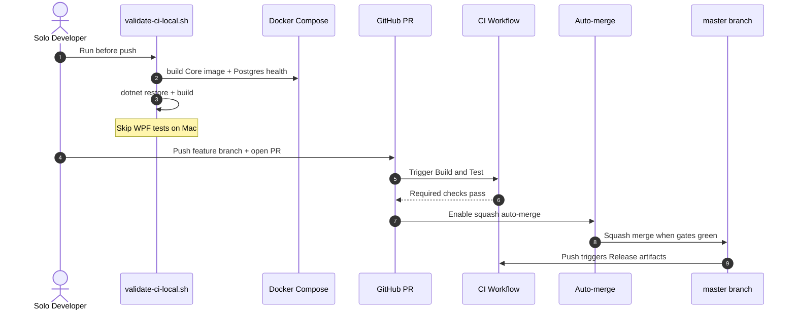

# BusBuddy-3 Architecture Map

Canonical repo architecture diagram. Update this file when services, CI jobs, or auth flows change; then run `python -m rag.index`.

**Ship tracker (open work):** [docs/action-items.md](../../docs/action-items.md)  
**Historical finish narrative (archived):** [../Archive/2026-06-Steady-State-Finish/STEADY-STATE-AND-FINISH-ROADMAP.md](../Archive/2026-06-Steady-State-Finish/STEADY-STATE-AND-FINISH-ROADMAP.md)

Optional editable Mermaid source: `busbuddy-3-architecture.mmd` in this folder if present.

## How to read the map

| Color  | Layer                                                       |
| ------ | ----------------------------------------------------------- |
| Blue   | Core — data, models, services                               |
| Orange | WPF — ViewModels and Syncfusion views                       |
| Green  | Infrastructure — Docker, CI/CD, databases, dev environments |
| Purple | Tests — BusBuddy.Tests proof coverage                       |

**Key flows:**

- **Mac hybrid dev**: Core/tests/Docker on Mac; full WPF in Windows VM (UTM/Parallels).
- **Data**: Services → Repositories → DbContext → Postgres (Docker) or SQL Server (prod) or InMemory (tests).
- **CI**: `feature/*` PR → Build & Test → auto-merge squash → Release artifacts on `master` push.
- **Local gate**: `.github/scripts/validate-ci-local.sh` mirrors Docker + compile before push.

## 1. System architecture

## 2. Solo-dev CI/CD sequence

## 3. Directory quick reference

| Path                                   | Role                                             |
| -------------------------------------- | ------------------------------------------------ |
| `BusBuddy.Core/`                       | Domain models, EF data layer, business services  |
| `BusBuddy.WPF/`                        | Syncfusion UI, ViewModels, App.xaml.cs DI + keys |
| `BusBuddy.Tests/Core/`                 | Service-level proof tests (CI filter target)     |
| `docker-compose.yml`                   | Postgres + test/dev profiles                     |
| `Dockerfile`                           | Linux Core build image                           |
| `.github/workflows/ci.yml`             | Merge gate: Build & Test                         |
| `.github/workflows/auto-merge.yml`     | Squash auto-merge on green                       |
| `.github/scripts/validate-ci-local.sh` | Pre-push local validation                        |
| `Documentation/Archive/`               | Legacy PS, MVP, hygiene archives                 |
| `docs/action-items.md`                 | Ship SSOT (open work only)                       |
| `rag/`                                 | Semantic RAG index for agent context             |
| `AGENTS.md`                            | Agent quick reference                            |
| `.github/copilot-instructions.md`      | Full AI dev standards + CI rules                 |

_Extracted from STEADY-STATE architecture section 2026-09-09. Re-validate Mermaid after major structural changes._
