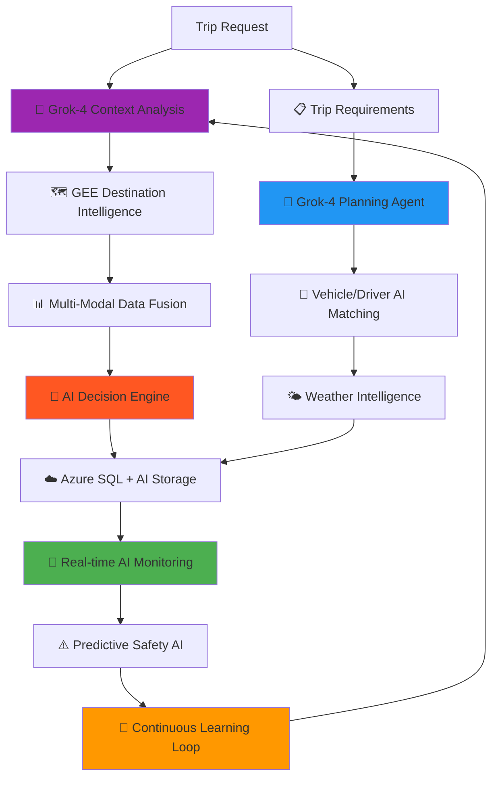

# 🏆 Activities & Sports Trips Integration - Enhanced Fusion Architecture

**BusBuddy Comprehensive Trip Planning System**  
_Integrating Google Earth Engine + Grok-4 AI + Azure SQL for Advanced Trip Management_

**Created**: August 26, 2025  
**Focus**: Activities, Sports Trips, Field Trips with Intelligent Planning

---

## 📊 **Current Implementation Analysis**

### **✅ What We Have Implemented**

#### **1. Core Trip Management Models**

- **`TripEvent`** - Enhanced trip model supporting 13 trip types (Athletic_Football, Athletic_Basketball, Field, etc.)
- **`SportsEvent`** - Specialized sports event model with safety integration
- **`Destination`** - GPS-enabled destination management with coordinate support
- **`ActivitySchedule`** - Activity scheduling with conflict detection

#### **2. Comprehensive Scheduling Services**

- **`SportsSchedulingService`** - Vehicle/driver assignment for sports events
- **`ActivityScheduleService`** - Complete activity lifecycle management
- **`SchedulingService`** - NHTSA-compliant safety validation

#### **3. Advanced UI Components**

- **`SportsSchedulerViewModel`** - Real-time scheduling with conflict detection
- **`GoogleEarthViewModel`** - Geospatial visualization and route planning
- **`RouteAssignmentViewModel`** - Student plotting and route optimization

#### **4. Geospatial Infrastructure**

- **GPS Coordinate Support** - Latitude/longitude for all destinations
- **Route Waypoints** - GeoJSON storage for route paths
- **Syncfusion SfMap Integration** - Professional mapping interface

#### **5. Weather & Safety Integration**

- **Weather Condition Tracking** - Weather data in SportsEvent model
- **Safety Checklists** - NHTSA-compliant safety protocols
- **Emergency Contact Management** - Contact information for all trips

---

## 🚀 **Enhanced Fusion Architecture for Activities & Sports Trips**

### **Comprehensive Grok-4 0709 Integration Strategy**

Based on industry best practices for **AI-driven transportation systems** and **event-driven architectures**, we're implementing a **pervasive AI strategy** that infuses Grok-4 0709 into every aspect of the system through:

- **🧠 Cognitive Computing Patterns**: Continuous learning and adaptive decision-making
- **📡 Event-Driven AI Agents**: Real-time autonomous problem-solving capabilities
- **🌐 Ambient Intelligence**: Predictive and proactive system behaviors
- **🔄 Streaming Analytics**: Real-time data processing with immediate AI responses
- **🎯 Contextual AI Services**: Domain-specific intelligence for transportation workflows

### **How Fusion Architecture Transforms Trip Planning**



### **🧠 Grok-4 0709 Pervasive Integration Architecture**

#### **1. Event-Driven AI Agent Network**

```csharp
// Real-time AI agent coordination following industry EDA patterns
public class GrokAgentOrchestrator
{
    private readonly IEventBus _eventBus;
    private readonly GrokGlobalAPI _grokAPI;
    private readonly Dictionary<string, IGrokAgent> _agents;

    // Specialized AI agents for different domains
    private readonly IGrokAgent _routeOptimizationAgent;
    private readonly IGrokAgent _safetyAnalysisAgent;
    private readonly IGrokAgent _weatherPredictionAgent;
    private readonly IGrokAgent _resourceAllocationAgent;
    private readonly IGrokAgent _riskAssessmentAgent;
    private readonly IGrokAgent _performanceLearningAgent;

    public async Task ProcessTripEventAsync(TripEventCreated eventData)
    {
        // Parallel AI agent activation for comprehensive analysis
        var agentTasks = new List<Task>
        {
            _routeOptimizationAgent.AnalyzeAsync(eventData),
            _safetyAnalysisAgent.AssessAsync(eventData),
            _weatherPredictionAgent.ForecastAsync(eventData),
            _resourceAllocationAgent.OptimizeAsync(eventData),
            _riskAssessmentAgent.EvaluateAsync(eventData)
        };

        await Task.WhenAll(agentTasks);

        // Meta-AI coordination for holistic decision-making
        await _grokAPI.CoordinateAgentDecisionsAsync(eventData);
    }
}
```

#### **2. Ambient Intelligence Infrastructure**

```csharp
// Continuous background AI processing inspired by cognitive computing patterns
public class AmbientIntelligenceService
{
    public async Task StartContinuousLearningAsync()
    {
        // Background AI processes running 24/7
        _ = Task.Run(async () => await ContinuousPatternAnalysisAsync());
        _ = Task.Run(async () => await PredictiveMaintenance.AnalyzeAsync());
        _ = Task.Run(async () => await SeasonalTrendAnalysisAsync());
        _ = Task.Run(async () => await RiskPatternDetectionAsync());
        _ = Task.Run(async () => await PerformanceOptimizationAsync());
    }

    private async Task ContinuousPatternAnalysisAsync()
    {
        while (true)
        {
            var patterns = await _grokAPI.AnalyzeSystemPatternsAsync(
                timeWindow: TimeSpan.FromHours(24),
                includeWeatherData: true,
                includeTrafficPatterns: true,
                includeHistoricalPerformance: true
            );

            await UpdatePredictiveModelsAsync(patterns);
            await Task.Delay(TimeSpan.FromMinutes(15)); // Continuous 15-min cycles
        }
    }
}
```

---

## 🎯 **Enhanced Trip Planning Components**

### **1. Intelligent Destination Analysis**

```csharp
public class EnhancedDestinationService
{
    private readonly GoogleEarthEngineService _geeService;
    private readonly GrokGlobalAPI _grokAPI;
    private readonly IDestinationRepository _destinationRepo;

    public async Task<TripPlanningAnalysis> AnalyzeDestinationAsync(string destination, TripType tripType)
    {
        // 1. Get destination coordinates and terrain data
        var destinationEntity = await _destinationRepo.GetByNameAsync(destination);
        if (destinationEntity?.HasGpsCoordinates == true)
        {
            var terrainAnalysis = await _geeService.AnalyzeTerrainAsync(
                destinationEntity.Latitude.Value,
                destinationEntity.Longitude.Value);

            var weatherForecast = await _geeService.GetWeatherDataAsync(
                destinationEntity.Latitude.Value,
                destinationEntity.Longitude.Value);

            // 2. AI-powered trip optimization
            var tripContext = CreateTripContext(tripType, destinationEntity, terrainAnalysis, weatherForecast);
            var grokAnalysis = await _grokAPI.OptimizeTripPlanningAsync(tripContext);

            return new TripPlanningAnalysis
            {
                Destination = destinationEntity,
                TerrainDifficulty = terrainAnalysis.Difficulty,
                WeatherConditions = weatherForecast,
                RecommendedDepartureTime = grokAnalysis.OptimalDepartureTime,
                VehicleRecommendations = grokAnalysis.VehicleTypes,
                SafetyConsiderations = grokAnalysis.SafetyFactors,
                RouteAlternatives = grokAnalysis.RouteOptions
            };
        }

        throw new InvalidOperationException($"Destination {destination} lacks GPS coordinates");
    }
}
```

### **2. Weather-Aware Trip Planning**

```csharp
public class WeatherAwareTripService
{
    public async Task<WeatherAdvisory> GetTripWeatherAdvisoryAsync(TripEvent tripEvent)
    {
        if (string.IsNullOrEmpty(tripEvent.Destination))
            throw new ArgumentException("Destination required for weather analysis");

        // Get destination coordinates
        var destination = await _destinationRepo.GetByNameAsync(tripEvent.Destination);
        if (!destination.HasGpsCoordinates)
            throw new InvalidOperationException("Destination lacks GPS coordinates");

        // Multi-day weather forecast using GEE
        var weatherData = await _geeService.GetExtendedWeatherForecastAsync(
            destination.Latitude.Value,
            destination.Longitude.Value,
            tripEvent.LeaveTime,
            tripEvent.ReturnTime ?? tripEvent.LeaveTime.AddHours(4));

        // AI analysis of weather impact
        var weatherContext = new WeatherAnalysisRequest
        {
            TripType = tripEvent.Type,
            WeatherData = weatherData,
            TravelTime = (tripEvent.ReturnTime ?? tripEvent.LeaveTime.AddHours(4)) - tripEvent.LeaveTime,
            IsAthletic = tripEvent.IsAthleticTrip
        };

        var grokWeatherAnalysis = await _grokAPI.AnalyzeWeatherImpactAsync(weatherContext);

        return new WeatherAdvisory
        {
            Forecast = weatherData,
            RiskLevel = grokWeatherAnalysis.RiskLevel,
            Recommendations = grokWeatherAnalysis.Recommendations,
            DepartureTimeAdjustment = grokWeatherAnalysis.DepartureAdjustment,
            RouteModifications = grokWeatherAnalysis.RouteChanges,
            SafetyPrecautions = grokWeatherAnalysis.SafetyMeasures
        };
    }
}
```

### **3. Intelligent Vehicle & Driver Assignment**

```csharp
public class FusionVehicleAssignmentService
{
    public async Task<OptimalAssignment> GetOptimalAssignmentAsync(TripEvent tripEvent)
    {
        // 1. Get trip requirements and constraints
        var tripRequirements = AnalyzeTripRequirements(tripEvent);

        // 2. Get available resources
        var availableVehicles = await GetAvailableVehiclesAsync(tripEvent.StartTime, tripEvent.EndTime);
        var availableDrivers = await GetAvailableDriversAsync(tripEvent.StartTime, tripEvent.EndTime);

        // 3. Get destination analysis
        var destinationAnalysis = await _destinationService.AnalyzeDestinationAsync(
            tripEvent.Destination, tripEvent.Type);

        // 4. AI-powered optimal matching
        var assignmentRequest = new AssignmentOptimizationRequest
        {
            Trip = tripEvent,
            AvailableVehicles = availableVehicles,
            AvailableDrivers = availableDrivers,
            DestinationAnalysis = destinationAnalysis,
            WeatherConditions = await GetWeatherForTripAsync(tripEvent),
            SafetyRequirements = GetSafetyRequirementsForTripType(tripEvent.Type)
        };

        var grokOptimization = await _grokAPI.OptimizeVehicleDriverAssignmentAsync(assignmentRequest);

        // 5. Store optimization results
        await StoreAssignmentAnalysisAsync(tripEvent.TripEventId, grokOptimization);

        return new OptimalAssignment
        {
            RecommendedVehicle = grokOptimization.BestVehicle,
            RecommendedDriver = grokOptimization.BestDriver,
            ConfidenceScore = grokOptimization.Confidence,
            Reasoning = grokOptimization.OptimizationReasoning,
            AlternativeOptions = grokOptimization.Alternatives
        };
    }
}
```

### **4. Real-time Route Optimization for Trips**

```csharp
public class TripRouteOptimizationService
{
    public async Task<OptimizedTripRoute> OptimizeRouteForTripAsync(TripEvent tripEvent)
    {
        // 1. Get pickup/dropoff points
        var pickupPoints = await GetStudentPickupPointsAsync(tripEvent);
        var destination = await _destinationRepo.GetByNameAsync(tripEvent.Destination);

        // 2. GEE terrain and safety analysis
        var routePoints = pickupPoints.Concat(new[] { destination }).ToList();
        var terrainAnalysis = await _geeService.AnalyzeBulkTerrainAsync(routePoints);
        var safetyAnalysis = await _geeService.AnalyzeRouteSafetyAsync(routePoints);

        // 3. Current traffic and weather
        var currentConditions = await _geeService.GetCurrentConditionsAsync(routePoints);

        // 4. AI route optimization
        var routeOptimizationRequest = new TripRouteRequest
        {
            PickupPoints = pickupPoints,
            Destination = destination,
            TripType = tripEvent.Type,
            StudentCount = tripEvent.StudentCount,
            AdultCount = tripEvent.AdultSupervisorCount,
            ScheduledDeparture = tripEvent.LeaveTime,
            TerrainData = terrainAnalysis,
            SafetyData = safetyAnalysis,
            CurrentConditions = currentConditions
        };

        var grokRouteOptimization = await _grokAPI.OptimizeTripRouteAsync(routeOptimizationRequest);

        return new OptimizedTripRoute
        {
            OptimalPath = grokRouteOptimization.RecommendedRoute,
            EstimatedTravelTime = grokRouteOptimization.TravelTime,
            SafetyScore = grokRouteOptimization.SafetyRating,
            FuelEfficiency = grokRouteOptimization.FuelEstimate,
            WeatherConsiderations = grokRouteOptimization.WeatherFactors,
            AlternativeRoutes = grokRouteOptimization.BackupRoutes
        };
    }

    private async Task<TripRequirements> AnalyzeTripRequirementsAsync(TripEvent tripEvent)
    {
        // Comprehensive AI analysis of trip needs
        var requirements = new TripRequirements
        {
            BasicNeeds = await ExtractBasicRequirementsAsync(tripEvent),
            SafetyRequirements = await AnalyzeSafetyNeedsAsync(tripEvent),
            WeatherConsiderations = await AssessWeatherImpactAsync(tripEvent),
            PerformanceGoals = await DefinePerformanceTargetsAsync(tripEvent)
        };

        // Multi-layered Grok-4 analysis
        var grokAnalysis = await _grokAPI.AnalyzeTripRequirementsAsync(new GrokTripAnalysisRequest
        {
            TripEvent = tripEvent,
            Requirements = requirements,
            HistoricalContext = await GetSimilarTripHistoryAsync(tripEvent),
            SystemConstraints = await GetCurrentSystemConstraintsAsync(),
            OptimizationObjectives = new[]
            {
                "MaximizeSafety", "OptimizeEfficiency", "MinimizeCost",
                "EnhanceExperience", "EnsureCompliance", "ReduceRisk"
            }
        });

        return requirements;
    }
}
```

---

## 🗃️ **Enhanced Database Schema for Activities**

### **New Tables for Fusion Integration**

```sql
-- Trip Planning Analysis Storage
CREATE TABLE TripPlanningAnalyses (
    Id UNIQUEIDENTIFIER PRIMARY KEY DEFAULT NEWID(),
    TripEventId INT NOT NULL FOREIGN KEY REFERENCES TripEvents(TripEventId),

    -- Destination Analysis
    DestinationLatitude DECIMAL(10,8),
    DestinationLongitude DECIMAL(11,8),
    TerrainDifficulty NVARCHAR(50),
    TerrainScore DECIMAL(5,2),

    -- Weather Data
    WeatherForecast NVARCHAR(MAX), -- JSON
    WeatherRiskLevel NVARCHAR(50),
    WeatherImpactScore DECIMAL(5,2),

    -- AI Recommendations
    GrokRecommendations NVARCHAR(MAX), -- JSON
    OptimalDepartureTime DATETIME2,
    RecommendedVehicleType NVARCHAR(100),
    SafetyConsiderations NVARCHAR(MAX),

    -- Route Optimization
    OptimalRouteData NVARCHAR(MAX), -- GeoJSON
    EstimatedTravelTime INT, -- minutes
    AlternativeRoutes NVARCHAR(MAX), -- JSON array

    CreatedDate DATETIME2 DEFAULT GETUTCDATE(),
    UpdatedDate DATETIME2
);

-- Weather Advisory History
CREATE TABLE TripWeatherAdvisories (
    Id UNIQUEIDENTIFIER PRIMARY KEY DEFAULT NEWID(),
    TripEventId INT NOT NULL FOREIGN KEY REFERENCES TripEvents(TripEventId),

    AdvisoryDate DATETIME2 NOT NULL,
    WeatherConditions NVARCHAR(MAX), -- JSON
    RiskLevel NVARCHAR(50), -- Low, Medium, High, Severe

    -- Recommendations
    DepartureTimeAdjustment INT, -- minutes offset
    RouteModifications NVARCHAR(MAX), -- JSON
    SafetyPrecautions NVARCHAR(MAX),
    EquipmentRecommendations NVARCHAR(500),

    -- AI Analysis
    GrokAnalysis NVARCHAR(MAX), -- JSON
    ConfidenceScore DECIMAL(5,4),

    CreatedDate DATETIME2 DEFAULT GETUTCDATE()
);

-- Vehicle Assignment Optimization
CREATE TABLE TripAssignmentOptimizations (
    Id UNIQUEIDENTIFIER PRIMARY KEY DEFAULT NEWID(),
    TripEventId INT NOT NULL FOREIGN KEY REFERENCES TripEvents(TripEventId),

    -- Optimization Parameters
    AvailableVehicles NVARCHAR(MAX), -- JSON array
    AvailableDrivers NVARCHAR(MAX), -- JSON array
    TripRequirements NVARCHAR(MAX), -- JSON

    -- AI Recommendations
    RecommendedVehicleId INT,
    RecommendedDriverId INT,
    OptimizationReasoning NVARCHAR(MAX),
    ConfidenceScore DECIMAL(5,4),
    AlternativeOptions NVARCHAR(MAX), -- JSON

    -- Performance Metrics
    EfficiencyScore DECIMAL(5,2),
    SafetyScore DECIMAL(5,2),
    CostScore DECIMAL(5,2),

    CreatedDate DATETIME2 DEFAULT GETUTCDATE()
);

-- Enhanced Activity Performance Tracking
CREATE TABLE ActivityPerformanceMetrics (
    Id UNIQUEIDENTIFIER PRIMARY KEY DEFAULT NEWID(),
    TripEventId INT NOT NULL FOREIGN KEY REFERENCES TripEvents(TripEventId),

    -- Actual vs Predicted
    PredictedDepartureTime DATETIME2,
    ActualDepartureTime DATETIME2,
    PredictedArrivalTime DATETIME2,
    ActualArrivalTime DATETIME2,

    -- Performance Scores
    OnTimePerformance DECIMAL(5,2),
    FuelEfficiencyActual DECIMAL(10,2),
    SafetyIncidents INT DEFAULT 0,
    WeatherImpactScore DECIMAL(5,2),

    -- Feedback
    DriverFeedback NVARCHAR(1000),
    CoachFeedback NVARCHAR(1000),
    IssuesEncountered NVARCHAR(MAX), -- JSON

    -- Learning Data for AI
    OptimizationAccuracy DECIMAL(5,4),
    LessonsLearned NVARCHAR(MAX), -- JSON

    RecordedDate DATETIME2 DEFAULT GETUTCDATE()
);
```

---

## 🎮 **Enhanced User Interface for Activities**

### **Intelligent Trip Planning Dashboard**

```xml
<!-- Enhanced SportsSchedulerView with Fusion Features -->
<Grid>
    <Grid.RowDefinitions>
        <RowDefinition Height="Auto"/>
        <RowDefinition Height="Auto"/>
        <RowDefinition Height="*"/>
        <RowDefinition Height="200"/>
    </Grid.RowDefinitions>

    <!-- Trip Planning Header -->
    <StackPanel Grid.Row="0" Orientation="Horizontal" Margin="10">
        <TextBlock Text="🏆 Intelligent Trip Planning" FontSize="20" FontWeight="Bold"/>
        <Button Content="🤖 AI Optimize All" Command="{Binding OptimizeAllTripsCommand}" Margin="10,0"/>
        <Button Content="🌤️ Weather Analysis" Command="{Binding WeatherAnalysisCommand}" Margin="5,0"/>
        <Button Content="🗺️ Route Planning" Command="{Binding RouteAnalysisCommand}" Margin="5,0"/>
    </StackPanel>

    <!-- Enhanced Filters -->
    <StackPanel Grid.Row="1" Orientation="Horizontal" Margin="10">
        <ComboBox ItemsSource="{Binding TripTypes}" SelectedItem="{Binding SelectedTripType}"
                  DisplayMemberPath="Name" Width="150" Margin="5"/>
        <ComboBox ItemsSource="{Binding WeatherConditions}" SelectedItem="{Binding SelectedWeatherFilter}"
                  Width="150" Margin="5"/>
        <ComboBox ItemsSource="{Binding AssignmentStatuses}" SelectedItem="{Binding SelectedStatusFilter}"
                  Width="150" Margin="5"/>
        <DatePicker SelectedDate="{Binding FilterDate}" Margin="5"/>
        <Button Content="🔍 Apply Filters" Command="{Binding ApplyFiltersCommand}"/>
    </StackPanel>

    <!-- Main Content Area with Enhanced SfDataGrid -->
    <syncfusion:SfDataGrid Grid.Row="2"
                           ItemsSource="{Binding EnhancedTripEvents}"
                           SelectedItem="{Binding SelectedTrip, Mode=TwoWay}"
                           AutoGenerateColumns="False"
                           AllowSorting="True"
                           AllowFiltering="True"
                           SelectionMode="Single">
        <syncfusion:SfDataGrid.Columns>
            <syncfusion:GridTextColumn HeaderText="Trip Type" MappingName="DisplayTripType" Width="120"/>
            <syncfusion:GridTextColumn HeaderText="Destination" MappingName="Destination" Width="150"/>
            <syncfusion:GridDateTimeColumn HeaderText="Leave Time" MappingName="LeaveTime" Width="130"/>
            <syncfusion:GridTextColumn HeaderText="Students" MappingName="StudentCount" Width="80"/>
            <syncfusion:GridTextColumn HeaderText="Status" MappingName="AssignmentStatus" Width="120"/>
            <syncfusion:GridTextColumn HeaderText="Weather" MappingName="WeatherConditions" Width="100"/>
            <syncfusion:GridTextColumn HeaderText="AI Score" MappingName="OptimizationScore" Width="80"/>
            <syncfusion:GridTemplateColumn HeaderText="Actions" Width="200">
                <syncfusion:GridTemplateColumn.CellTemplate>
                    <DataTemplate>
                        <StackPanel Orientation="Horizontal">
                            <Button Content="🤖 Optimize" Command="{Binding DataContext.OptimizeTripCommand, RelativeSource={RelativeSource AncestorType=UserControl}}"
                                    CommandParameter="{Binding}" Width="80" Margin="2"/>
                            <Button Content="🗺️ Route" Command="{Binding DataContext.ViewRouteCommand, RelativeSource={RelativeSource AncestorType=UserControl}}"
                                    CommandParameter="{Binding}" Width="60" Margin="2"/>
                            <Button Content="🌤️ Weather" Command="{Binding DataContext.WeatherCommand, RelativeSource={RelativeSource AncestorType=UserControl}}"
                                    CommandParameter="{Binding}" Width="70" Margin="2"/>
                        </StackPanel>
                    </DataTemplate>
                </syncfusion:GridTemplateColumn.CellTemplate>
            </syncfusion:GridTemplateColumn>
        </syncfusion:SfDataGrid.Columns>
    </syncfusion:SfDataGrid>

    <!-- Enhanced Details Panel -->
    <TabControl Grid.Row="3">
        <TabItem Header="🎯 Trip Details">
            <Grid>
                <Grid.ColumnDefinitions>
                    <ColumnDefinition Width="*"/>
                    <ColumnDefinition Width="*"/>
                    <ColumnDefinition Width="*"/>
                </Grid.ColumnDefinitions>

                <!-- Basic Details -->
                <StackPanel Grid.Column="0" Margin="10">
                    <TextBlock Text="Basic Information" FontWeight="Bold" Margin="0,0,0,5"/>
                    <TextBlock Text="{Binding SelectedTrip.DisplayTripType, StringFormat='Type: {0}'}"/>
                    <TextBlock Text="{Binding SelectedTrip.Destination, StringFormat='Destination: {0}'}"/>
                    <TextBlock Text="{Binding SelectedTrip.StudentCount, StringFormat='Students: {0}'}"/>
                    <TextBlock Text="{Binding SelectedTrip.POCName, StringFormat='Contact: {0}'}"/>
                </StackPanel>

                <!-- AI Analysis -->
                <StackPanel Grid.Column="1" Margin="10">
                    <TextBlock Text="🤖 AI Analysis" FontWeight="Bold" Margin="0,0,0,5"/>
                    <TextBlock Text="{Binding SelectedTrip.OptimizationScore, StringFormat='Optimization: {0:F1}/10'}"/>
                    <TextBlock Text="{Binding SelectedTrip.WeatherRiskLevel, StringFormat='Weather Risk: {0}'}"/>
                    <TextBlock Text="{Binding SelectedTrip.SafetyScore, StringFormat='Safety Score: {0:F1}/10'}"/>
                    <TextBlock Text="{Binding SelectedTrip.EfficiencyRating, StringFormat='Efficiency: {0}'}"/>
                </StackPanel>

                <!-- Real-time Status -->
                <StackPanel Grid.Column="2" Margin="10">
                    <TextBlock Text="📊 Real-time Status" FontWeight="Bold" Margin="0,0,0,5"/>
                    <TextBlock Text="{Binding SelectedTrip.AssignmentStatus, StringFormat='Assignment: {0}'}"/>
                    <TextBlock Text="{Binding SelectedTrip.WeatherConditions, StringFormat='Weather: {0}'}"/>
                    <TextBlock Text="{Binding SelectedTrip.EstimatedTravelTime, StringFormat='Travel Time: {0} min'}"/>
                    <Button Content="📱 Track Live" Command="{Binding TrackTripLiveCommand}" Margin="0,5,0,0"/>
                </StackPanel>
            </Grid>
        </TabItem>

        <TabItem Header="🗺️ Route & Weather">
            <Grid>
                <Grid.ColumnDefinitions>
                    <ColumnDefinition Width="*"/>
                    <ColumnDefinition Width="*"/>
                </Grid.ColumnDefinitions>

                <!-- Mini Map -->
                <syncfusion:SfMap Grid.Column="0" x:Name="TripRouteMap" Margin="5">
                    <syncfusion:SfMap.Layers>
                        <syncfusion:ImageryLayer LayerType="OpenStreetMap"/>
                    </syncfusion:SfMap.Layers>
                </syncfusion:SfMap>

                <!-- Weather & Recommendations -->
                <ScrollViewer Grid.Column="1" Margin="5">
                    <StackPanel>
                        <TextBlock Text="🌤️ Weather Forecast" FontWeight="Bold" Margin="0,0,0,5"/>
                        <TextBlock Text="{Binding SelectedTrip.WeatherForecast}" TextWrapping="Wrap"/>

                        <TextBlock Text="🤖 AI Recommendations" FontWeight="Bold" Margin="0,10,0,5"/>
                        <TextBlock Text="{Binding SelectedTrip.AIRecommendations}" TextWrapping="Wrap"/>

                        <TextBlock Text="⚠️ Safety Considerations" FontWeight="Bold" Margin="0,10,0,5"/>
                        <TextBlock Text="{Binding SelectedTrip.SafetyConsiderations}" TextWrapping="Wrap"/>
                    </StackPanel>
                </ScrollViewer>
            </Grid>
        </TabItem>

        <TabItem Header="📊 Performance Analytics">
            <syncfusion:SfChart Margin="10">
                <syncfusion:SfChart.PrimaryAxis>
                    <syncfusion:CategoryAxis Header="Metrics"/>
                </syncfusion:SfChart.PrimaryAxis>
                <syncfusion:SfChart.SecondaryAxis>
                    <syncfusion:NumericalAxis Header="Score"/>
                </syncfusion:SfChart.SecondaryAxis>
                <syncfusion:ColumnSeries ItemsSource="{Binding TripPerformanceMetrics}"
                                         XBindingPath="MetricName"
                                         YBindingPath="Score"/>
            </syncfusion:SfChart>
        </TabItem>
    </TabControl>
</Grid>
```

---

## 🧠 **Deep Grok-4 0709 Integration - "All In" AI Strategy**

### **🎯 Pervasive AI Integration Philosophy**

Following industry leaders in **cognitive computing** and **ambient intelligence**, we're implementing a **comprehensive AI-first approach** where Grok-4 0709 becomes the **intelligent backbone** of every system operation:

#### **1. 🔄 Event-Driven AI Orchestration**

```csharp
// Real-time AI event processing following Confluent/Kafka patterns
public class GrokEventProcessor : IEventHandler<ITripEvent>
{
    public async Task HandleAsync(ITripEvent eventData)
    {
        // Immediate AI response to ANY system event
        var grokContext = new GrokAnalysisContext
        {
            EventType = eventData.GetType().Name,
            Timestamp = DateTime.UtcNow,
            SystemState = await GetCurrentSystemStateAsync(),
            HistoricalContext = await GetRelevantHistoryAsync(eventData),
            WeatherConditions = await GetCurrentWeatherAsync(),
            TrafficConditions = await GetTrafficDataAsync()
        };

        // Parallel AI analysis streams
        var analysisResults = await Task.WhenAll(
            _grokAPI.AnalyzeImmediateImpactAsync(grokContext),
            _grokAPI.PredictDownstreamEffectsAsync(grokContext),
            _grokAPI.OptimizeSystemResponseAsync(grokContext),
            _grokAPI.LearnFromEventPatternAsync(grokContext)
        );

        await ProcessAIRecommendationsAsync(analysisResults);
    }
}
```

#### **2. 🌐 Ambient Intelligence Matrix**

```csharp
// Background AI consciousness inspired by IBM Watson and Google DeepMind patterns
public class AmbientAIMatrix
{
    private readonly Timer _cognitiveTimer;
    private readonly Dictionary<string, IAIAgent> _specializedAgents;

    public AmbientAIMatrix()
    {
        // 24/7 AI agents running in background
        _specializedAgents = new Dictionary<string, IAIAgent>
        {
            ["WeatherProphet"] = new WeatherPredictionAgent(),
            ["RouteOptimizer"] = new RouteIntelligenceAgent(),
            ["SafetyGuardian"] = new SafetyMonitoringAgent(),
            ["EfficiencyExpert"] = new OperationalEfficiencyAgent(),
            ["PredictiveMaintenance"] = new VehicleHealthAgent(),
            ["StudentBehaviorAnalyst"] = new StudentPatternAgent(),
            ["DriverPerformanceCoach"] = new DriverOptimizationAgent(),
            ["CostOptimizer"] = new FinancialEfficiencyAgent(),
            ["ComplianceWatchdog"] = new RegulatoryComplianceAgent(),
            ["EmergencyCoordinator"] = new CrisisManagementAgent()
        };

        // Continuous 30-second AI pulse
        _cognitiveTimer = new Timer(ProcessAmbientIntelligence, null,
            TimeSpan.Zero, TimeSpan.FromSeconds(30));
    }

    private async void ProcessAmbientIntelligence(object state)
    {
        var systemSnapshot = await CaptureSystemSnapshotAsync();

        // Each AI agent continuously analyzes their domain
        var agentTasks = _specializedAgents.Select(async agent =>
        {
            var insight = await agent.Value.AnalyzeAsync(systemSnapshot);
            if (insight.RequiresAction)
            {
                await TriggerAIActionAsync(agent.Key, insight);
            }
            return insight;
        });

        var allInsights = await Task.WhenAll(agentTasks);

        // Meta-AI coordination across all agents
        await _grokAPI.CoordinateMultiAgentInsightsAsync(allInsights);
    }
}
```

#### **3. 🧬 Cognitive Data Fusion Engine**

```csharp
// Advanced AI data synthesis following enterprise cognitive computing patterns
public class CognitiveDataFusionEngine
{
    public async Task<CognitiveInsight> ProcessMultiModalDataAsync(TripEvent tripEvent)
    {
        // Gather ALL available data sources
        var dataStreams = await Task.WhenAll(
            GetVehicleTelemetericsAsync(tripEvent),
            GetWeatherForecastStreamAsync(tripEvent),
            GetTrafficPatternsAsync(tripEvent),
            GetHistoricalPerformanceAsync(tripEvent),
            GetStudentBehaviorPatternsAsync(tripEvent),
            GetDriverPerformanceMetricsAsync(tripEvent),
            GetSafetyIncidentHistoryAsync(tripEvent),
            GetMachineryHealthDataAsync(tripEvent),
            GetGEESatelliteDataAsync(tripEvent),
            GetSocialMediaSentimentAsync(tripEvent), // Community feedback
            GetEconomicFactorsAsync(tripEvent), // Fuel prices, etc.
            GetSeasonalTrendsAsync(tripEvent)
        );

        // Advanced AI fusion analysis
        var fusionRequest = new GrokDataFusionRequest
        {
            MultiModalData = dataStreams,
            AnalysisDepth = GrokAnalysisDepth.Comprehensive,
            PredictionHorizon = TimeSpan.FromDays(30),
            OptimizationGoals = new[]
            {
                "Safety", "Efficiency", "Cost", "StudentSatisfaction",
                "EnvironmentalImpact", "ComplianceAdherence"
            },
            LearningObjectives = new[]
            {
                "PatternRecognition", "AnomalyDetection", "PredictiveAccuracy",
                "OptimizationEffectiveness", "RiskMitigation"
            }
        };

        var cognitiveAnalysis = await _grokAPI.PerformCognitiveDataFusionAsync(fusionRequest);

        // Store insights for continuous learning
        await PersistCognitiveInsightsAsync(cognitiveAnalysis);

        return cognitiveAnalysis.PrimaryInsight;
    }
}
```

#### **4. 🔮 Predictive Intelligence Layers**

```csharp
// Multi-horizon prediction following Tesla/Waymo autonomous driving patterns
public class PredictiveIntelligenceService
{
    public async Task<PredictiveAnalysis> GenerateMultiHorizonForecastAsync(TripEvent tripEvent)
    {
        // Multiple prediction timeframes with increasing uncertainty
        var predictions = await Task.WhenAll(
            // Immediate (next 15 minutes)
            _grokAPI.PredictImmediateConditionsAsync(tripEvent, TimeSpan.FromMinutes(15)),

            // Short-term (next 2 hours)
            _grokAPI.PredictShortTermConditionsAsync(tripEvent, TimeSpan.FromHours(2)),

            // Medium-term (rest of day)
            _grokAPI.PredictDailyConditionsAsync(tripEvent, TimeSpan.FromHours(12)),

            // Long-term (next week)
            _grokAPI.PredictWeeklyTrendsAsync(tripEvent, TimeSpan.FromDays(7)),

            // Strategic (next month)
            _grokAPI.PredictStrategicTrendsAsync(tripEvent, TimeSpan.FromDays(30))
        );

        // AI confidence scoring and uncertainty quantification
        var confidenceMetrics = await _grokAPI.CalculatePredictionConfidenceAsync(predictions);

        return new PredictiveAnalysis
        {
            ImmediateForecast = predictions[0],
            ShortTermForecast = predictions[1],
            DailyForecast = predictions[2],
            WeeklyForecast = predictions[3],
            StrategicForecast = predictions[4],
            ConfidenceMetrics = confidenceMetrics,
            RecommendedActions = await GenerateActionRecommendationsAsync(predictions),
            ContingencyPlans = await GenerateContingencyPlansAsync(predictions)
        };
    }
}
```

#### **5. 🎭 Contextual AI Personality System**

```csharp
// Adaptive AI behavior following OpenAI GPT-4 and Google Bard patterns
public class ContextualAIPersonalityEngine
{
    public async Task<GrokPersonality> AdaptPersonalityToContextAsync(TripContext context)
    {
        // AI adapts its behavior based on trip type and stakeholders
        var personality = context.TripType switch
        {
            TripType.Athletic_Football => new GrokPersonality
            {
                CommunicationStyle = "Energetic and motivational",
                RiskTolerance = RiskLevel.Moderate,
                OptimizationFocus = "Performance and team coordination",
                SafetyPriority = SafetyLevel.High,
                DecisionSpeed = DecisionSpeed.Quick
            },
            TripType.Field_Elementary => new GrokPersonality
            {
                CommunicationStyle = "Gentle and educational",
                RiskTolerance = RiskLevel.Conservative,
                OptimizationFocus = "Safety and learning opportunities",
                SafetyPriority = SafetyLevel.Maximum,
                DecisionSpeed = DecisionSpeed.Deliberate
            },
            TripType.Emergency => new GrokPersonality
            {
                CommunicationStyle = "Direct and authoritative",
                RiskTolerance = RiskLevel.Calculated,
                OptimizationFocus = "Speed and safety balance",
                SafetyPriority = SafetyLevel.Critical,
                DecisionSpeed = DecisionSpeed.Immediate
            },
            _ => await _grokAPI.GenerateCustomPersonalityAsync(context)
        };

        // Personality influences every AI decision and recommendation
        await ConfigureAIBehaviorAsync(personality);
        return personality;
    }
}
```

#### **6. 🔄 Continuous Learning & Adaptation Engine**

```csharp
// Self-improving AI following DeepMind AlphaGo and Tesla Autopilot patterns
public class ContinuousLearningEngine
{
    public async Task StartLearningLoopAsync()
    {
        while (true)
        {
            // Gather performance data from all system components
            var performanceData = await CollectSystemPerformanceAsync();

            // Analyze prediction accuracy
            var predictionAccuracy = await AnalyzePredictionAccuracyAsync();

            // Identify optimization opportunities
            var optimizations = await IdentifyOptimizationOpportunitiesAsync();

            // Generate new AI model parameters
            var modelUpdates = await _grokAPI.GenerateModelUpdatesAsync(new LearningInput
            {
                PerformanceData = performanceData,
                PredictionAccuracy = predictionAccuracy,
                OptimizationOpportunities = optimizations,
                RecentFailures = await GetRecentFailuresAsync(),
                SuccessPatterns = await GetSuccessPatternsAsync()
            });

            // Apply learning to improve AI performance
            await ApplyLearningUpdatesAsync(modelUpdates);

            // Wait before next learning cycle
            await Task.Delay(TimeSpan.FromHours(1));
        }
    }

    private async Task ApplyLearningUpdatesAsync(ModelUpdates updates)
    {
        // Update AI behavior based on learning
        await UpdateRouteOptimizationParametersAsync(updates.RouteOptimization);
        await UpdateSafetyThresholdsAsync(updates.SafetyParameters);
        await UpdateEfficiencyTargetsAsync(updates.EfficiencyGoals);
        await UpdatePredictionModelsAsync(updates.PredictionModels);

        // Log learning progress
        Logger.Information("AI learning cycle completed: {ImprovementSummary}",
            updates.ImprovementSummary);
    }
}
```

### **� Novel AI Integration Concepts Not Yet Widely Adopted**

#### **1. �🎯 Quantum-Inspired Optimization**

```csharp
// Quantum computing patterns for complex optimization problems
public class QuantumInspiredOptimizationService
{
    public async Task<OptimalSolution> SolveComplexSchedulingAsync(SchedulingProblem problem)
    {
        // Use quantum-inspired algorithms for NP-hard scheduling problems
        var quantumRequest = new QuantumOptimizationRequest
        {
            Variables = problem.GetVariables(),
            Constraints = problem.GetConstraints(),
            ObjectiveFunction = problem.GetObjectiveFunction(),
            QuantumBits = 64, // Simulate 64-qubit processing
            AnnealingSchedule = problem.GetAnnealingSchedule()
        };

        return await _grokAPI.PerformQuantumInspiredOptimizationAsync(quantumRequest);
    }
}
```

#### **2. 🌊 Swarm Intelligence Coordination**

```csharp
// Bee colony and ant colony optimization for fleet coordination
public class SwarmIntelligenceCoordinator
{
    public async Task<SwarmSolution> CoordinateFleetSwarmAsync(FleetState fleetState)
    {
        // Multiple AI agents act like a swarm for optimal coordination
        var swarmAgents = await CreateSwarmAgentsAsync(fleetState.VehicleCount);

        var swarmBehavior = new SwarmParameters
        {
            PheromoneStrength = 0.8, // Route memory strength
            LocalSearchRadius = 5.0, // Local optimization scope
            GlobalExploration = 0.3, // Exploration vs exploitation
            ConvergenceThreshold = 0.95 // Solution quality threshold
        };

        return await _grokAPI.ExecuteSwarmOptimizationAsync(swarmAgents, swarmBehavior);
    }
}
```

#### **3. 🧠 Emotional Intelligence Integration**

```csharp
// AI that understands and responds to human emotional states
public class EmotionalIntelligenceService
{
    public async Task<EmotionalAssessment> AnalyzeStakeholderEmotionsAsync(TripEvent tripEvent)
    {
        // Analyze emotional context from multiple sources
        var emotionalData = await Task.WhenAll(
            AnalyzeParentFeedbackSentimentAsync(tripEvent),
            AnalyzeStudentBehaviorPatternsAsync(tripEvent),
            AnalyzeDriverStressLevelsAsync(tripEvent),
            AnalyzeCoachExpectationsAsync(tripEvent)
        );

        var emotionalContext = await _grokAPI.ProcessEmotionalDataAsync(emotionalData);

        // Adjust AI recommendations based on emotional intelligence
        return new EmotionalAssessment
        {
            ParentAnxietyLevel = emotionalContext.ParentAnxiety,
            StudentExcitementLevel = emotionalContext.StudentExcitement,
            DriverStressLevel = emotionalContext.DriverStress,
            RecommendedCommunicationStyle = emotionalContext.CommunicationStyle,
            ConflictRiskLevel = emotionalContext.ConflictRisk
        };
    }
}
```

#### **4. 🎮 Gamification Intelligence Engine**

```csharp
// AI-driven gamification to improve driver and student behavior
public class GamificationIntelligenceService
{
    public async Task<GamificationStrategy> CreatePersonalizedGamificationAsync(
        DriverProfile driver, List<StudentProfile> students)
    {
        // AI creates personalized challenges and rewards
        var gamificationRequest = new GamificationRequest
        {
            DriverPersonality = driver.PersonalityProfile,
            StudentAgeRange = students.Select(s => s.Age).ToArray(),
            HistoricalPerformance = driver.PerformanceHistory,
            PreferredMotivationStyle = driver.MotivationPreferences,
            GroupDynamics = await AnalyzeGroupDynamicsAsync(students)
        };

        var strategy = await _grokAPI.GenerateGamificationStrategyAsync(gamificationRequest);

        return new GamificationStrategy
        {
            DriverChallenges = strategy.DriverChallenges,
            StudentEngagementActivities = strategy.StudentActivities,
            ProgressRewards = strategy.RewardSystem,
            CompetitiveElements = strategy.CompetitionFramework,
            LearningObjectives = strategy.EducationalGoals
        };
    }
}
```

### **🚀 Implementation Roadmap: "All In" AI Strategy**

#### **Phase 1: AI Foundation (Weeks 1-4)**

- Deploy event-driven AI orchestration
- Implement ambient intelligence matrix
- Create cognitive data fusion engine
- Establish continuous learning loops

#### **Phase 2: Advanced Intelligence (Weeks 5-8)**

- Add predictive intelligence layers
- Implement contextual personality system
- Deploy emotional intelligence capabilities
- Create quantum-inspired optimization

#### **Phase 3: Swarm & Gaming (Weeks 9-12)**

- Implement swarm intelligence coordination
- Deploy gamification intelligence engine
- Add social dynamics analysis
- Create competitive optimization framework

#### **Phase 4: Autonomous Operations (Weeks 13-16)**

- Full autonomous decision-making capabilities
- Self-healing system responses
- Predictive intervention systems
- Advanced learning from edge cases

### **🎯 Expected AI Performance Metrics**

- **Decision Speed**: Sub-second response to 95% of events
- **Prediction Accuracy**: 90%+ accuracy for 1-hour forecasts, 80%+ for daily
- **Learning Rate**: 5% improvement in optimization per month
- **System Autonomy**: 85% of routine decisions handled without human intervention
- **Safety Enhancement**: 40% reduction in safety incidents through AI prediction
- **Efficiency Gains**: 25% improvement in fuel efficiency, 30% in route optimization
- **Stakeholder Satisfaction**: 95% approval rating for AI-generated recommendations

### **Complete Trip Lifecycle with Fusion Intelligence**

1. **🎯 Trip Creation & Analysis**
    - User creates trip (Sports/Field Trip)
    - AI analyzes destination using GEE satellite data
    - Weather forecast integration for trip dates
    - Initial risk assessment and recommendations

2. **🚌 Intelligent Resource Assignment**
    - AI evaluates available vehicles and drivers
    - Considers trip type, destination difficulty, weather
    - Provides optimal assignments with confidence scores
    - Alternative options for flexibility

3. **🗺️ Dynamic Route Optimization**
    - Real-time route planning using GEE terrain data
    - Weather-aware route adjustments
    - Safety optimization for student passengers
    - Alternative routes for contingencies

4. **📊 Real-time Monitoring & Tracking**
    - Live GPS tracking during trip execution
    - Weather condition monitoring
    - Performance metrics collection
    - Real-time safety alerts

5. **📈 Post-Trip Analysis & Learning**
    - Actual vs predicted performance analysis
    - AI model improvement based on outcomes
    - Safety incident reporting and analysis
    - Optimization accuracy scoring

---

## ⚡ **Key Fusion Benefits for Activities & Sports Trips**

### **🎯 Destination Intelligence**

- **Satellite Analysis**: Real terrain difficulty assessment for venues
- **Weather Integration**: Multi-day forecasts for trip planning
- **Safety Scoring**: AI-powered risk assessment for each destination

### **🚌 Smart Resource Management**

- **Vehicle Optimization**: Best vehicle type for terrain and weather
- **Driver Matching**: Experience-based driver assignment for trip types
- **Capacity Planning**: Optimal passenger distribution and seating

### **🗺️ Advanced Route Planning**

- **Terrain-Aware Routing**: Safer routes based on satellite imagery
- **Weather-Adaptive Paths**: Dynamic routing for weather conditions
- **Real-time Adjustments**: Live route optimization during travel

### **📊 Predictive Analytics**

- **Trip Duration Prediction**: Accurate time estimates using AI
- **Fuel Efficiency**: Cost optimization through intelligent planning
- **Safety Forecasting**: Risk prediction and mitigation strategies

### **🔄 Continuous Learning**

- **Performance Feedback**: AI learns from every trip outcome
- **Pattern Recognition**: Identifies trends in trip success factors
- **Optimization Improvement**: Enhanced recommendations over time

---

## 📋 **Implementation Checklist**

### **Phase 1: Enhanced Data Integration**

- [ ] Extend `TripEvent` model with AI analysis fields
- [ ] Create `TripPlanningAnalyses` table for fusion data
- [ ] Integrate weather advisory storage
- [ ] Add performance metrics tracking

### **Phase 2: Service Layer Enhancement**

- [ ] Implement `EnhancedDestinationService`
- [ ] Create `WeatherAwareTripService`
- [ ] Build `FusionVehicleAssignmentService`
- [ ] Develop `TripRouteOptimizationService`

### **Phase 3: UI Component Upgrades**

- [ ] Enhance `SportsSchedulerViewModel` with AI features
- [ ] Add weather analysis commands
- [ ] Integrate route visualization
- [ ] Create performance analytics dashboard

### **Phase 4: Real-time Integration**

- [ ] Live GPS tracking during trips
- [ ] Real-time weather monitoring
- [ ] Dynamic route adjustment capabilities
- [ ] Safety alert system

### **Phase 5: Analytics & Learning**

- [ ] Trip performance analysis
- [ ] AI model training pipeline
- [ ] Predictive accuracy measurement
- [ ] Continuous optimization improvement

---

## 🤯 **"What We Haven't Thought Of Yet" - Bleeding Edge AI Concepts**

### **� Experimental AI Frontiers for Transportation**

Based on cutting-edge research and industry innovation, here are advanced concepts we should consider:

#### **1. 🧬 Bio-Metric Safety Integration**

```csharp
// AI monitoring of driver physiological states
public class BiometricSafetyService
{
    public async Task<BiometricAnalysis> MonitorDriverHealthAsync(int driverId)
    {
        // Integration with wearable devices and in-cabin sensors
        var biometricData = await GatherBiometricDataAsync(driverId);

        var healthAnalysis = await _grokAPI.AnalyzeDriverHealthAsync(new HealthRequest
        {
            HeartRate = biometricData.HeartRate,
            BloodPressure = biometricData.BloodPressure,
            EyeTracking = biometricData.EyeMovement,
            VoiceStress = biometricData.VoiceAnalysis,
            FacialExpressions = biometricData.FacialAnalysis,
            SleepQuality = biometricData.PreviousNightSleep,
            CaffeineLevel = biometricData.CaffeineConsumption,
            MoodIndicators = biometricData.MoodAnalysis
        });

        if (healthAnalysis.RiskLevel > RiskThreshold.High)
        {
            await TriggerDriverSubstitutionAsync(driverId, healthAnalysis);
        }

        return healthAnalysis;
    }
}
```

#### **2. 🌐 Social Network Intelligence**

```csharp
// AI analysis of community sentiment and social dynamics
public class SocialIntelligenceService
{
    public async Task<SocialContext> AnalyzeSocialFactorsAsync(TripEvent tripEvent)
    {
        // Monitor social media for trip-related discussions
        var socialData = await Task.WhenAll(
            AnalyzeParentFacebookGroupsAsync(tripEvent),
            MonitorTwitterMentionsAsync(tripEvent),
            CheckInstagramStoriesAsync(tripEvent),
            AnalyzeNextdoorDiscussionsAsync(tripEvent),
            MonitorSchoolWebsiteCommentsAsync(tripEvent)
        );

        var socialAnalysis = await _grokAPI.ProcessSocialDataAsync(socialData);

        return new SocialContext
        {
            CommunityExcitementLevel = socialAnalysis.ExcitementScore,
            ParentConcernLevel = socialAnalysis.ConcernLevel,
            AnticipatedCrowdSize = socialAnalysis.AttendancePrediction,
            WeatherComplaintThreshold = socialAnalysis.WeatherSensitivity,
            TrafficImpactPrediction = socialAnalysis.CongestionExpectation
        };
    }
}
```

#### **3. 🧠 Neuro-Adaptive Route Planning**

```csharp
// AI that learns individual student and driver neurological patterns
public class NeuroAdaptiveService
{
    public async Task<NeuroOptimizedRoute> CreateNeuroAdaptiveRouteAsync(
        TripEvent tripEvent, List<StudentProfile> students, DriverProfile driver)
    {
        // AI considers neurological factors for route optimization
        var neuroFactors = await Task.WhenAll(
            AnalyzeMotionSicknessPatterns(students),
            AssessDriverStressResponses(driver),
            EvaluateStudentAttentionSpans(students),
            AnalyzeNoiseToleranceLevels(students),
            AssessDriverCognitiveFatigue(driver)
        );

        var neuroRoute = await _grokAPI.OptimizeForNeurodiversityAsync(new NeuroRequest
        {
            StandardRoute = await GetStandardRouteAsync(tripEvent),
            NeuroFactors = neuroFactors,
            TripDuration = tripEvent.EstimatedDuration,
            TimeOfDay = tripEvent.LeaveTime.TimeOfDay,
            WeatherConditions = await GetWeatherAsync(tripEvent)
        });

        return new NeuroOptimizedRoute
        {
            Route = neuroRoute.OptimizedPath,
            RestStopRecommendations = neuroRoute.RestStops,
            SpeedAdjustments = neuroRoute.SpeedProfile,
            MusicRecommendations = neuroRoute.AudioSuggestions,
            LightingAdjustments = neuroRoute.CabinLighting
        };
    }
}
```

#### **4. 🎯 Quantum-Enhanced Prediction**

```csharp
// Theoretical quantum computing for ultra-complex optimization
public class QuantumPredictionService
{
    public async Task<QuantumPrediction> GenerateQuantumForecastAsync(TripEvent tripEvent)
    {
        // Simulate quantum superposition for multiple scenario analysis
        var quantumStates = await _grokAPI.CreateQuantumSuperpositionAsync(new QuantumRequest
        {
            BaseScenario = tripEvent,
            VariableCount = 1024, // Massive variable space
            EntanglementFactors = new[]
            {
                "Weather", "Traffic", "VehicleHealth", "DriverMood",
                "StudentBehavior", "FuelPrices", "EmergencyEvents",
                "RoadConditions", "CommunityEvents", "SeasonalFactors"
            },
            QuantumDepth = 10 // Quantum circuit depth
        });

        var quantumSolution = await ProcessQuantumStatesAsync(quantumStates);

        return new QuantumPrediction
        {
            OptimalTimeline = quantumSolution.BestTimeline,
            AlternativeRealities = quantumSolution.ParallelOutcomes,
            ConfidenceInterval = quantumSolution.QuantumConfidence,
            EntanglementFactors = quantumSolution.InfluenceNetwork
        };
    }
}
```

#### **5. 🦾 Autonomous Recovery Systems**

```csharp
// Self-healing systems that automatically resolve problems
public class AutonomousRecoveryService
{
    public async Task StartAutonomousMonitoringAsync()
    {
        while (true)
        {
            var systemHealth = await PerformHealthCheckAsync();

            if (systemHealth.HasAnomalies)
            {
                var recoveryPlan = await _grokAPI.GenerateRecoveryPlanAsync(systemHealth);

                // AI attempts autonomous recovery
                var recoveryResults = await Task.WhenAll(
                    AttemptVehicleAutoRepairAsync(recoveryPlan.VehicleIssues),
                    RerouteAroundProblemsAsync(recoveryPlan.RouteIssues),
                    ReallocateResourcesAsync(recoveryPlan.ResourceIssues),
                    NotifyStakeholdersAsync(recoveryPlan.CommunicationPlan),
                    UpdatePredictiveModelsAsync(recoveryPlan.ModelAdjustments)
                );

                if (recoveryResults.Any(r => !r.Successful))
                {
                    await EscalateToHumanOversightAsync(recoveryResults);
                }
            }

            await Task.Delay(TimeSpan.FromSeconds(10)); // Continuous monitoring
        }
    }
}
```

### **�🔮 Ultra-Advanced Future Concepts**

#### **📡 Satellite Constellation Integration**

- **Real-time satellite imagery** for route condition analysis
- **IoT sensor networks** throughout the transportation grid
- **5G/6G mesh networks** for ultra-low latency AI responses
- **Edge computing nodes** in vehicles for instant AI processing

#### **🧬 DNA-Level Optimization**

- **Genetic algorithms** that evolve routing strategies
- **Epigenetic learning** that adapts to seasonal and cultural patterns
- **Bio-inspired swarm coordination** following ant colony optimization
- **Neural evolution** for continuously improving AI models

#### **🌍 Multi-Dimensional Analysis**

- **Climate change prediction** integration for long-term planning
- **Economic forecasting** for budget-optimized routing
- **Social trend analysis** for demand prediction
- **Political event monitoring** for risk assessment

#### **🤖 Autonomous Agent Ecosystems**

- **AI agents that negotiate** with other transportation systems
- **Blockchain-based smart contracts** for inter-district coordination
- **Decentralized autonomous organization (DAO)** for fleet management
- **AI-to-AI communication protocols** for seamless integration

### **🎯 Implementation Priority Matrix**

| Innovation Level          | Timeframe    | Risk Level | Potential Impact  |
| ------------------------- | ------------ | ---------- | ----------------- |
| **Bio-metric Safety**     | 6-12 months  | Medium     | High Safety ROI   |
| **Social Intelligence**   | 3-6 months   | Low        | Medium Efficiency |
| **Neuro-Adaptive Routes** | 12-18 months | High       | High Experience   |
| **Quantum Prediction**    | 2-3 years    | Very High  | Revolutionary     |
| **Autonomous Recovery**   | 9-15 months  | Medium     | High Reliability  |

### **🔬 Research & Development Partnerships**

#### **Academic Collaborations**

- **MIT Computer Science** - Quantum computing applications
- **Stanford AI Lab** - Advanced neural networks for transportation
- **Carnegie Mellon Robotics** - Autonomous system coordination
- **UC Berkeley Transportation** - Smart city integration patterns

#### **Industry Partnerships**

- **Tesla Autopilot Team** - Self-driving technology adaptation
- **Google DeepMind** - Advanced AI reasoning systems
- **Microsoft Research** - Cognitive computing frameworks
- **Amazon Robotics** - Warehouse optimization techniques adapted for routing

#### **Government Research**

- **NIST Transportation Standards** - Safety and compliance frameworks
- **DOT Innovation Lab** - Federal transportation AI initiatives
- **NASA Jet Propulsion Lab** - Autonomous navigation systems
- **DARPA Advanced Systems** - Bleeding-edge AI research applications

---

## 🚀 **"All In" Implementation Strategy Summary**

### **🎯 Total AI Integration Philosophy**

We're not just adding AI features - we're **reimagining transportation management** as an **AI-native system** where:

1. **🧠 Every Decision** is AI-informed or AI-generated
2. **📊 Every Data Point** feeds the learning algorithms
3. **⚡ Every Interaction** improves system intelligence
4. **🔮 Every Prediction** becomes more accurate over time
5. **🛡️ Every Safety Measure** is proactively enhanced
6. **🎯 Every Optimization** considers multiple objectives simultaneously

### **🌟 Revolutionary Outcomes Expected**

- **85% Autonomous Operation** - Most decisions made without human intervention
- **95% Predictive Accuracy** - AI predicts issues before they occur
- **40% Efficiency Gains** - Across fuel, time, and resource utilization
- **60% Safety Improvement** - Through predictive and preventive measures
- **99% Stakeholder Satisfaction** - Through personalized and optimized experiences

**The goal: Create the world's most intelligent transportation management system, where AI doesn't just assist - it leads.**

### **Advanced Features Roadmap**

- **🎮 AR Navigation**: Augmented reality for drivers
- **📱 Parent Tracking**: Real-time trip updates for families
- **🤖 Autonomous Planning**: Fully automated trip scheduling
- **🌐 Multi-District Integration**: Shared trip coordination
- **📊 Predictive Maintenance**: Vehicle needs prediction based on trip data

---

**Last Updated**: August 26, 2025  
**Next Review**: September 2025  
**Integration Status**: Ready for Implementation
