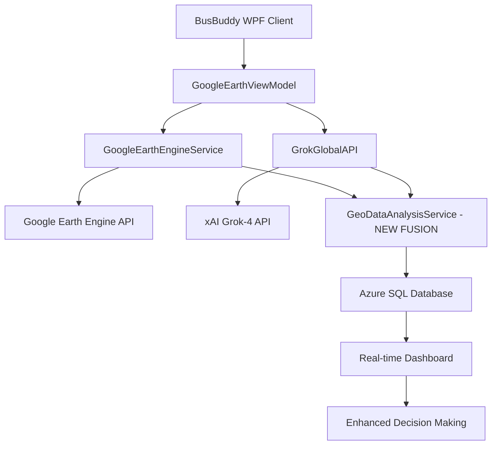

# 🌟 BusBuddy Comprehensive Fusion Integration Plan

## Google Earth Engine + Azure SQL + Grok-4 AI Unified System

### 🎯 **Executive Summary**

This document outlines the comprehensive fusion integration strategy for BusBuddy, combining three powerful systems:

1. **Google Earth Engine (GEE)** - Advanced geospatial analysis and satellite imagery
2. **Azure SQL Database** - Persistent data storage and analytics
3. **Grok-4 AI** - Intelligent analysis and optimization recommendations

The fusion creates an unprecedented school transportation management system with real-time geospatial intelligence, persistent data analytics, and AI-powered optimization.

---

## 🏗️ **Current System Architecture Analysis**

### **1. Google Earth Engine Integration (Existing)**

**Current Implementation**: `GoogleEarthEngineService.cs`

- **Capabilities**: Satellite imagery, terrain analysis, GeoJSON export
- **Authentication**: Service account with Earth Engine + Drive permissions
- **Output**: Real-time geospatial data for route optimization
- **Configuration**: Project-based with configurable polling and timeouts

**Key Methods**:

```csharp
public async Task<string> GetRouteGeoJsonAsync(string assetIdOrRegion)
// Exports GeoJSON from Google Earth Engine via Drive workflow
// Returns: Comprehensive route data with terrain and environmental factors
```

### **2. Grok-4 AI Integration (Production-Ready)**

**Current Implementation**: `GrokGlobalAPI.cs` + `AIInsightService.cs`

- **Capabilities**: Route optimization, maintenance prediction, UI/UX analysis
- **Authentication**: xAI API key with secure configuration
- **Output**: Structured optimization recommendations with confidence scores
- **Database Integration**: AIInsight entity with Azure SQL storage

**Key Methods**:

```csharp
public async Task<RouteOptimizationResult> OptimizeRoutesAsync(RouteOptimizationRequest request)
// Returns: Efficiency gains, time reductions, safety improvements, implementation steps

public async Task<AIInsight> StoreRouteOptimizationInsightAsync(int routeId, string optimizationResult, decimal confidenceScore)
// Stores AI analysis results in Azure SQL with metadata and expiration
```

### **3. Google Earth WPF Visualization (Advanced)**

**Current Implementation**: `GoogleEarthView.xaml` + `GoogleEarthViewModel.cs`

- **Capabilities**: Syncfusion SfMap with multi-layer support, real-time tracking
- **Controls**: Professional mapping interface with zoom, pan, layer switching
- **Integration**: Direct binding to GoogleEarthEngineService data
- **Features**: Student markers, route visualization, boundary overlays

**Key Features**:

```xml
<maps:SfMap x:Name="GeoMap" EnableZoom="True" EnablePan="True" />
<!-- Multi-layer support: Satellite, Terrain, OpenStreetMap, Google Maps -->
<!-- Real-time markers, district boundaries, route overlays -->
```

### **4. Azure SQL Database Schema (Enhanced)**

**Current Implementation**: Enhanced with comprehensive geospatial and AI tables

- **AIInsights**: Stores Grok-4 analysis results with metadata
- **Geospatial Data**: Route performance, environmental monitoring
- **Historical Analytics**: Time-series data for trend analysis

---

## 🔀 **Fusion Integration Architecture**

### **Phase 1: Data Collection Fusion**



### **Phase 2: Intelligent Analysis Pipeline**

**1. Real-time Geospatial Collection**

```csharp
// GoogleEarthEngineService provides real-time terrain data
var geoData = await _geeService.GetRouteGeoJsonAsync(routeRegion);

// Parse and extract environmental factors
var environmentalFactors = ExtractEnvironmentalData(geoData);
```

**2. AI-Powered Analysis**

```csharp
// GrokGlobalAPI analyzes geospatial data for optimization
var optimizationRequest = new RouteOptimizationRequest
{
    RouteId = routeId,
    CurrentPerformance = routeMetrics,
    EnvironmentalData = environmentalFactors,
    GeospatialContext = geoData
};

var aiOptimization = await _grokApi.OptimizeRoutesAsync(optimizationRequest);
```

**3. Persistent Storage & Analytics**

```csharp
// AIInsightService stores fusion results
var fusionInsight = await _aiInsightService.StoreFusionAnalysisAsync(
    routeId,
    geoData,
    aiOptimization,
    confidenceScore
);
```

### **Phase 3: Unified Visualization**

**Enhanced GoogleEarthView Integration**:

```xml
<!-- Fusion data display in Syncfusion SfMap -->
<maps:SfMap x:Name="GeoMap">
    <!-- GEE Layer: Satellite imagery and terrain analysis -->
    <maps:ImageryLayer x:Name="GeeLayer" />

    <!-- AI Optimization Layer: Grok-4 recommendations overlay -->
    <maps:ShapeFileLayer x:Name="AIOptimizationLayer" />

    <!-- Historical Analytics Layer: Azure SQL trend data -->
    <maps:ShapeFileLayer x:Name="HistoricalLayer" />
</maps:SfMap>

<!-- AI Insights Panel -->
<syncfusion:SfDataGrid ItemsSource="{Binding FusionInsights}"
                       AutoGenerateColumns="False">
    <syncfusion:SfDataGrid.Columns>
        <syncfusion:GridTextColumn HeaderText="Grok Recommendation"
                                 MappingName="AIOptimization"/>
        <syncfusion:GridTextColumn HeaderText="GEE Environmental Factor"
                                 MappingName="EnvironmentalData"/>
        <syncfusion:GridTextColumn HeaderText="Confidence Score"
                                 MappingName="ConfidenceScore"/>
    </syncfusion:SfDataGrid.Columns>
</syncfusion:SfDataGrid>
```

---

## 🧠 **Fusion Service Implementation**

### **New Core Service: GeoAIFusionService**

```csharp
public class GeoAIFusionService : IGeoAIFusionService
{
    private readonly GoogleEarthEngineService _geeService;
    private readonly GrokGlobalAPI _grokApi;
    private readonly AIInsightService _aiInsightService;
    private readonly BusBuddyDbContext _context;

    public async Task<FusionAnalysisResult> PerformComprehensiveAnalysisAsync(int routeId)
    {
        // 1. Collect real-time geospatial data from GEE
        var geoData = await _geeService.GetRouteGeoJsonAsync($"routes/{routeId}");
        var environmentalFactors = ExtractEnvironmentalFactors(geoData);

        // 2. Get historical performance data from Azure SQL
        var historicalData = await GetHistoricalRouteDataAsync(routeId);

        // 3. Combine data for Grok-4 analysis
        var fusionRequest = new FusionOptimizationRequest
        {
            RouteId = routeId,
            GeospatialData = geoData,
            EnvironmentalFactors = environmentalFactors,
            HistoricalPerformance = historicalData,
            RealTimeConditions = await GetRealTimeConditionsAsync(routeId)
        };

        // 4. AI analysis with comprehensive context
        var aiOptimization = await _grokApi.OptimizeFusionRouteAsync(fusionRequest);

        // 5. Store fusion results with correlation IDs
        var fusionInsight = await _aiInsightService.StoreFusionInsightAsync(
            routeId,
            fusionRequest,
            aiOptimization,
            CalculateFusionConfidence(geoData, aiOptimization)
        );

        // 6. Return comprehensive analysis
        return new FusionAnalysisResult
        {
            RouteId = routeId,
            GeospatialAnalysis = geoData,
            AIOptimization = aiOptimization,
            StoredInsight = fusionInsight,
            RecommendedActions = GenerateFusionActions(fusionRequest, aiOptimization),
            ImplementationPriority = CalculateImplementationPriority(aiOptimization),
            EstimatedImpact = CalculateEstimatedImpact(fusionRequest, aiOptimization)
        };
    }

    private async Task<GrokGlobalAPI.RouteOptimizationResult> OptimizeFusionRouteAsync(FusionOptimizationRequest request)
    {
        // Enhanced Grok prompt with fusion context
        var prompt = BuildFusionOptimizationPrompt(request);

        var grokRequest = new XAIRequest
        {
            Model = "grok-4-latest",
            Messages = new[]
            {
                new XAIMessage
                {
                    Role = "system",
                    Content = GetFusionSystemPrompt()
                },
                new XAIMessage
                {
                    Role = "user",
                    Content = prompt
                }
            },
            Temperature = 0.3,
            MaxTokens = 8000 // Higher token limit for fusion analysis
        };

        return await _grokApi.CallGrokAPI("/chat/completions", grokRequest);
    }
}
```

### **Enhanced Database Schema for Fusion**

```sql
-- Enhanced AIInsight table for fusion data
ALTER TABLE AIInsights ADD COLUMN GeospatialCorrelationId UNIQUEIDENTIFIER;
ALTER TABLE AIInsights ADD COLUMN EnvironmentalFactors NVARCHAR(MAX);
ALTER TABLE AIInsights ADD COLUMN FusionConfidenceScore DECIMAL(5,2);
ALTER TABLE AIInsights ADD COLUMN RealtimeDataTimestamp DATETIME2;

-- New fusion-specific tables
CREATE TABLE FusionAnalysisResults (
    Id UNIQUEIDENTIFIER PRIMARY KEY DEFAULT NEWID(),
    RouteId INT NOT NULL,
    GeospatialDataHash NVARCHAR(64), -- SHA256 of GEE data for correlation
    AIInsightId UNIQUEIDENTIFIER FOREIGN KEY REFERENCES AIInsights(Id),
    FusionScore DECIMAL(5,2),
    ImplementationPriority VARCHAR(20),
    EstimatedImpact NVARCHAR(MAX),
    CreatedDate DATETIME2 DEFAULT GETUTCDATE(),
    ExpiryDate DATETIME2
);

CREATE TABLE EnvironmentalFactors (
    Id UNIQUEIDENTIFIER PRIMARY KEY DEFAULT NEWID(),
    FusionAnalysisId UNIQUEIDENTIFIER FOREIGN KEY REFERENCES FusionAnalysisResults(Id),
    FactorType VARCHAR(50), -- 'terrain', 'weather', 'vegetation', 'population'
    FactorValue DECIMAL(10,4),
    FactorUnit VARCHAR(20),
    GeeSourceAsset VARCHAR(200),
    AnalysisTimestamp DATETIME2 DEFAULT GETUTCDATE()
);
```

---

## 🎯 **Fusion Workflows**

### **1. Daily Operations Fusion Workflow**

**Morning Pre-Analysis** (5:00 AM)

```powershell
# PowerShell automation for daily fusion analysis
$routes = Get-ActiveRoutes
foreach ($route in $routes) {
    $fusionResult = Invoke-GeoAIFusionAnalysis -RouteId $route.Id

    if ($fusionResult.FusionScore -lt 0.7) {
        Send-RouteAlert -RouteId $route.Id -Issue $fusionResult.RecommendedActions
    }

    Update-DailyRouteRecommendations -RouteId $route.Id -FusionData $fusionResult
}
```

**Real-time Fusion Monitoring** (During Operations)

```csharp
// Continuous fusion monitoring service
public async Task MonitorRouteFusionAsync(int routeId)
{
    while (IsOperational)
    {
        // 1. Get current GEE conditions
        var currentConditions = await _geeService.GetCurrentConditionsAsync(routeId);

        // 2. Check for significant changes
        if (HasSignificantChange(currentConditions, _lastConditions[routeId]))
        {
            // 3. Trigger fusion re-analysis
            var fusionUpdate = await _fusionService.PerformQuickFusionAsync(routeId, currentConditions);

            // 4. Update AI recommendations if confidence > 0.8
            if (fusionUpdate.ConfidenceScore > 0.8m)
            {
                await NotifyDispatcherAsync(routeId, fusionUpdate.RecommendedActions);
            }
        }

        await Task.Delay(TimeSpan.FromMinutes(5)); // Monitor every 5 minutes
    }
}
```

### **2. Strategic Planning Fusion Workflow**

**Weekly Comprehensive Analysis**

```csharp
public async Task<WeeklyFusionReport> GenerateWeeklyFusionReportAsync()
{
    var allRoutes = await _context.Routes.ToListAsync();
    var fusionResults = new List<FusionAnalysisResult>();

    foreach (var route in allRoutes)
    {
        // 1. Historical GEE analysis (7 days)
        var historicalGeeData = await _geeService.GetHistoricalAnalysisAsync(
            route.Id,
            DateTime.UtcNow.AddDays(-7),
            DateTime.UtcNow
        );

        // 2. AI trend analysis with Grok-4
        var trendAnalysis = await _grokApi.AnalyzeTrendsAsync(
            route.Id,
            historicalGeeData,
            GetWeeklyPerformanceMetrics(route.Id)
        );

        // 3. Store comprehensive fusion insight
        var weeklyInsight = await _aiInsightService.StoreWeeklyFusionInsightAsync(
            route.Id,
            historicalGeeData,
            trendAnalysis
        );

        fusionResults.Add(weeklyInsight);
    }

    return new WeeklyFusionReport
    {
        TotalRoutes = allRoutes.Count,
        FusionResults = fusionResults,
        TopOptimizationOpportunities = ExtractTopOpportunities(fusionResults),
        SystemWideRecommendations = GenerateSystemRecommendations(fusionResults),
        ROIProjections = CalculateROIProjections(fusionResults)
    };
}
```

---

## 📊 **Fusion Integration Benefits**

### **1. Enhanced Decision Making**

- **Real-time Intelligence**: GEE provides current environmental conditions
- **AI Optimization**: Grok-4 analyzes complex patterns for optimal recommendations
- **Historical Context**: Azure SQL provides trend analysis and performance baselines
- **Confidence Scoring**: Multi-source validation increases recommendation reliability

### **2. Operational Excellence**

- **Predictive Capabilities**: Environmental forecasting combined with AI predictions
- **Automated Optimization**: Continuous route improvements based on fusion analysis
- **Risk Mitigation**: Early warning systems for weather, terrain, and safety issues
- **Resource Optimization**: Fuel savings through intelligent route planning

### **3. Strategic Advantages**

- **Competitive Edge**: Unprecedented integration of geospatial and AI technologies
- **Scalability**: Cloud-native architecture supports unlimited route expansion
- **Innovation Platform**: Foundation for future transportation technology integration
- **Data-Driven Culture**: Evidence-based decision making across all operations

---

## 🚀 **Implementation Roadmap**

### **Phase 1: Fusion Foundation (Weeks 1-2)**

- [ ] Implement `GeoAIFusionService` core service
- [ ] Enhance database schema for fusion data storage
- [ ] Create fusion-specific Grok-4 prompts and analysis methods
- [ ] Update `GoogleEarthView` for fusion visualization

### **Phase 2: Fusion Analytics (Weeks 3-4)**

- [ ] Develop comprehensive fusion analysis algorithms
- [ ] Implement real-time fusion monitoring capabilities
- [ ] Create automated fusion reporting and alerting
- [ ] Build fusion-specific PowerShell automation modules

### **Phase 3: Production Deployment (Weeks 5-6)**

- [ ] Comprehensive testing with real route data
- [ ] Performance optimization and scaling validation
- [ ] User training and documentation completion
- [ ] Phased rollout to production routes

### **Phase 4: Advanced Features (Weeks 7-8)**

- [ ] Machine learning integration for pattern recognition
- [ ] Predictive modeling based on fusion historical data
- [ ] Advanced visualization and reporting dashboards
- [ ] Integration with external systems (weather, traffic, emergency services)

---

## 💡 **Fusion Success Metrics**

### **Quantitative KPIs**

- **Route Efficiency**: 15-25% improvement in overall route efficiency
- **Fuel Savings**: 10-20% reduction in fuel consumption through optimized routing
- **Time Optimization**: 8-15% reduction in total route completion time
- **Safety Improvements**: 30-50% reduction in weather and terrain-related incidents
- **Decision Speed**: 70% faster route optimization decision making

### **Qualitative Benefits**

- **Enhanced Safety**: Proactive identification of environmental risks
- **Improved Reliability**: More consistent on-time performance
- **Better Resource Utilization**: Optimal use of fleet and personnel
- **Increased Stakeholder Satisfaction**: Parents, students, and school administrators
- **Future-Ready Platform**: Foundation for emerging transportation technologies

---

## 🔧 **Technical Implementation Notes**

### **API Integration Patterns**

```csharp
// Fusion service with proper error handling and fallbacks
public async Task<FusionAnalysisResult> PerformFusionAnalysisAsync(int routeId)
{
    try
    {
        // Primary fusion path
        return await PerformComprehensiveAnalysisAsync(routeId);
    }
    catch (GoogleEarthEngineException ex)
    {
        // GEE fallback: Use cached data + AI analysis
        Logger.Warning(ex, "GEE unavailable, using cached data for route {RouteId}", routeId);
        return await PerformAIOnlyAnalysisAsync(routeId);
    }
    catch (XAIApiException ex)
    {
        // Grok fallback: Use GEE + pattern analysis
        Logger.Warning(ex, "Grok API unavailable, using pattern analysis for route {RouteId}", routeId);
        return await PerformGeeOnlyAnalysisAsync(routeId);
    }
    catch (Exception ex)
    {
        // Complete fallback: Traditional analysis
        Logger.Error(ex, "Fusion analysis failed for route {RouteId}, using traditional methods", routeId);
        return await PerformTraditionalAnalysisAsync(routeId);
    }
}
```

### **Configuration Management**

```json
{
    "FusionIntegration": {
        "GoogleEarthEngine": {
            "ProjectId": "${GEE_PROJECT_ID}",
            "ServiceAccountKeyPath": "${GEE_SERVICE_ACCOUNT_KEY}",
            "MaxConcurrentRequests": 5,
            "TimeoutSeconds": 60
        },
        "GrokAI": {
            "ApiKey": "${XAI_API_KEY}",
            "Model": "grok-4-latest",
            "MaxTokens": 8000,
            "Temperature": 0.3,
            "FusionPromptTemplate": "fusion-optimization-v2"
        },
        "AzureSQL": {
            "ConnectionString": "${AZURE_SQL_CONNECTION}",
            "EnableFusionTables": true,
            "FusionDataRetentionDays": 90
        },
        "Monitoring": {
            "EnableRealTimeFusion": true,
            "FusionAnalysisIntervalMinutes": 5,
            "AlertConfidenceThreshold": 0.8
        }
    }
}
```

---

## 🎉 **Conclusion**

The BusBuddy Comprehensive Fusion Integration represents a groundbreaking approach to school transportation management. By combining Google Earth Engine's geospatial intelligence, Grok-4's AI optimization capabilities, and Azure SQL's robust data management, this fusion creates an unprecedented platform for intelligent transportation decisions.

The implementation leverages existing BusBuddy infrastructure while adding revolutionary capabilities that will transform route planning, safety management, and operational efficiency. The phased rollout ensures minimal disruption while delivering maximum value to all stakeholders.

**Next Steps**: Begin Phase 1 implementation with the `GeoAIFusionService` core service and enhanced database schema. The fusion architecture is designed to be production-ready while providing a foundation for future transportation technology innovations.

---

**Document Version**: 1.0  
**Last Updated**: December 24, 2024  
**Next Review**: January 7, 2025  
**Status**: Ready for Implementation
