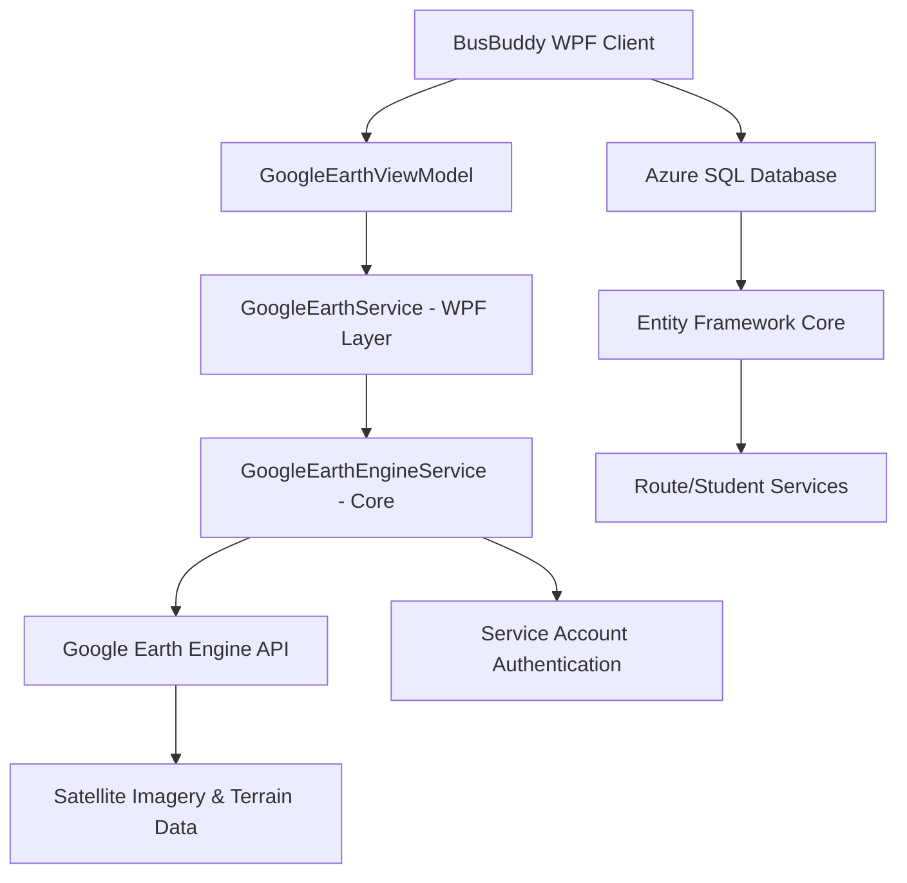
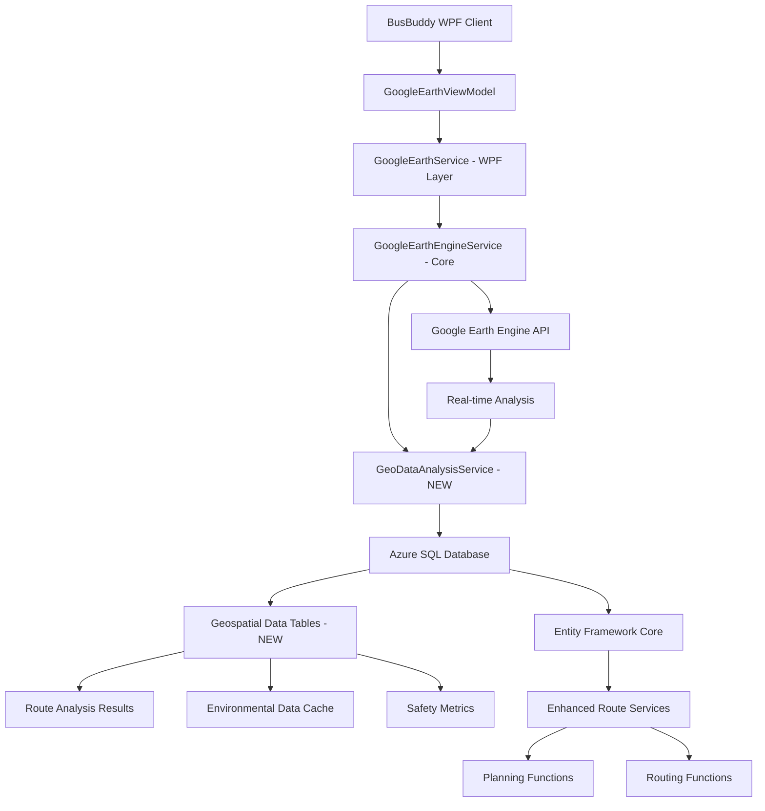
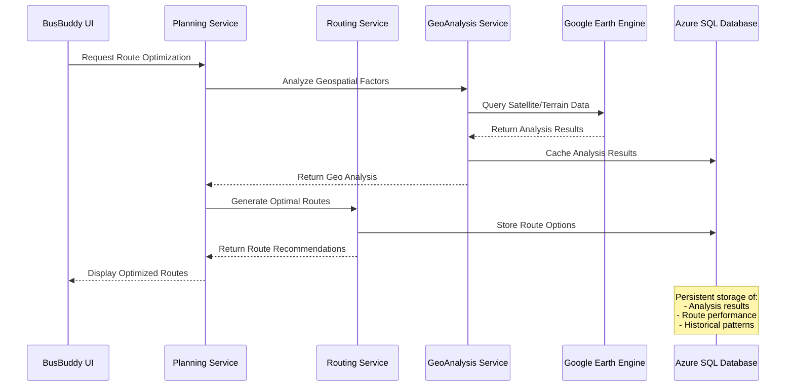

# 🌍 Google Earth Engine + Azure SQL Database Integration Plan

## BusBuddy Advanced Geospatial Route Planning & Analysis

_Implementation Plan - August 26, 2025_

---

## 📖 **Executive Summary**

This document outlines the integration strategy for Google Earth Engine (GEE) with Azure SQL Database to create an advanced geospatial planning and routing system for BusBuddy. The integration will enhance route optimization, safety analysis, and environmental monitoring capabilities while maintaining data persistence and historical analysis through Azure SQL.

### **Key Integration Points**

- **Real-time Geospatial Analysis**: GEE processes satellite imagery, terrain, and environmental data
- **Persistent Data Storage**: Azure SQL stores analysis results, route metrics, and historical patterns
- **Intelligent Route Planning**: Combined GEE insights with database-driven route optimization
- **Safety & Compliance**: Environmental hazard detection with regulatory compliance tracking

---

## 🏗️ **Current Architecture Overview**

### **Existing Components**



### **Enhanced Integration Architecture**



---

## 🗃️ **Azure SQL Database Schema Enhancements**

### **New Geospatial Tables**

#### **1. RouteAnalysisResults**

```sql
CREATE TABLE RouteAnalysisResults (
    Id UNIQUEIDENTIFIER PRIMARY KEY DEFAULT NEWID(),
    RouteId INT NOT NULL FOREIGN KEY REFERENCES Routes(Id),
    AnalysisType NVARCHAR(50) NOT NULL, -- 'Terrain', 'Weather', 'Traffic', 'Safety'
    GeeAssetId NVARCHAR(255), -- Google Earth Engine asset reference
    AnalysisDate DATETIME2 NOT NULL DEFAULT GETUTCDATE(),

    -- Terrain Analysis
    ElevationProfile NVARCHAR(MAX), -- JSON array of elevation points
    SlopeAnalysis NVARCHAR(MAX), -- JSON object with slope metrics
    TerrainDifficulty DECIMAL(3,2), -- 0.0 to 10.0 scale

    -- Environmental Conditions
    WeatherRisk DECIMAL(3,2), -- 0.0 to 10.0 scale
    SeasonalFactors NVARCHAR(MAX), -- JSON object
    EnvironmentalHazards NVARCHAR(MAX), -- JSON array

    -- Safety Metrics
    AccidentRiskScore DECIMAL(3,2),
    VisibilityConditions NVARCHAR(MAX),
    RoadConditionScore DECIMAL(3,2),

    -- Performance Metrics
    OptimalSpeed DECIMAL(5,2), -- km/h
    FuelEfficiency DECIMAL(5,2), -- L/100km estimated
    EstimatedTravelTime INT, -- minutes

    -- Geospatial Data
    GeoBounds GEOGRAPHY, -- Route boundary polygon
    WaypointAnalysis NVARCHAR(MAX), -- JSON array of waypoint details

    CreatedDate DATETIME2 NOT NULL DEFAULT GETUTCDATE(),
    LastUpdated DATETIME2 NOT NULL DEFAULT GETUTCDATE()
);

CREATE INDEX IX_RouteAnalysisResults_RouteId_AnalysisType
ON RouteAnalysisResults(RouteId, AnalysisType);

CREATE INDEX IX_RouteAnalysisResults_AnalysisDate
ON RouteAnalysisResults(AnalysisDate);
```

#### **2. GeoDataCache**

```sql
CREATE TABLE GeoDataCache (
    Id UNIQUEIDENTIFIER PRIMARY KEY DEFAULT NEWID(),
    GeeAssetId NVARCHAR(255) NOT NULL,
    DataType NVARCHAR(50) NOT NULL, -- 'Satellite', 'Terrain', 'Weather', 'Traffic'
    GeographicBounds GEOGRAPHY NOT NULL,
    Resolution DECIMAL(8,2), -- meters per pixel

    -- Data Storage
    GeoJsonData NVARCHAR(MAX), -- Cached GeoJSON from GEE
    ImageryUrl NVARCHAR(500), -- Tile service URL
    MetadataJson NVARCHAR(MAX), -- Additional GEE metadata

    -- Cache Management
    ExpirationDate DATETIME2 NOT NULL,
    LastAccessed DATETIME2 NOT NULL DEFAULT GETUTCDATE(),
    AccessCount INT DEFAULT 0,
    DataSize BIGINT, -- bytes

    CreatedDate DATETIME2 NOT NULL DEFAULT GETUTCDATE()
);

CREATE INDEX IX_GeoDataCache_AssetId_DataType
ON GeoDataCache(GeeAssetId, DataType);

CREATE SPATIAL INDEX SIX_GeoDataCache_Bounds
ON GeoDataCache(GeographicBounds);
```

#### **3. RouteOptimizationHistory**

```sql
CREATE TABLE RouteOptimizationHistory (
    Id UNIQUEIDENTIFIER PRIMARY KEY DEFAULT NEWID(),
    RouteId INT NOT NULL FOREIGN KEY REFERENCES Routes(Id),
    OptimizationDate DATETIME2 NOT NULL DEFAULT GETUTCDATE(),

    -- Original Route Data
    OriginalWaypoints NVARCHAR(MAX), -- JSON array
    OriginalDistance DECIMAL(10,2), -- kilometers
    OriginalEstimatedTime INT, -- minutes

    -- Optimized Route Data
    OptimizedWaypoints NVARCHAR(MAX), -- JSON array
    OptimizedDistance DECIMAL(10,2), -- kilometers
    OptimizedEstimatedTime INT, -- minutes

    -- GEE Analysis Factors
    TerrainOptimization BIT DEFAULT 0,
    WeatherConsideration BIT DEFAULT 0,
    TrafficIntegration BIT DEFAULT 0,
    SafetyPrioritization BIT DEFAULT 0,

    -- Performance Improvements
    DistanceReduction DECIMAL(10,2), -- kilometers saved
    TimeReduction INT, -- minutes saved
    FuelSavingsEstimate DECIMAL(8,2), -- liters saved
    SafetyScoreImprovement DECIMAL(3,2),

    -- Implementation Status
    IsApproved BIT DEFAULT 0,
    IsImplemented BIT DEFAULT 0,
    ApprovedBy NVARCHAR(100),
    ApprovedDate DATETIME2,

    CreatedDate DATETIME2 NOT NULL DEFAULT GETUTCDATE()
);
```

#### **4. EnvironmentalMonitoring**

```sql
CREATE TABLE EnvironmentalMonitoring (
    Id UNIQUEIDENTIFIER PRIMARY KEY DEFAULT NEWID(),
    MonitoringDate DATETIME2 NOT NULL DEFAULT GETUTCDATE(),

    -- Geographic Coverage
    ServiceArea GEOGRAPHY NOT NULL,
    RegionName NVARCHAR(100),

    -- Weather Conditions
    WeatherData NVARCHAR(MAX), -- JSON from GEE weather analysis
    TemperatureRange NVARCHAR(50), -- "min-max°C"
    PrecipitationMm DECIMAL(5,2),
    WindSpeedKmh DECIMAL(5,2),
    VisibilityKm DECIMAL(5,2),

    -- Road Conditions
    RoadSurfaceAnalysis NVARCHAR(MAX), -- JSON from GEE imagery analysis
    IceRisk DECIMAL(3,2), -- 0.0 to 10.0
    FloodRisk DECIMAL(3,2), -- 0.0 to 10.0
    ConstructionZones NVARCHAR(MAX), -- JSON array

    -- Air Quality
    AirQualityIndex INT,
    PollutionLevels NVARCHAR(MAX), -- JSON object

    -- Safety Alerts
    ActiveHazards NVARCHAR(MAX), -- JSON array
    RiskLevel NVARCHAR(20), -- 'Low', 'Medium', 'High', 'Critical'

    CreatedDate DATETIME2 NOT NULL DEFAULT GETUTCDATE()
);

CREATE SPATIAL INDEX SIX_EnvironmentalMonitoring_ServiceArea
ON EnvironmentalMonitoring(ServiceArea);
```

---

## 🔧 **Enhanced Service Layer Architecture**

### **1. GeoDataAnalysisService**

```csharp
public interface IGeoDataAnalysisService
{
    // Route Analysis
    Task<RouteAnalysisResult> AnalyzeRouteAsync(int routeId, AnalysisType type);
    Task<RouteOptimization> OptimizeRouteAsync(int routeId, OptimizationCriteria criteria);

    // Environmental Monitoring
    Task<EnvironmentalData> GetEnvironmentalConditionsAsync(Geography serviceArea);
    Task UpdateEnvironmentalCacheAsync();

    // Performance Analytics
    Task<RoutePerformanceMetrics> GetRoutePerformanceAsync(int routeId, DateTime startDate, DateTime endDate);
    Task<List<RouteRecommendation>> GetRouteRecommendationsAsync();

    // Data Management
    Task<bool> CacheGeoDataAsync(string geeAssetId, DataType dataType);
    Task CleanExpiredCacheAsync();
}

public class GeoDataAnalysisService : IGeoDataAnalysisService
{
    private readonly AppContext _context;
    private readonly GoogleEarthEngineService _geeService;
    private readonly ILogger<GeoDataAnalysisService> _logger;

    public async Task<RouteAnalysisResult> AnalyzeRouteAsync(int routeId, AnalysisType type)
    {
        using var activity = _logger.BeginScope("AnalyzeRoute");

        try
        {
            // 1. Get route from database
            var route = await _context.Routes.FindAsync(routeId);
            if (route == null) throw new NotFoundException($"Route {routeId} not found");

            // 2. Check for cached analysis
            var cached = await GetCachedAnalysisAsync(routeId, type);
            if (cached != null && !cached.IsExpired())
                return cached;

            // 3. Perform GEE analysis
            var geeData = await _geeService.AnalyzeRouteGeographyAsync(route.Waypoints, type);

            // 4. Process and store results
            var analysis = new RouteAnalysisResult
            {
                RouteId = routeId,
                AnalysisType = type.ToString(),
                GeeAssetId = geeData.AssetId,
                TerrainDifficulty = CalculateTerrainDifficulty(geeData.ElevationProfile),
                WeatherRisk = CalculateWeatherRisk(geeData.WeatherData),
                AccidentRiskScore = CalculateSafetyRisk(geeData.RoadConditions),
                OptimalSpeed = CalculateOptimalSpeed(geeData),
                EstimatedTravelTime = CalculateTravelTime(geeData),
                GeoBounds = CreateGeographyFromWaypoints(route.Waypoints)
            };

            _context.RouteAnalysisResults.Add(analysis);
            await _context.SaveChangesAsync();

            _logger.Information("Route analysis completed for Route {RouteId}, Type {AnalysisType}",
                routeId, type);

            return analysis;
        }
        catch (Exception ex)
        {
            _logger.Error(ex, "Failed to analyze route {RouteId}", routeId);
            throw;
        }
    }
}
```

### **2. Enhanced RoutePlanningService**

```csharp
public interface IRoutePlanningService
{
    // Core Planning Functions
    Task<OptimizedRoute> CreateOptimalRouteAsync(RouteRequest request);
    Task<List<RouteOption>> GenerateRouteAlternativesAsync(RouteRequest request);
    Task<RouteValidationResult> ValidateRouteAsync(Route route);

    // Geospatial Planning
    Task<RouteAnalysis> AnalyzeRouteGeospatialFactorsAsync(Route route);
    Task<List<SafetyRecommendation>> GetRouteSafetyRecommendationsAsync(Route route);
    Task<EnvironmentalImpactAssessment> AssessEnvironmentalImpactAsync(Route route);

    // Dynamic Planning
    Task<RouteAdjustment> GetDynamicRouteAdjustmentAsync(int routeId, DateTime travelDate);
    Task<WeatherAdvisory> GetWeatherBasedAdvisoryAsync(Route route, DateTime travelDate);
}

public class RoutePlanningService : IRoutePlanningService
{
    private readonly IGeoDataAnalysisService _geoAnalysisService;
    private readonly AppContext _context;
    private readonly ILogger<RoutePlanningService> _logger;

    public async Task<OptimizedRoute> CreateOptimalRouteAsync(RouteRequest request)
    {
        using var activity = _logger.BeginScope("CreateOptimalRoute");

        try
        {
            // 1. Generate base route options
            var baseRoutes = await GenerateBaseRoutesAsync(request);

            // 2. Analyze each route with GEE
            var analyzedRoutes = new List<AnalyzedRoute>();
            foreach (var route in baseRoutes)
            {
                var terrainAnalysis = await _geoAnalysisService.AnalyzeRouteAsync(route.Id, AnalysisType.Terrain);
                var weatherAnalysis = await _geoAnalysisService.AnalyzeRouteAsync(route.Id, AnalysisType.Weather);
                var safetyAnalysis = await _geoAnalysisService.AnalyzeRouteAsync(route.Id, AnalysisType.Safety);

                analyzedRoutes.Add(new AnalyzedRoute
                {
                    Route = route,
                    TerrainScore = terrainAnalysis.TerrainDifficulty,
                    WeatherRisk = weatherAnalysis.WeatherRisk,
                    SafetyScore = safetyAnalysis.AccidentRiskScore,
                    OverallScore = CalculateOverallScore(terrainAnalysis, weatherAnalysis, safetyAnalysis)
                });
            }

            // 3. Select optimal route based on criteria
            var optimalRoute = SelectOptimalRoute(analyzedRoutes, request.OptimizationCriteria);

            // 4. Store optimization history
            await StoreOptimizationHistoryAsync(optimalRoute, analyzedRoutes);

            _logger.Information("Optimal route created with score {Score}", optimalRoute.OverallScore);

            return optimalRoute;
        }
        catch (Exception ex)
        {
            _logger.Error(ex, "Failed to create optimal route");
            throw;
        }
    }
}
```

---

## 🎯 **Planning Functions Integration**

### **1. Strategic Route Planning**

```csharp
public class StrategicPlanningService
{
    // Long-term route optimization based on historical GEE data
    public async Task<List<RouteImprovement>> GetAnnualRouteOptimizationPlanAsync()
    {
        var historicalData = await GetHistoricalGeeAnalysisAsync(TimeSpan.FromDays(365));
        var seasonalPatterns = AnalyzeSeasonalPatterns(historicalData);
        var improvementOpportunities = IdentifyImprovementOpportunities(seasonalPatterns);

        return improvementOpportunities;
    }

    // Service area expansion planning
    public async Task<ServiceAreaAnalysis> AnalyzeServiceAreaExpansionAsync(Geography proposedArea)
    {
        var terrainAnalysis = await _geeService.AnalyzeBulkTerrainAsync(proposedArea);
        var infrastructureAnalysis = await _geeService.AnalyzeInfrastructureAsync(proposedArea);
        var populationDensity = await _geeService.GetPopulationDataAsync(proposedArea);

        return new ServiceAreaAnalysis
        {
            TerrainSuitability = CalculateTerrainSuitability(terrainAnalysis),
            InfrastructureReadiness = AssessInfrastructure(infrastructureAnalysis),
            DemandProjection = ProjectDemand(populationDensity),
            RecommendedPhasing = CreateImplementationPhases(proposedArea)
        };
    }

    // Budget planning with GEE insights
    public async Task<BudgetProjection> GetGeeEnhancedBudgetProjectionAsync(int fiscalYear)
    {
        var routeEfficiencies = await GetGeeOptimizedRouteEfficienciesAsync();
        var fuelSavings = CalculateFuelSavingsFromOptimization(routeEfficiencies);
        var maintenanceReductions = EstimateMaintenanceReductions(routeEfficiencies);

        return new BudgetProjection
        {
            FuelSavings = fuelSavings,
            MaintenanceReductions = maintenanceReductions,
            OptimizationROI = CalculateROI(fuelSavings, maintenanceReductions)
        };
    }
}
```

### **2. Operational Planning Functions**

```csharp
public class OperationalPlanningService
{
    // Daily route optimization
    public async Task<DailyRouteOptimization> OptimizeDailyRoutesAsync(DateTime operationDate)
    {
        var weatherForecast = await _geoAnalysisService.GetEnvironmentalConditionsAsync(ServiceArea);
        var routeAdjustments = new List<RouteAdjustment>();

        foreach (var route in await GetActiveRoutesAsync())
        {
            var weatherImpact = AssessWeatherImpact(route, weatherForecast);
            var roadConditions = await GetRoadConditionForecastAsync(route, operationDate);

            if (weatherImpact.RequiresAdjustment || roadConditions.HasRisks)
            {
                var adjustment = await CreateRouteAdjustmentAsync(route, weatherImpact, roadConditions);
                routeAdjustments.Add(adjustment);
            }
        }

        return new DailyRouteOptimization
        {
            OperationDate = operationDate,
            RouteAdjustments = routeAdjustments,
            WeatherAdvisories = CreateWeatherAdvisories(weatherForecast),
            SafetyRecommendations = CreateSafetyRecommendations(routeAdjustments)
        };
    }

    // Emergency routing
    public async Task<EmergencyRouteResponse> CreateEmergencyRoutingAsync(EmergencyScenario scenario)
    {
        var affectedArea = scenario.ImpactArea;
        var alternativeRoutes = await FindAlternativeRoutesAsync(affectedArea);

        foreach (var altRoute in alternativeRoutes)
        {
            var safetyAnalysis = await _geoAnalysisService.AnalyzeRouteAsync(altRoute.Id, AnalysisType.Safety);
            altRoute.EmergencySuitability = CalculateEmergencySuitability(safetyAnalysis, scenario);
        }

        return new EmergencyRouteResponse
        {
            Scenario = scenario,
            RecommendedRoutes = alternativeRoutes.OrderByDescending(r => r.EmergencySuitability).ToList(),
            ImplementationTimeline = CreateImplementationTimeline(alternativeRoutes)
        };
    }
}
```

---

## 🛣️ **Routing Functions Integration**

### **1. Dynamic Routing Engine**

```csharp
public class DynamicRoutingEngine
{
    // Real-time route optimization
    public async Task<RouteOptimization> OptimizeRouteRealTimeAsync(int routeId, VehicleLocation currentLocation)
    {
        var currentConditions = await _geoAnalysisService.GetEnvironmentalConditionsAsync(
            CreateBufferAroundLocation(currentLocation, 10000)); // 10km buffer

        var remainingWaypoints = GetRemainingWaypoints(routeId, currentLocation);
        var optimizedPath = await CalculateOptimalPathAsync(remainingWaypoints, currentConditions);

        return new RouteOptimization
        {
            OriginalPath = remainingWaypoints,
            OptimizedPath = optimizedPath,
            TimeSaving = CalculateTimeSaving(remainingWaypoints, optimizedPath),
            FuelSaving = CalculateFuelSaving(remainingWaypoints, optimizedPath),
            SafetyImprovement = CalculateSafetyImprovement(remainingWaypoints, optimizedPath)
        };
    }

    // Adaptive routing based on conditions
    public async Task<AdaptiveRouteResponse> GetAdaptiveRouteAsync(RouteRequest request, DateTime departureTime)
    {
        var forecastConditions = await GetConditionsForecastAsync(request.ServiceArea, departureTime);
        var routeOptions = await GenerateAdaptiveRoutesAsync(request, forecastConditions);

        foreach (var route in routeOptions)
        {
            route.ConditionAdaptations = AnalyzeConditionAdaptations(route, forecastConditions);
            route.RiskAssessment = await PerformRiskAssessmentAsync(route, forecastConditions);
        }

        return new AdaptiveRouteResponse
        {
            PrimaryRoute = routeOptions.First(),
            AlternativeRoutes = routeOptions.Skip(1).ToList(),
            ConditionsSummary = forecastConditions,
            RecommendedDepartureTime = OptimizeDepartureTime(routeOptions, forecastConditions)
        };
    }
}
```

### **2. Intelligent Routing Algorithms**

```csharp
public class IntelligentRoutingService
{
    // Multi-criteria route optimization
    public async Task<MultiCriteriaRouteResult> OptimizeRouteMultiCriteriaAsync(
        RouteRequest request,
        RoutingCriteria criteria)
    {
        var geoFactors = await AnalyzeGeoFactorsAsync(request.StartPoint, request.EndPoint, request.Waypoints);

        var weights = new RoutingWeights
        {
            TimeWeight = criteria.PrioritizeTime ? 0.4 : 0.2,
            SafetyWeight = criteria.PrioritizeSafety ? 0.4 : 0.3,
            FuelWeight = criteria.PrioritizeFuel ? 0.3 : 0.2,
            ComfortWeight = criteria.PrioritizeComfort ? 0.2 : 0.1,
            TerrainWeight = geoFactors.TerrainComplexity > 0.7 ? 0.3 : 0.1
        };

        var optimizedRoute = await CalculateWeightedOptimalRouteAsync(request, weights, geoFactors);

        return new MultiCriteriaRouteResult
        {
            OptimizedRoute = optimizedRoute,
            CriteriaScores = CalculateCriteriaScores(optimizedRoute, weights),
            GeoFactors = geoFactors,
            Recommendations = GenerateRoutingRecommendations(optimizedRoute, geoFactors)
        };
    }

    // Machine learning enhanced routing
    public async Task<MLEnhancedRoute> GetMLEnhancedRouteAsync(RouteRequest request)
    {
        var historicalPerformance = await GetHistoricalRoutePerformanceAsync(request.RoutePattern);
        var geeAnalysis = await GetComprehensiveGeeAnalysisAsync(request);

        var mlModel = await LoadPreTrainedRoutingModelAsync();
        var prediction = await mlModel.PredictOptimalRouteAsync(request, historicalPerformance, geeAnalysis);

        return new MLEnhancedRoute
        {
            PredictedOptimalRoute = prediction.Route,
            ConfidenceScore = prediction.Confidence,
            PerformanceProjection = prediction.ExpectedPerformance,
            LearningRecommendations = prediction.ImprovementSuggestions
        };
    }
}
```

---

## 📊 **Data Flow and Processing Pipeline**

### **Real-time Data Processing Flow**



### **Batch Processing for Historical Analysis**

```csharp
public class GeospatialBatchProcessor
{
    public async Task ProcessHistoricalAnalysisAsync(DateTime startDate, DateTime endDate)
    {
        var routes = await GetRoutesInDateRangeAsync(startDate, endDate);
        var batchSize = 10; // Process 10 routes at a time

        for (int i = 0; i < routes.Count; i += batchSize)
        {
            var batch = routes.Skip(i).Take(batchSize);
            var tasks = batch.Select(async route =>
            {
                try
                {
                    var analysis = await _geoAnalysisService.AnalyzeRouteAsync(route.Id, AnalysisType.Historical);
                    await StoreHistoricalAnalysisAsync(analysis);

                    _logger.Information("Processed historical analysis for route {RouteId}", route.Id);
                }
                catch (Exception ex)
                {
                    _logger.Error(ex, "Failed to process historical analysis for route {RouteId}", route.Id);
                }
            });

            await Task.WhenAll(tasks);

            // Rate limiting to respect GEE quotas
            await Task.Delay(TimeSpan.FromSeconds(2));
        }
    }
}
```

---

## 🔄 **Integration Workflows**

### **1. Daily Operations Workflow**

1. **Morning Pre-Analysis** (5:00 AM)
    - Fetch weather forecast via GEE
    - Analyze current road conditions
    - Update environmental monitoring cache
    - Generate daily route advisories

2. **Route Optimization** (6:00 AM)
    - Apply GEE analysis to scheduled routes
    - Calculate optimal departure times
    - Generate alternative routes for high-risk conditions
    - Update driver briefings with GEE insights

3. **Real-time Monitoring** (During Operations)
    - Monitor environmental conditions
    - Trigger route adjustments based on GEE alerts
    - Track route performance against GEE predictions
    - Log actual vs. predicted performance

4. **End-of-Day Analysis** (6:00 PM)
    - Analyze route performance against GEE factors
    - Update ML models with actual performance data
    - Generate optimization recommendations for next day
    - Store performance metrics in Azure SQL

### **2. Weekly Planning Workflow**

1. **Comprehensive Route Analysis**
    - Perform detailed GEE analysis on all routes
    - Identify optimization opportunities
    - Analyze seasonal patterns and trends
    - Generate route improvement recommendations

2. **Performance Review**
    - Compare actual vs. GEE-predicted performance
    - Identify areas for model improvement
    - Update routing algorithms based on learnings
    - Generate management reports with GEE insights

### **3. Monthly Strategic Planning**

1. **Service Area Optimization**
    - Analyze service area efficiency using GEE data
    - Identify expansion opportunities
    - Assess infrastructure development needs
    - Plan route network improvements

2. **Budget Impact Analysis**
    - Calculate fuel savings from GEE optimization
    - Assess maintenance cost reductions
    - Project ROI from continued GEE integration
    - Plan technology upgrades and improvements

---

## 🎯 **Key Performance Indicators (KPIs)**

### **Operational KPIs**

- **Route Efficiency**: Distance/time optimization percentage
- **Fuel Savings**: Liters saved per month through GEE optimization
- **Safety Improvement**: Reduction in accident risk scores
- **On-time Performance**: Percentage improvement in schedule adherence
- **Weather Adaptation**: Success rate of weather-based route adjustments

### **Technical KPIs**

- **GEE API Performance**: Average response time and success rate
- **Data Freshness**: Average age of cached geospatial data
- **Prediction Accuracy**: Actual vs. predicted route performance
- **System Availability**: Uptime of GEE integration services
- **Data Quality**: Completeness and accuracy of GEE analysis results

### **Business KPIs**

- **Cost Reduction**: Total operational cost savings
- **Service Quality**: Student/parent satisfaction with route improvements
- **Compliance**: Environmental regulation compliance rate
- **Scalability**: Ability to handle increasing route complexity
- **Innovation Index**: Successful implementation of new GEE features

---

## 🤔 **Questions for Refinement**

### **1. Business Objectives**

- What are your top 3 priorities: Cost reduction, safety improvement, or operational efficiency?
- Do you have specific fuel cost reduction targets for this fiscal year?
- Are there environmental compliance requirements you need to meet?
- What's your acceptable ROI timeline for the GEE integration investment?

### **2. Technical Requirements**

- What's your preferred data refresh frequency for geospatial analysis? (Real-time, hourly, daily)
- Do you need historical analysis going back months/years, or focus on current/future optimization?
- What level of route automation are you comfortable with? (Recommendations vs. automatic adjustments)
- Are there specific GEE datasets you're most interested in? (Weather, terrain, traffic, satellite imagery)

### **3. Operational Constraints**

- What are your peak API usage periods and acceptable quota limits?
- Do you have preferences for data storage duration in Azure SQL?
- Are there specific geographic regions or route types to prioritize first?
- What's your comfort level with route changes based on automated analysis?

### **4. Integration Scope**

- Should GEE analysis integrate with your existing student assignment system?
- Do you want real-time driver notifications based on GEE conditions?
- Should the system generate automated reports for management review?
- Are there specific safety or compliance reports you need from GEE data?

### **5. Future Expansion**

- Are you planning to expand service areas in the next 2 years?
- Interest in predictive maintenance using GEE road condition analysis?
- Want to explore carbon footprint tracking and environmental impact reporting?
- Consider integration with external traffic management systems or emergency services?

---

## 📝 **Next Steps**

1. **Review and Refine**: Address the questions above to customize the implementation plan
2. **Prototype Development**: Create proof-of-concept for highest-priority use cases
3. **Database Schema Implementation**: Deploy the enhanced Azure SQL schema
4. **Service Development**: Build the core GeoDataAnalysisService and enhanced routing services
5. **UI Integration**: Update GoogleEarthView to display GEE analysis results
6. **Testing and Validation**: Comprehensive testing with real route data
7. **Phased Rollout**: Gradual implementation starting with pilot routes
8. **Performance Monitoring**: Establish KPI tracking and optimization feedback loops

This plan provides a comprehensive foundation for integrating Google Earth Engine with Azure SQL Database to enhance BusBuddy's planning and routing capabilities. The next step is to refine this plan based on your specific requirements and priorities.
