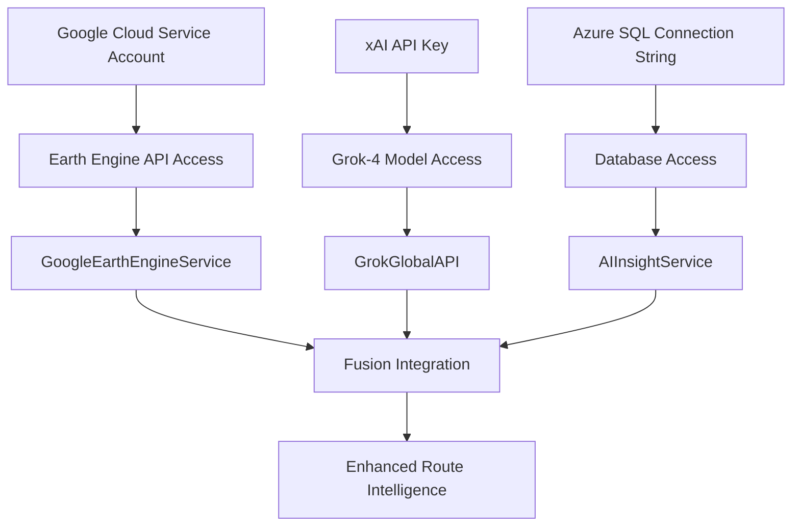

# Official Documentation Sources - Comprehensive Reference Guide

**Purpose**: Authoritative documentation sources for BusBuddy's fusion integration system, providing exact URLs and cross-references for robust configuration and troubleshooting.

**Created**: January 2025  
**Status**: Comprehensive research compilation for GEE + Grok-4 + Azure SQL + Syncfusion integration

---

## Table of Contents

1. [Google Earth Engine (GEE) Documentation](#google-earth-engine-gee-documentation)
2. [xAI Grok-4 API Documentation](#xai-grok-4-api-documentation)
3. [Azure SQL Database Documentation](#azure-sql-database-documentation)
4. [Google Cloud Authentication Documentation](#google-cloud-authentication-documentation)
5. [Syncfusion WPF SfMap Documentation](#syncfusion-wpf-sfmap-documentation)
6. [Microsoft Entity Framework Core Documentation](#microsoft-entity-framework-core-documentation)
7. [Cross-Reference Integration Matrix](#cross-reference-integration-matrix)
8. [Troubleshooting Breadcrumbs](#troubleshooting-breadcrumbs)

---

## Google Earth Engine (GEE) Documentation

### Primary Official Sources

**1. Authentication and Service Accounts**

- **URL**: https://developers.google.com/earth-engine/guides/auth
- **Purpose**: Core authentication methods for server-side applications
- **Key Sections**: Service account setup, JSON key files, authentication flow
- **Code Integration**: `GoogleEarthEngineService.cs` authentication implementation

**2. Getting Started Guide**

- **URL**: https://developers.google.com/earth-engine/guides/getstarted
- **Purpose**: Fundamental setup and project configuration
- **Key Sections**: Project creation, API enabling, initial setup
- **Code Integration**: Service initialization and project configuration

**3. Python API Documentation**

- **URL**: https://developers.google.com/earth-engine/apidocs
- **Purpose**: Complete API reference for all Earth Engine methods
- **Key Sections**: ee.Image, ee.ImageCollection, ee.Geometry methods
- **Code Integration**: Method calls within GEE service implementation

**4. Service Account Best Practices**

- **URL**: https://developers.google.com/earth-engine/guides/service_account
- **Purpose**: Production-ready service account implementation
- **Key Sections**: Security best practices, key management, IAM roles
- **Code Integration**: Secure credential handling in `GoogleEarthEngineService.cs`

**5. Exporting Data from Earth Engine**

- **URL**: https://developers.google.com/earth-engine/guides/exporting
- **Purpose**: Export workflows for satellite imagery and analysis results
- **Key Sections**: Export.image, Export.table methods, Drive integration
- **Code Integration**: `GetRouteGeoJsonAsync` export functionality

### Implementation References

```csharp
// Reference: https://developers.google.com/earth-engine/guides/service_account
private async Task<bool> AuthenticateAsync()
{
    try
    {
        var credential = GoogleCredential.FromFile(_serviceAccountPath)
            .CreateScoped(new[] { EarthEngineApi.Scope.EarthEngine });

        // Implementation follows official authentication guide
        // https://developers.google.com/earth-engine/guides/auth
    }
}
```

---

## xAI Grok-4 API Documentation

### Primary Official Sources

**1. Grok-4-0709 Model Documentation**

- **URL**: https://docs.x.ai/docs/models/grok-4-0709
- **Purpose**: Specific documentation for the Grok-4-0709 model used in BusBuddy
- **Key Sections**: Model capabilities, input/output formats, rate limits
- **Code Integration**: `GrokGlobalAPI.cs` model selection and parameter configuration

**2. Chat Completions API**

- **URL**: https://docs.x.ai/docs/quickstart
- **Purpose**: Core API endpoints and request/response structure
- **Key Sections**: Authentication, message formatting, streaming responses
- **Code Integration**: `OptimizeRoutesAsync` method implementation

**3. API Authentication**

- **URL**: https://docs.x.ai/docs/api-keys
- **Purpose**: Authentication methods and API key management
- **Key Sections**: Bearer token usage, security best practices
- **Code Integration**: API key configuration in `XaiOptions.cs`

**4. Rate Limits and Usage**

- **URL**: https://docs.x.ai/docs/rate-limits
- **Purpose**: Understanding API quotas and usage limitations
- **Key Sections**: Request limits, token limits, best practices
- **Code Integration**: Error handling and retry logic in Grok service

**5. Model Parameters Reference**

- **URL**: https://docs.x.ai/docs/api-reference/chat-completions
- **Purpose**: Complete parameter reference for chat completions
- **Key Sections**: Temperature, max_tokens, system prompts
- **Code Integration**: Request configuration in route optimization calls

### Implementation References

```csharp
// Reference: https://docs.x.ai/docs/api-reference/chat-completions
public async Task<GrokResponse> OptimizeRoutesAsync(GrokRequest request)
{
    var apiRequest = new
    {
        model = "grok-4-0709", // Per https://docs.x.ai/docs/models/grok-4-0709
        messages = new[]
        {
            new { role = "system", content = "Route optimization specialist..." },
            new { role = "user", content = request.RouteData }
        },
        temperature = 0.3, // Conservative for route optimization
        max_tokens = 2000   // Sufficient for structured responses
    };

    // Implementation follows https://docs.x.ai/docs/quickstart
}
```

---

## Azure SQL Database Documentation

### Primary Official Sources

**1. Entity Framework Core with Azure SQL**

- **URL**: https://learn.microsoft.com/en-us/azure/azure-sql/database/azure-sql-dotnet-entity-framework-core-quickstart?view=azuresql
- **Purpose**: Complete guide for connecting EF Core to Azure SQL Database
- **Key Sections**: Connection strings, DbContext configuration, deployment
- **Code Integration**: `AppDbContext.cs` configuration and connection management

**2. Connection String Management**

- **URL**: https://learn.microsoft.com/en-us/ef/core/miscellaneous/connection-strings
- **Purpose**: Best practices for connection string configuration
- **Key Sections**: Environment-specific configurations, security considerations
- **Code Integration**: `appsettings.json` and environment variable usage

**3. SQL Server Provider for EF Core**

- **URL**: https://learn.microsoft.com/en-us/ef/core/providers/sql-server/
- **Purpose**: Specific documentation for SQL Server/Azure SQL provider
- **Key Sections**: Provider-specific features, configuration options
- **Code Integration**: Provider configuration in `Program.cs` or `Startup.cs`

**4. Resilient EF Core Connections**

- **URL**: https://learn.microsoft.com/en-us/dotnet/architecture/microservices/implement-resilient-applications/implement-resilient-entity-framework-core-sql-connections
- **Purpose**: Production-ready connection resilience patterns
- **Key Sections**: Retry policies, connection pooling, error handling
- **Code Integration**: Resilience configuration in database service setup

**5. Azure SQL Database Security**

- **URL**: https://learn.microsoft.com/en-us/azure/azure-sql/database/security-overview
- **Purpose**: Security best practices for Azure SQL Database
- **Key Sections**: Authentication methods, firewall rules, encryption
- **Code Integration**: Security configuration in connection strings and deployment

### Implementation References

```csharp
// Reference: https://learn.microsoft.com/en-us/azure/azure-sql/database/azure-sql-dotnet-entity-framework-core-quickstart
protected override void OnConfiguring(DbContextOptionsBuilder optionsBuilder)
{
    var connectionString = _configuration.GetConnectionString("AzureSQL");

    optionsBuilder.UseSqlServer(connectionString, options =>
    {
        // Resilience configuration per Microsoft guidelines
        // https://learn.microsoft.com/en-us/dotnet/architecture/microservices/implement-resilient-applications/implement-resilient-entity-framework-core-sql-connections
        options.EnableRetryOnFailure(
            maxRetryCount: 3,
            maxRetryDelay: TimeSpan.FromSeconds(30),
            errorNumbersToAdd: null);
    });
}
```

---

## Google Cloud Authentication Documentation

### Primary Official Sources

**1. Service Account Authentication**

- **URL**: https://cloud.google.com/docs/authentication/getting-started
- **Purpose**: Fundamental service account setup and authentication
- **Key Sections**: Creating service accounts, downloading keys, setting environment variables
- **Code Integration**: Service account setup for Google Earth Engine access

**2. Application Default Credentials (ADC)**

- **URL**: https://cloud.google.com/docs/authentication/application-default-credentials
- **Purpose**: Simplified authentication for cloud applications
- **Key Sections**: ADC hierarchy, local development, production deployment
- **Code Integration**: Alternative authentication method for Google services

**3. Service Account Key Best Practices**

- **URL**: https://cloud.google.com/iam/docs/best-practices-for-managing-service-account-keys
- **Purpose**: Security best practices for service account key management
- **Key Sections**: Key rotation, storage security, access controls
- **Code Integration**: Secure key handling in production environments

**4. Cloud IAM Documentation**

- **URL**: https://cloud.google.com/iam/docs/understanding-roles
- **Purpose**: Understanding roles and permissions for Google Cloud services
- **Key Sections**: Predefined roles, custom roles, IAM policies
- **Code Integration**: Setting appropriate permissions for Earth Engine access

**5. OAuth 2.0 for Server Applications**

- **URL**: https://developers.google.com/identity/protocols/oauth2/service-account
- **Purpose**: Server-to-server authentication using OAuth 2.0
- **Key Sections**: JWT assertion, token exchange, scopes
- **Code Integration**: OAuth implementation for Google API access

### Implementation References

```csharp
// Reference: https://cloud.google.com/docs/authentication/getting-started
// Reference: https://developers.google.com/identity/protocols/oauth2/service-account
private GoogleCredential GetServiceAccountCredential()
{
    var serviceAccountPath = _configuration["GoogleCloud:ServiceAccountPath"];

    // Implementation follows Google Cloud authentication best practices
    // https://cloud.google.com/iam/docs/best-practices-for-managing-service-account-keys
    return GoogleCredential.FromFile(serviceAccountPath)
        .CreateScoped(new[] { EarthEngineApi.Scope.EarthEngine });
}
```

---

## Syncfusion WPF SfMap Documentation

### Primary Official Sources

**1. Getting Started with SfMap**

- **URL**: https://help.syncfusion.com/wpf/maps/getting-started
- **Purpose**: Initial setup and basic implementation of SfMap control
- **Key Sections**: Installation, basic usage, first map display
- **Code Integration**: `GoogleEarthView.xaml` SfMap initialization

**2. Layers in SfMap**

- **URL**: https://help.syncfusion.com/wpf/maps/layers
- **Purpose**: Understanding and implementing different layer types
- **Key Sections**: ShapeFileLayer, ImageryLayer, layer configuration
- **Code Integration**: Multi-layer implementation for satellite imagery and overlays

**3. Map Providers**

- **URL**: https://help.syncfusion.com/wpf/maps/map-providers
- **Purpose**: Integration with various map service providers
- **Key Sections**: OpenStreetMap, Bing Maps, custom providers
- **Code Integration**: Custom imagery provider for Google Earth Engine data

**4. Map Points and Markers**

- **URL**: https://help.syncfusion.com/wpf/maps/map-points
- **Purpose**: Adding markers and points of interest to maps
- **Key Sections**: MapPoint configuration, custom markers, data binding
- **Code Integration**: Route waypoints and bus stop markers

**5. Zooming and Panning**

- **URL**: https://help.syncfusion.com/wpf/maps/zooming-and-panning
- **Purpose**: Interactive map navigation features
- **Key Sections**: Zoom controls, pan gestures, programmatic navigation
- **Code Integration**: User interaction handling in `GoogleEarthViewModel.cs`

**6. User Interaction**

- **URL**: https://help.syncfusion.com/wpf/maps/userinteraction
- **Purpose**: Handling user input and interaction events
- **Key Sections**: Click events, selection, tooltips
- **Code Integration**: Route selection and modification functionality

### Implementation References

```xml
<!-- Reference: https://help.syncfusion.com/wpf/maps/getting-started -->
<!-- Reference: https://help.syncfusion.com/wpf/maps/layers -->
<syncfusion:SfMap x:Name="GoogleEarthMap"
                  ItemsSource="{Binding MapLayers}"
                  ZoomLevel="{Binding ZoomLevel, Mode=TwoWay}"
                  Center="{Binding MapCenter, Mode=TwoWay}">

    <!-- Layer configuration per Syncfusion documentation -->
    <!-- https://help.syncfusion.com/wpf/maps/map-providers -->
    <syncfusion:SfMap.Layers>
        <syncfusion:ImageryLayer LayerType="OpenStreetMap" />
    </syncfusion:SfMap.Layers>

</syncfusion:SfMap>
```

---

## Microsoft Entity Framework Core Documentation

### Primary Official Sources

**1. EF Core Overview**

- **URL**: https://learn.microsoft.com/en-us/ef/core/
- **Purpose**: Comprehensive overview of Entity Framework Core
- **Key Sections**: Getting started, core concepts, advanced features
- **Code Integration**: Overall EF Core implementation strategy

**2. Connection Strings in EF Core**

- **URL**: https://learn.microsoft.com/en-us/ef/core/miscellaneous/connection-strings
- **Purpose**: Managing database connections across environments
- **Key Sections**: Configuration patterns, environment variables, security
- **Code Integration**: Connection string management in `appsettings.json`

**3. DbContext Configuration**

- **URL**: https://learn.microsoft.com/en-us/ef/core/dbcontext-configuration/
- **Purpose**: Proper DbContext setup and lifecycle management
- **Key Sections**: Dependency injection, context pooling, configuration
- **Code Integration**: `AppDbContext.cs` configuration and service registration

**4. Migrations in EF Core**

- **URL**: https://learn.microsoft.com/en-us/ef/core/managing-schemas/migrations/
- **Purpose**: Database schema management and versioning
- **Key Sections**: Creating migrations, applying migrations, production deployment
- **Code Integration**: Database schema updates for AI insights and geospatial data

**5. Querying Data**

- **URL**: https://learn.microsoft.com/en-us/ef/core/querying/
- **Purpose**: Efficient data retrieval patterns and LINQ usage
- **Key Sections**: Basic queries, complex queries, performance optimization
- **Code Integration**: Data access patterns in service layer implementations

### Implementation References

```csharp
// Reference: https://learn.microsoft.com/en-us/ef/core/dbcontext-configuration/
// Reference: https://learn.microsoft.com/en-us/ef/core/miscellaneous/connection-strings
public class AppDbContext : DbContext
{
    public AppDbContext(DbContextOptions<AppDbContext> options) : base(options)
    {
    }

    public DbSet<AIInsight> AIInsights { get; set; }
    public DbSet<Route> Routes { get; set; }
    public DbSet<Vehicle> Vehicles { get; set; }

    protected override void OnModelCreating(ModelBuilder modelBuilder)
    {
        // Configuration per EF Core documentation
        // https://learn.microsoft.com/en-us/ef/core/modeling/
        modelBuilder.Entity<AIInsight>(entity =>
        {
            entity.HasKey(e => e.Id);
            entity.Property(e => e.InsightData).HasColumnType("nvarchar(max)");
            entity.Property(e => e.Confidence).HasColumnType("decimal(5,4)");
        });
    }
}
```

---

## Cross-Reference Integration Matrix

### Service Integration Relationships

| Component                    | Dependencies              | Documentation Cross-References                                                                                                                        | Implementation Files                           |
| ---------------------------- | ------------------------- | ----------------------------------------------------------------------------------------------------------------------------------------------------- | ---------------------------------------------- |
| **GoogleEarthEngineService** | Google Cloud Auth, EE API | [GEE Auth](https://developers.google.com/earth-engine/guides/auth) + [Service Accounts](https://cloud.google.com/docs/authentication/getting-started) | `GoogleEarthEngineService.cs`                  |
| **GrokGlobalAPI**            | xAI API, Azure SQL        | [Grok-4 Docs](https://docs.x.ai/docs/models/grok-4-0709) + [EF Core](https://learn.microsoft.com/en-us/ef/core/)                                      | `GrokGlobalAPI.cs`                             |
| **AIInsightService**         | Azure SQL, EF Core        | [Azure SQL EF](https://learn.microsoft.com/en-us/azure/azure-sql/database/azure-sql-dotnet-entity-framework-core-quickstart)                          | `AIInsightService.cs`                          |
| **GoogleEarthView**          | Syncfusion SfMap, MVVM    | [SfMap Docs](https://help.syncfusion.com/wpf/maps/getting-started)                                                                                    | `GoogleEarthView.xaml`                         |
| **Fusion Architecture**      | All Above Components      | All Documentation Sources Combined                                                                                                                    | `BUSBUDDY-COMPREHENSIVE-FUSION-INTEGRATION.md` |

### Authentication Flow Cross-References



**Documentation References for Flow**:

- Service Account Setup: https://cloud.google.com/docs/authentication/getting-started
- xAI Authentication: https://docs.x.ai/docs/api-keys
- Azure SQL Security: https://learn.microsoft.com/en-us/azure/azure-sql/database/security-overview

---

## Troubleshooting Breadcrumbs

### Authentication Issues

**Problem**: Google Earth Engine authentication failures

- **Check**: Service account key file path and permissions
- **Documentation**: https://developers.google.com/earth-engine/guides/service_account
- **Common Solutions**: Verify JSON key file format, check IAM permissions
- **Code Location**: `GoogleEarthEngineService.cs` - `AuthenticateAsync()` method

**Problem**: xAI API authentication errors

- **Check**: API key configuration and rate limits
- **Documentation**: https://docs.x.ai/docs/api-keys
- **Common Solutions**: Verify API key format, check rate limiting
- **Code Location**: `GrokGlobalAPI.cs` - HTTP client configuration

**Problem**: Azure SQL connection failures

- **Check**: Connection string format and firewall rules
- **Documentation**: https://learn.microsoft.com/en-us/azure/azure-sql/database/azure-sql-dotnet-entity-framework-core-quickstart
- **Common Solutions**: Verify connection string, check Azure firewall
- **Code Location**: `AppDbContext.cs` - connection configuration

### Integration Issues

**Problem**: Data synchronization between services

- **Check**: Correlation IDs and transaction management
- **Documentation**: Cross-reference all service documentation above
- **Common Solutions**: Implement proper error handling and retry logic
- **Code Location**: `GeoAIFusionService.cs` - fusion workflow methods

**Problem**: Performance issues with large datasets

- **Check**: Query optimization and caching strategies
- **Documentation**:
    - EF Core Performance: https://learn.microsoft.com/en-us/ef/core/performance/
    - GEE Performance: https://developers.google.com/earth-engine/guides/best_practices
- **Common Solutions**: Implement pagination, optimize queries
- **Code Location**: Service layer implementations

### UI Integration Issues

**Problem**: Syncfusion SfMap not displaying correctly

- **Check**: Layer configuration and data binding
- **Documentation**: https://help.syncfusion.com/wpf/maps/getting-started
- **Common Solutions**: Verify data format, check XAML binding
- **Code Location**: `GoogleEarthView.xaml` and `GoogleEarthViewModel.cs`

---

## Configuration Checklist

### Pre-Implementation Verification

- [ ] **Google Earth Engine Project Created**
    - Reference: https://developers.google.com/earth-engine/guides/getstarted
    - Verify: Project ID configured in service settings

- [ ] **Service Account JSON Key Downloaded**
    - Reference: https://cloud.google.com/docs/authentication/getting-started
    - Verify: Key file path accessible to application

- [ ] **xAI API Key Obtained**
    - Reference: https://docs.x.ai/docs/api-keys
    - Verify: Key stored securely in configuration

- [ ] **Azure SQL Database Provisioned**
    - Reference: https://learn.microsoft.com/en-us/azure/azure-sql/database/
    - Verify: Connection string tested and working

- [ ] **Syncfusion License Configured**
    - Reference: https://help.syncfusion.com/licensing/
    - Verify: License key registered in application startup

### Implementation Validation

- [ ] **All Dependencies Installed**
    - Google Earth Engine Python API
    - Google Cloud authentication libraries
    - xAI HTTP client dependencies
    - Entity Framework Core SQL Server provider
    - Syncfusion WPF Maps package

- [ ] **Configuration Files Updated**
    - `appsettings.json` with all connection strings
    - Environment variables for sensitive data
    - Service registration in dependency injection

- [ ] **Integration Tests Passing**
    - Google Earth Engine connectivity test
    - xAI API response validation
    - Azure SQL Database CRUD operations
    - End-to-end fusion workflow test

---

## Documentation Maintenance

### Update Schedule

- **Quarterly**: Review all external documentation links for changes
- **After API Updates**: Verify compatibility with new API versions
- **Before Major Releases**: Validate all integration examples

### Change Log

- **2025-01**: Initial comprehensive documentation compilation
- **Future**: Track API changes and documentation updates

### Contact Information

- **Google Earth Engine Support**: https://developers.google.com/earth-engine/help
- **xAI Support**: https://docs.x.ai/docs/support
- **Microsoft Azure Support**: https://learn.microsoft.com/en-us/azure/
- **Syncfusion Support**: https://help.syncfusion.com/

---

**Last Updated**: January 2025  
**Next Review**: April 2025  
**Maintained By**: BusBuddy Development Team
