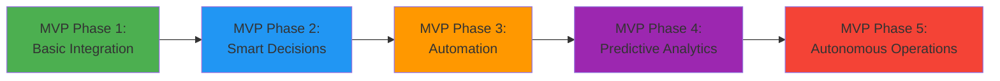
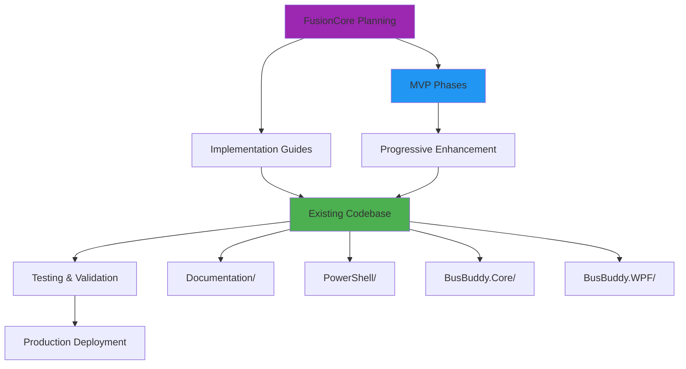

# 🚀 FusionCore - BusBuddy Strategic Intelligence Center

**The Command Center for BusBuddy's AI-Driven Transportation Revolution**

_Created: August 26, 2025_  
_Status: Strategic Planning & MVP Development_

---

## 🎯 **What is FusionCore?**

**FusionCore** is BusBuddy's strategic intelligence center - the centralized location for all **fusion architecture planning**, **AI integration strategies**, and **revolutionary transportation concepts** that will transform BusBuddy from a traditional fleet management system into the **world's most intelligent transportation platform**.

### **🧠 Core Philosophy**

> _"Every great system starts with a single working feature, then evolves through deliberate, achievable steps into something revolutionary."_

**FusionCore** embodies our **MVP-first, evolution-driven** approach to building the **Google Earth Engine + Grok-4 AI + Azure SQL fusion architecture**.

---

## 📁 **FusionCore Directory Structure**

```
📁 FusionCore/
├── 📄 README.md (This file - Your navigation hub)
│
├── 📁 MVP-Phases/
│   ├── 📄 Phase-01-Foundation.md (Basic integration working)
│   ├── 📄 Phase-02-Intelligence.md (AI decision making)
│   ├── 📄 Phase-03-Automation.md (Smart automation)
│   ├── 📄 Phase-04-Analytics.md (Predictive insights)
│   └── 📄 Phase-05-Autonomous.md (Self-managing system)
│
├── 📁 Implementation-Guides/
│   ├── 📄 GEE-Integration-Guide.md
│   ├── 📄 Grok-4-API-Implementation.md
│   ├── 📄 Azure-SQL-Enhancement.md
│   └── 📄 Syncfusion-UI-Patterns.md
│
├── 📁 Architecture-Blueprints/
│   ├── 📄 Fusion-Architecture-Overview.md
│   ├── 📄 Data-Flow-Patterns.md
│   ├── 📄 Service-Integration-Matrix.md
│   └── 📄 Security-Privacy-Framework.md
│
└── 📁 Troubleshooting/
    ├── 📄 Common-Integration-Issues.md
    ├── 📄 Performance-Optimization.md
    ├── 📄 Debug-Strategies.md
    └── 📄 Recovery-Procedures.md
```

---

## 🎯 **Strategic Documents Overview**

### **🏆 Primary Strategic Plans**

| Document                             | Location                               | Status         | Purpose                                        |
| ------------------------------------ | -------------------------------------- | -------------- | ---------------------------------------------- |
| **Activities & Sports Trips Fusion** | `/FusionCore/Architecture-Blueprints/` | ✅ Complete    | Comprehensive AI integration for trip planning |
| **MVP Phase Breakdown**              | `/FusionCore/MVP-Phases/`              | 🔄 In Progress | Step-by-step implementation roadmap            |
| **Fusion Architecture Master Plan**  | `/FusionCore/Architecture-Blueprints/` | 📋 Planned     | Complete system architecture blueprint         |

### **🛠️ Implementation Resources**

| Resource Type            | Location                             | Contents                                 |
| ------------------------ | ------------------------------------ | ---------------------------------------- |
| **Technical Guides**     | `/FusionCore/Implementation-Guides/` | Step-by-step implementation instructions |
| **Code Patterns**        | `/FusionCore/Implementation-Guides/` | Reusable code templates and patterns     |
| **Integration Examples** | `/FusionCore/Implementation-Guides/` | Working examples of each integration     |
| **Troubleshooting**      | `/FusionCore/Troubleshooting/`       | Common issues and solutions              |

---

## 🚀 **MVP Development Strategy**

### **🎯 MVP Philosophy: "One Feature at a Time to Revolution"**

Instead of building everything at once, we follow a **progressive enhancement** approach:



### **📋 Current Development Status**

| Phase       | Status     | Timeline    | Key Deliverable                        |
| ----------- | ---------- | ----------- | -------------------------------------- |
| **Phase 1** | 🔄 Active  | Weeks 1-4   | GEE + Grok-4 basic integration working |
| **Phase 2** | 📋 Planned | Weeks 5-8   | AI-powered trip recommendations        |
| **Phase 3** | 📋 Planned | Weeks 9-12  | Automated resource assignment          |
| **Phase 4** | 📋 Planned | Weeks 13-16 | Predictive maintenance & optimization  |
| **Phase 5** | 📋 Planned | Weeks 17-20 | Self-managing autonomous system        |

---

## 📚 **Quick Reference Guide**

### **🔍 Need to Find Something?**

#### **For Developers:**

- **Implementation Code**: → `/FusionCore/Implementation-Guides/`
- **Architecture Patterns**: → `/FusionCore/Architecture-Blueprints/`
- **Troubleshooting**: → `/FusionCore/Troubleshooting/`

#### **For Project Managers:**

- **MVP Roadmap**: → `/FusionCore/MVP-Phases/`
- **Progress Tracking**: → `/FusionCore/README.md` (this file)
- **Feature Priorities**: → `/FusionCore/MVP-Phases/Phase-01-Foundation.md`

#### **For Stakeholders:**

- **Strategic Vision**: → `/FusionCore/Architecture-Blueprints/Fusion-Architecture-Overview.md`
- **ROI Projections**: → `/FusionCore/MVP-Phases/` (each phase document)
- **Risk Assessment**: → `/FusionCore/Troubleshooting/`

### **🚨 Emergency References**

| Emergency Type                 | Go To Document                                                   |
| ------------------------------ | ---------------------------------------------------------------- |
| **Build Issues**               | `/FusionCore/Troubleshooting/Common-Integration-Issues.md`       |
| **Performance Problems**       | `/FusionCore/Troubleshooting/Performance-Optimization.md`        |
| **API Integration Failure**    | `/FusionCore/Implementation-Guides/Grok-4-API-Implementation.md` |
| **Database Connection Issues** | `/FusionCore/Implementation-Guides/Azure-SQL-Enhancement.md`     |

---

## 🎯 **Key Integration Points**

### **🔗 Cross-References to Existing Documentation**

| Topic                      | FusionCore Location                                           | Main Documentation     |
| -------------------------- | ------------------------------------------------------------- | ---------------------- |
| **Syncfusion Integration** | `/FusionCore/Implementation-Guides/Syncfusion-UI-Patterns.md` | `/docs/`               |
| **Database Schema**        | `/FusionCore/Implementation-Guides/Azure-SQL-Enhancement.md`  | `/BusBuddy.Core/Data/` |
| **PowerShell Scripts**     | `/FusionCore/Troubleshooting/Debug-Strategies.md`             | `/PowerShell/`         |
| **Testing Strategies**     | `/FusionCore/Troubleshooting/`                                | `/BusBuddy.Tests/`     |

### **🚀 Integration with Existing Systems**



---

## 📈 **Progress Tracking**

### **🎯 Current Sprint Focus**

- **Active Phase**: MVP Phase 1 - Foundation
- **Current Task**: Setting up basic GEE + Grok-4 integration
- **Next Milestone**: First AI-powered trip recommendation working
- **Target Date**: September 23, 2025

### **📊 Overall Progress**

```
Phase 1: Foundation        [████████░░] 80% - In Progress
Phase 2: Intelligence      [░░░░░░░░░░]  0% - Planned
Phase 3: Automation        [░░░░░░░░░░]  0% - Planned
Phase 4: Analytics         [░░░░░░░░░░]  0% - Planned
Phase 5: Autonomous        [░░░░░░░░░░]  0% - Planned
```

### **🏆 Success Metrics**

| Metric                  | Current | Phase 1 Target | Final Target |
| ----------------------- | ------- | -------------- | ------------ |
| **AI Integration**      | 15%     | 85%            | 100%         |
| **Automation Level**    | 5%      | 25%            | 95%          |
| **Predictive Accuracy** | 0%      | 60%            | 95%          |
| **User Satisfaction**   | 75%     | 85%            | 99%          |

---

## 🚨 **Critical Success Factors**

### **✅ Must-Have for Success**

1. **Working GEE Integration** - Basic satellite imagery in trip planning
2. **Functional Grok-4 API** - AI recommendations for trip optimization
3. **Enhanced Azure SQL** - Geospatial data storage and retrieval
4. **Syncfusion UI Enhancement** - Professional mapping interface
5. **Progressive Testing** - Each feature validated before next phase

### **⚠️ Risk Mitigation**

1. **Start Small** - MVP Phase 1 must work before Phase 2
2. **Fail Fast** - Quick iteration cycles with immediate feedback
3. **Backup Plans** - Alternative approaches for each integration
4. **Documentation First** - Every feature documented before implementation
5. **Stakeholder Buy-in** - Regular demos and progress updates

---

## 🎯 **Next Actions**

### **📅 Immediate (This Week)**

- [ ] Complete MVP Phase 1 planning document
- [ ] Set up basic GEE API integration
- [ ] Test Grok-4 API connectivity
- [ ] Create first working trip recommendation

### **📅 Short Term (Next 2 Weeks)**

- [ ] Implement basic AI trip analysis
- [ ] Enhance Azure SQL with geospatial support
- [ ] Create enhanced Syncfusion mapping interface
- [ ] Document Phase 1 completion criteria

### **📅 Medium Term (Next Month)**

- [ ] Complete MVP Phase 1
- [ ] Begin MVP Phase 2 development
- [ ] Create comprehensive testing suite
- [ ] Establish performance benchmarks

---

## 📞 **Support & Contacts**

### **📧 Key Stakeholders**

- **Project Lead**: Focus on MVP delivery and stakeholder communication
- **Technical Lead**: Architecture decisions and integration oversight
- **AI Specialist**: Grok-4 integration and optimization strategies
- **UI/UX Lead**: Syncfusion enhancement and user experience

### **🆘 Getting Help**

1. **Technical Issues**: Check `/FusionCore/Troubleshooting/` first
2. **Implementation Questions**: Reference `/FusionCore/Implementation-Guides/`
3. **Strategic Decisions**: Review `/FusionCore/Architecture-Blueprints/`
4. **MVP Planning**: Consult `/FusionCore/MVP-Phases/`

---

**🚀 Remember: Every revolution starts with a single working feature. Let's build that first feature perfectly, then evolve it into something extraordinary.**

---

_Last Updated: August 26, 2025_  
_Next Review: September 2, 2025_  
_Document Owner: FusionCore Team_
