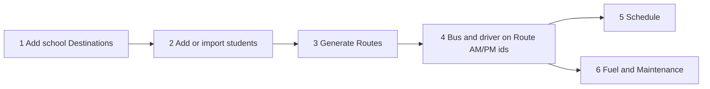

# Clerk path (what is actually connected)

This is the spine of BusBuddy. Dock lists and extra windows are not a second product.

**Canonical write path:** school → students → generate routes → bus and driver on the route → fuel / maintenance on that bus.

Due-outs: [action-items.md](./action-items.md). Overview tree: [function-tree.md](./function-tree.md).

---

## Hops (status)

| Hop     | Clerk action                                    | UI                                                         | Database                                          | Status                                                         |
| ------- | ----------------------------------------------- | ---------------------------------------------------------- | ------------------------------------------------- | -------------------------------------------------------------- |
| 1       | Catalog a school with start, dismissal, and GPS | Students → **Add School**                                  | `Destinations` (`DestinationType=School`)         | **Now.** Code + unit tests. VM smoke open                      |
| 2       | Add kids, assign that school, save address      | Students → Add Student / Import CSV; dock Add Student      | `Students` (`DestinationId`, coords)              | After hop 1 VM smoke                                           |
| 3       | Generate routes                                 | Routes pane **Generate Routes** or Route Assignments       | `Routes`, `RouteStops`                            | Needs hop 1 GPS + hop 2. Serilog: `Route generation completed` |
| 4       | Put a bus and driver on the route               | Route Assignments (Drivers **Assign Bus** opens this pane) | `Routes.AMVehicleId` / `AMDriverId` (and PM)      | Prove this write. See duplicates below                         |
| 5       | Daily schedule                                  | Driver Schedule                                            | `Schedules`                                       | After hop 4b picks one write                                   |
| 6       | Fuel and maintenance                            | Header **Fuel** / **Maintenance**                          | `FuelRecords` / `MaintenanceRecords` → `Vehicles` | After hop 4 bus exists                                         |
| Map     | Plot kids who have coordinates                  | Map pane / Students View Map                               | reads `Students` + `Destinations`                 | Read-only overlay                                              |
| Reports | Print roster / assignment                       | Header **Reports**                                         | reads the same tables                             | Read-only                                                      |

Dock **Students / Routes / Buses / Drivers** grids are summaries of Postgres. They do not invent sample rows. Status bar shows the load count or that the database is unavailable.

---

## Duplicate UI (same table, two screens)

Keep both for now. After a dialog closes, the dock grid refreshes from the service.

| Entity   | Dock pane          | Full editor                                              |
| -------- | ------------------ | -------------------------------------------------------- |
| Students | left Students grid | Students window                                          |
| Buses    | Buses document     | Vehicle Management window (`Bus` type, `Vehicles` table) |
| Drivers  | Drivers document   | Drivers window                                           |
| Routes   | right Routes grid  | Route Assignments document                               |

---

## Duplicate writes (do not pick one until we walk methods)

These are **not** deleted in this pass. Proof walks will choose a single write.

| Concern                   | Places it is stored                                                                                                |
| ------------------------- | ------------------------------------------------------------------------------------------------------------------ |
| Bus and driver on a route | `Route.AMVehicleId` / `AMDriverId` (canonical for generate and reports); also `RouteAssignments`; also `Schedules` |
| Kid on a route            | `Student.AMRoute` / `PMRoute` strings; `Student.RouteId`; `Student.RouteAssignmentId`                              |

---

## Dead for the clerk path (tables exist; no source-of-truth UI)

Do not wire these until the hops above are proved. Do not drop tables without a migration decision.

- `Families` / `Guardians` (`FamilyService` is not in DI)
- `TripEvents`
- `AIInsights`
- `SchoolCalendar`
- `ActivityLogs`
- `VehiclesViewModel` sample loader (unused; `VehiclesView` is excluded from compile)

Activity Timeline is a separate sports/trip path (`Activity` / `ActivitySchedule`). It overlaps `Schedules` and is **not** hop 3–4.

---

## Method proof walk

One hop per session. Call the method, watch Serilog, confirm the Postgres row. Tracker: [action-items.md](./action-items.md) P0.

| #         | Method                                                     | Proof                                                                                                              |
| --------- | ---------------------------------------------------------- | ------------------------------------------------------------------------------------------------------------------ |
| 1 **now** | `DestinationService.AddSchoolAsync`                        | Students → Add School → `Added school DestinationId=` → `Destinations` has times; GPS if Maps key or typed lat/lng |
| 2         | Student save / CSV                                         | `DestinationId` + student coordinates                                                                              |
| 3         | `RouteGenerationCoordinator` / `RouteDeterminationService` | `Route generation completed`                                                                                       |
| 4         | Assign bus/driver                                          | `Routes.AMVehicleId` and `AMDriverId`                                                                              |
| 4b        | Pick one write                                             | Drop or ignore `RouteAssignments` vs `Schedules` extra writes                                                      |
| 5         | `ScheduleService`                                          | schedule row for that route                                                                                        |
| 6         | `FuelService` / `MaintenanceService`                       | records point at that bus                                                                                          |

**Later, not during hops:** split `MainWindow.xaml.cs` and stop growing `StudentsViewModel.cs`.

Stop if a hop writes a second table. Decide which table wins before continuing.
