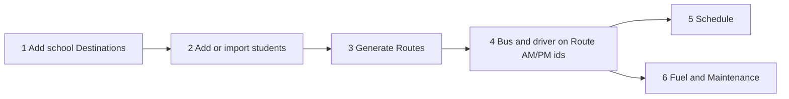

# Clerk path (what is actually connected)

This is the spine of BusBuddy. Dock lists and extra windows are not a second product.

**Canonical write path:** school → students → generate routes → bus and driver on the route → fuel / maintenance on that bus.

```mermaid
flowchart LR
  School[1 Add school Destinations]
  Kids[2 Add or import students]
  Gen[3 Generate Routes]
  Fleet[4 Bus and driver on Route AM/PM ids]
  Sched[5 Schedule]
  Ops[6 Fuel and Maintenance]
  School --> Kids --> Gen --> Fleet --> Sched
  Fleet --> Ops
```

Open ship work / hop proof boxes: [action-items.md](./action-items.md). Overview tree: [function-tree.md](./function-tree.md).

---

## Hops (what connects)

Proof checkboxes live only in [action-items.md](./action-items.md) — do not duplicate open/closed status here.

| Hop     | Clerk action                                    | UI                                                                            | Database                                          |
| ------- | ----------------------------------------------- | ----------------------------------------------------------------------------- | ------------------------------------------------- |
| 1       | Catalog a school with start, dismissal, and GPS | Students → **Add School** (Mac proof: `DbPrep hop1-add-school`)               | `Destinations` (`DestinationType=School`)         |
| 2       | Add kids, assign that school, save address      | Students → Add Student / Import CSV; Mac proof: `DbPrep hop2-add-student`     | `Students` (`DestinationId`, coords)              |
| 3       | Generate routes                                 | Routes pane **Generate Routes**; Mac: `DbPrep hop3-generate-routes`           | `Routes`, `RouteStops`                            |
| 4       | Put a bus and driver on the route               | Route Assignments Assign Vehicle/Driver; Mac: `DbPrep hop4-assign-bus-driver` | `Routes.AMVehicleId` / `AMDriverId` (and PM)      |
| 5       | Daily schedule                                  | Driver Schedule                                                               | `Schedules`                                       |
| 6       | Fuel and maintenance                            | Header **Fuel** / **Maintenance**                                             | `FuelRecords` / `MaintenanceRecords` → `Vehicles` |
| Map     | Plot kids who have coordinates                  | Map pane / Students View Map                                                  | reads `Students` + `Destinations`                 |
| Trips   | Office trip board / activity timeline           | Header **Trips** → timeline; **Trip Board** on that window                    | `TripEvents` (not daily `Routes`)                 |
| Reports | Print roster / assignment                       | Header **Reports**                                                            | reads the same tables                             |

Dock **Students / Routes / Buses / Drivers** grids are summaries of Postgres. They do not invent sample rows. Status bar shows the load count or that the database is unavailable.

---

## Duplicate UI (same table, two screens)

Keep both for now. After a dialog closes, the dock grid refreshes from the service.

| Entity   | Dock pane          | Full editor                                              |
| -------- | ------------------ | -------------------------------------------------------- |
| Students | left Students grid | Students window                                          |
| Buses    | Buses document     | Vehicle Management window (`Bus` type, `Vehicles` table) |
| Drivers  | Drivers document   | Drivers window                                           |
| Routes   | right Routes grid  | Route Assignments document                               |

---

## Duplicate writes (decision)

| Concern                    | Canonical write                                                                                                                                                                                                                                                                                  | Also exists (do not dual-write from Hop 4/5 clerk path)                                          |
| -------------------------- | ------------------------------------------------------------------------------------------------------------------------------------------------------------------------------------------------------------------------------------------------------------------------------------------------ | ------------------------------------------------------------------------------------------------ |
| Bus and driver on a route  | **`Routes.AMVehicleId` / `AMDriverId` (and PM)** via `RouteService.Assign*ToRouteAsync`                                                                                                                                                                                                          | `RouteAssignments` table; do not invent a fourth path                                            |
| Daily schedule for a route | **`Schedules`** via `IScheduleService.AddDailyFromPublishedRouteAsync` (session slot pairing + begin time; persist forwards `routeId`). Does not derive trip towns.                                                                                                                              | —                                                                                                |
| Pickup catalog             | **`PickupStops`** via `IPickupStopService.AddStopAsync` / `UpdateStopAsync` / `RetireStopAsync` (`CatalogDeleteResult`: unused delete, else `Active=false`). One `CatalogPickerDialog` for school and pickup pick.                                                                               | denormalized `RouteStop.StopName` — do not invent `LocationId`                                   |
| Kid on a route             | **`Student.AmRouteId` / `PmRouteId`** via `RouteService.AssignStudentToRouteAsync` (names still mirrored until the string drop). `IStudentService.AssignStudentToRouteAsync(names)` wraps unique names onto that method. Roster read: `GetStudentsByRouteAsync(int)` with a unique-name wrapper. | leftover `AssignStudentsToRoutesAsync` still writes `RouteAssignments`; do not finish that table |

Hop **4b (2026-09-09):** keep `Route.AM*` / `PM*` as the year-default bus/driver source of truth. `RouteAssignments` stays in the schema unused by Assign Vehicle/Driver. `Schedules` is the next hop (daily instance), not a competing place to store the default pairing.

---

## Leave alone (tables may exist; not the clerk spine)

Hops 1–6 are proved. That is not permission to wire these. Do not drop tables without a migration decision. Tracker: [action-items.md](./action-items.md) Leave alone.

| Leave alone                                                                          | Why                                                                                                                         |
| ------------------------------------------------------------------------------------ | --------------------------------------------------------------------------------------------------------------------------- |
| `FamilyService` / `GuardianService`                                                  | Not in DI. Spec does not require a family graph for routing. Guardian name/phone live on the student (`specs/students.md`). |
| `ActivityService` / `ActivityScheduleService`                                        | Parallel trip product. Board = `TripEventService` (`specs/trips.md`). Header **Trips** / Trip Board already use that path.  |
| `FleetMonitoringService`                                                             | Live GPS deferred. Do not hook a timer.                                                                                     |
| `BusBuddyAIReportingService`                                                         | No clerk surface.                                                                                                           |
| `DataIntegrityService` (empty), `BusBuddyScheduleDataProvider` (empty), `*.disabled` | Delete in a hygiene PR; do not implement.                                                                                   |
| Split `RouteService` because it is 80KB                                              | Explicitly parked in [action-items.md](./action-items.md).                                                                  |

Also leftover (keep until a drop migration): `AIInsights`, `SchoolCalendar`, unused `VehiclesViewModel` sample loader (`VehiclesView` excluded from compile).

---

## Method proof walk

One hop per session. Call the method, watch Serilog, confirm the Postgres row. Tracker: [action-items.md](./action-items.md) P0.

| #         | Method                                                     | Proof                                                                                                              |
| --------- | ---------------------------------------------------------- | ------------------------------------------------------------------------------------------------------------------ |
| 1 **now** | `DestinationService.AddSchoolAsync`                        | Students → Add School → `Added school DestinationId=` → `Destinations` has times; GPS if Maps key or typed lat/lng |
| 2         | Student save / CSV                                         | `DestinationId` + student coordinates. Unvalidated GPS is stored as null (incomplete list, no 0,0 pin). Archive keeps the row; hard delete needs `StudentDeletionReason`. |
| 3         | `RouteGenerationCoordinator` / `RouteDeterminationService` | `Route generation completed`                                                                                       |
| 4         | Assign bus/driver                                          | `Routes.AMVehicleId` and `AMDriverId`                                                                              |
| 4b        | Pick one write                                             | **Done:** canonical = `Route.AM*` / `PM*`; ignore `RouteAssignments` for Assign Vehicle/Driver                     |
| 5         | `ScheduleService.AddDailyFromPublishedRouteAsync`          | daily `Schedules` row; bus/driver/begin from the route session slot; Route ≠ Trip                                  |
| 6         | `FuelService` / `MaintenanceService`                       | records point at that bus; retired buses show as `FleetLabel` (`5 (retired)`), not as deleted                      |

**Later, not during hops:** split `MainWindow.xaml.cs` and stop growing `StudentsViewModel.cs`.

Stop if a hop writes a second table. Decide which table wins before continuing.
