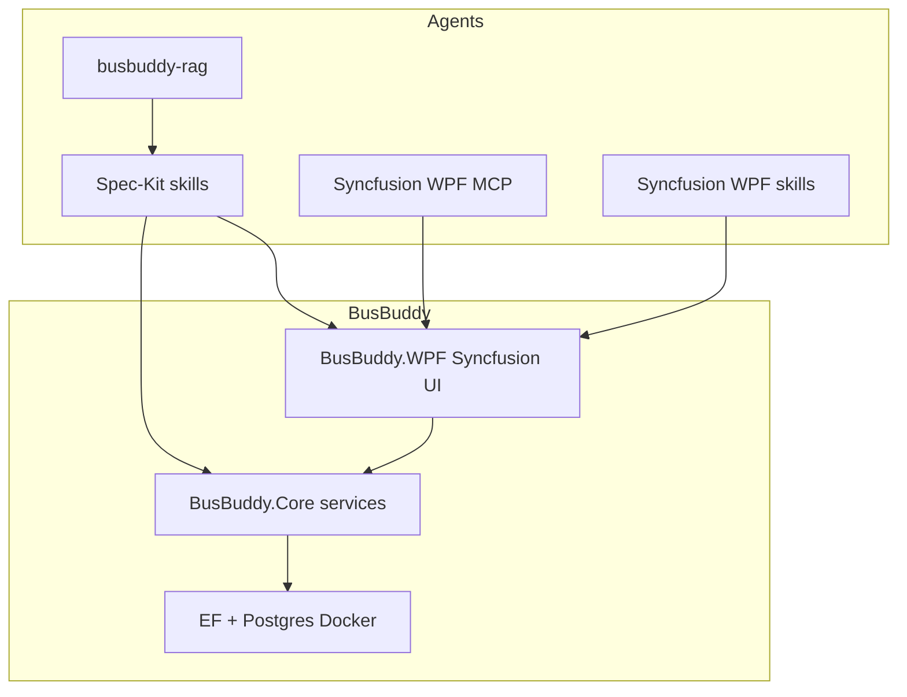

# BusBuddy Function Tree (overview)

High-level surface area. Detail and due-outs: [action-items.md](./action-items.md).

```mermaid
flowchart TB
  subgraph agents [Agents]
    SpecKit[Spec-Kit skills]
    RAG[busbuddy-rag]
    SfMCP[Syncfusion WPF MCP]
    SfSkills[Syncfusion WPF skills]
  end
  subgraph app [BusBuddy]
    WPF[BusBuddy.WPF Syncfusion UI]
    Core[BusBuddy.Core services]
    Data[EF + Postgres Docker]
  end
  SpecKit --> Core
  SpecKit --> WPF
  RAG --> SpecKit
  SfMCP --> WPF
  SfSkills --> WPF
  WPF --> Core
  Core --> Data
```

Update when major layers change (new services, new agent tooling).
