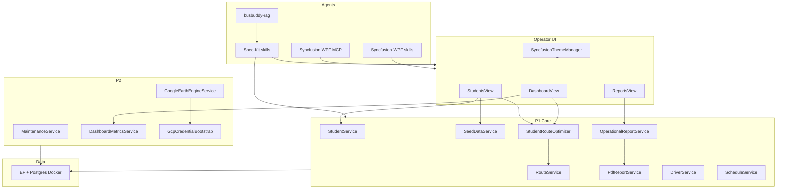

# BusBuddy Function Tree (overview)

High-level surface area. Due-outs: [action-items.md](./action-items.md). Generated scan: [function-inventory.generated.md](./function-inventory.generated.md).

Allowlist lives in [`.function-inventory.json`](../.function-inventory.json) (P1 first). Update this tree when a new operator view or core service is added to that list.
